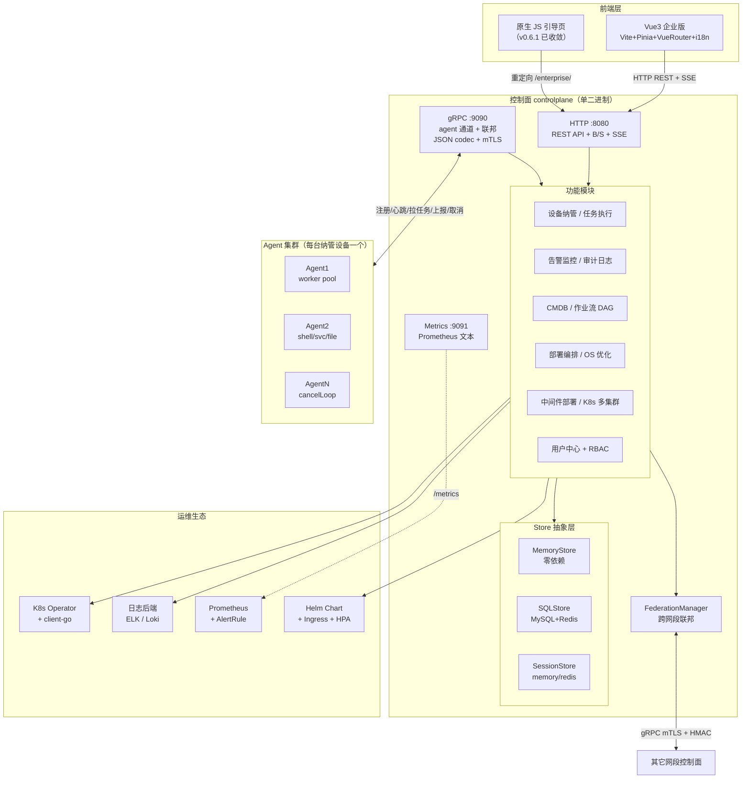
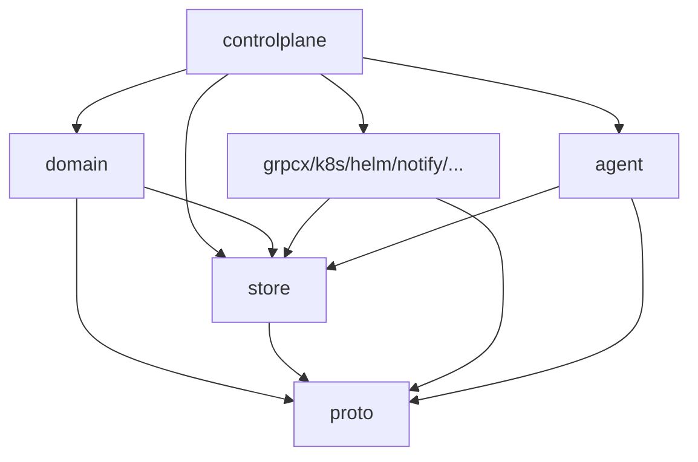
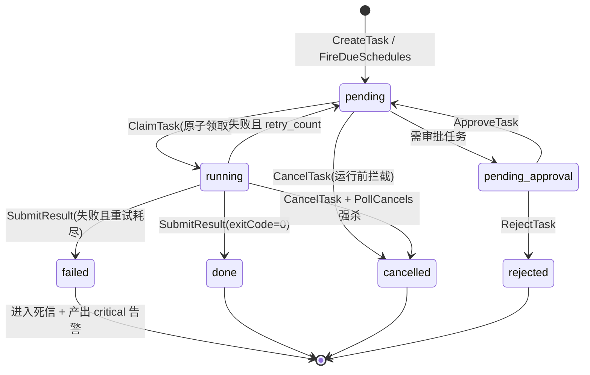
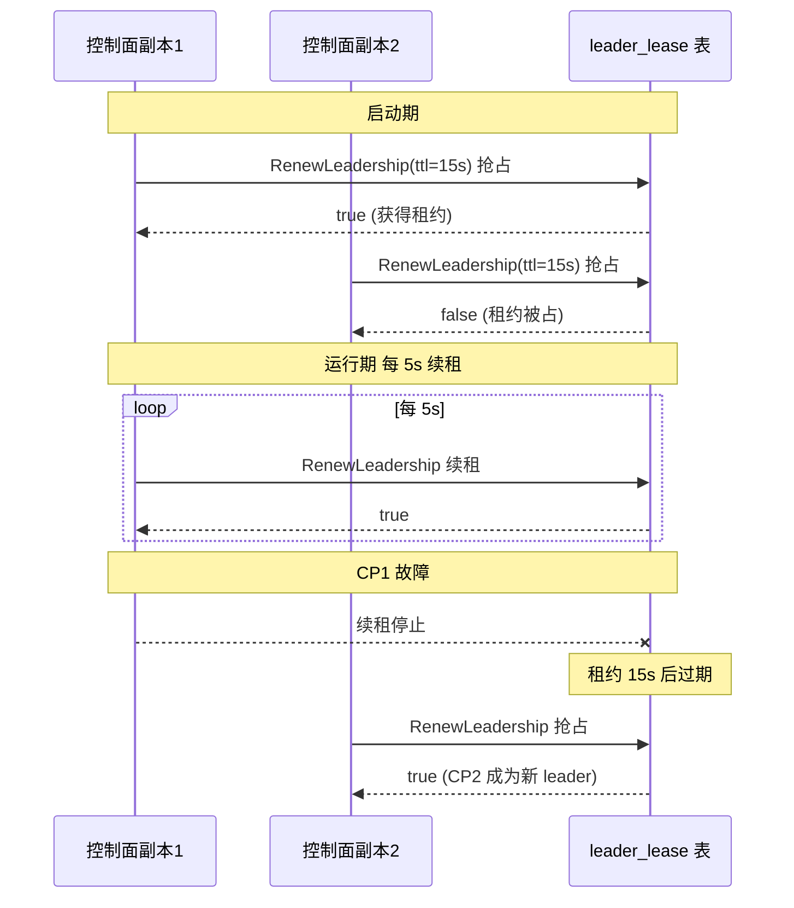
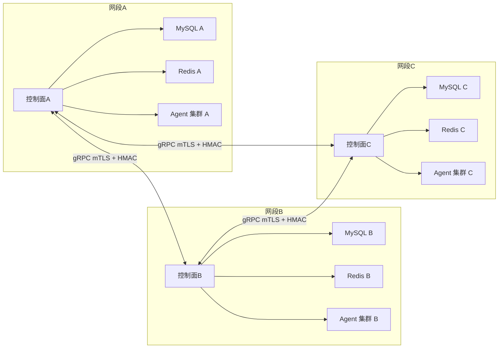

# OpsMesh 架构设计文档

> 版本：v1.0 · 编制日期：2026-08-17 · 基线：MVP（ADR-001 Option A）+ M2 演进落地
>
> 本文档描述 OpsMesh 控制面、Agent、Store、前端与联邦的整体架构、分层职责、模块依赖、数据流、技术选型、扩展点、容量规划、高可用与多租户设计。已实现能力以 `README.md` 功能矩阵为准，规划项以 `docs/product-roadmap.md` 为准。

---

## 第1章 整体架构

### 1.1 架构总览

OpsMesh 是私有化单中心 B/S 自动化部署与运维平台。控制面以单二进制承载 HTTP/gRPC/Metrics 三端口，向下经 gRPC 通道管控 Agent 集群，向上经 HTTP/SSE 服务前端与运维生态。Store 抽象层使控制面与具体存储后端（Memory/MySQL+Redis）解耦；联邦管理器在跨网段场景下经 mTLS+HMAC 互联多个控制面。

#### 图：OpsMesh 整体架构图（Mermaid）



### 1.2 通信通道

#### 表：OpsMesh 通信通道对照表

| 通道 | 协议 | 端口 | 用途 | 安全 |
|---|---|---|---|---|
| 注册 | gRPC（JSON codec） | 9090 | agent 上报元信息，服务端盖章租户、分配 agentID | mTLS + HMAC 签名 |
| 心跳 | gRPC | 9090 | agent 每 10s 上报在线状态与负载 | mTLS |
| 拉任务 | gRPC | 9090 | agent 原子领取 pending 任务（多副本安全） | mTLS + HMAC |
| 上报结果 | gRPC | 9090 | 任务执行完毕回写 stdout/stderr/exitCode | mTLS + HMAC |
| 取消信号 | gRPC | 9090 | agent 轮询 PollCancels，立即中止正在执行的任务 | mTLS |
| 仪表盘 | HTTP | 8080 | B/S 看板：设备/任务/告警/审计/纳管操作 | JWT/Cookie + 头注入 |
| SSE 事件 | HTTP | 8080 | 实时推送任务状态/告警/设备上下线 | 同上 |
| 指标 | HTTP | 9091 | Prometheus 文本格式观测指标 | CIDR 白名单 |
| 联邦 | gRPC（mTLS） | 9090 | 跨控制面任务转发/设备视图同步 | mTLS + HMAC 共享密钥 |

### 1.3 部署形态

OpsMesh 以单二进制双模式（`--mode=controlplane|agent`）承载两种角色，配合部署编排形成多种形态：

#### 表：OpsMesh 部署形态对照表

| 形态 | 控制面 | Agent | Store | 适用场景 |
|---|---|---|---|---|
| 单机体验 | 1 副本 | 1 个 | memory | 本地演示、30 秒启动 |
| docker-compose | 1 副本 | 1 个 | mysql + redis | 一键体验完整闭环 |
| 生产单中心 | 多副本 | DaemonSet | mysql + redis | 私有化单网段运维 |
| 联邦多中心 | 每网段一套 | DaemonSet | 各自 mysql + redis | 跨网段规模化 |
| K8s Helm | Deployment + PDB | DaemonSet | StatefulSet | 云原生部署 |

---

## 第2章 分层设计

OpsMesh 采用四层架构：表现层、API 层、领域层、基础设施层。层间依赖单向向下，跨层调用经接口抽象解耦。

### 2.1 表现层（前端）

#### 2.1.1 Vue3 企业版（主线）

位于 `web/enterprise/`，技术栈 Vue3 + Vite + Pinia + VueRouter + i18n。构建产物经 Go `embed` 内嵌进控制面单二进制，访问路径 `/enterprise/`。

职责边界：
- 调用控制面 REST API 完成设备/任务/告警/审计/CMDB/作业流/部署等全部业务交互
- 经 SSE 客户端（`api/sse.js`）订阅 10 种事件契约，事件驱动刷新替代轮询
- 持有设计 token（颜色/间距/圆角/阴影/字号）作为唯一视觉契约
- 路由级懒加载 + Pinia 状态管理 + i18n 中英切换

#### 2.1.2 原生 JS 引导页（已收敛）

位于 `internal/controlplane/web/`，业务 JS（1.3 万行）已移除，`GET /` 仅返回引导页重定向 `/enterprise/`（v0.6.1 落地）。bootstrap 端点（`/install.sh`、`/bin/opsmesh-agent`）保留供 agent 纳管闭环使用。

### 2.2 API 层（controlplane HTTP/gRPC handler）

位于 `internal/controlplane/`，是控制面的"薄编排层"。`Server` 结构体聚合各功能 Handler 与基础设施依赖，`NewServer` 完成全部构造，`Start` 启动 HTTP/gRPC/Metrics 三监听器与后台 loop。

职责边界：
- HTTP 路由注册：仪表盘、设备、任务、告警、审计、CMDB、作业流、部署、日志、用户中心、RBAC、配额、联邦等 116 个 flag 控制的全部端点
- gRPC 服务实现：`Registration` 服务的 Register/Heartbeat/PullTasks/ReportResult/CancelTask/PollCancels 六方法
- 中间件链：鉴权（JWT/头注入）→ 限流（IP 令牌桶）→ 审计切面 → 租户隔离 → CORS → 请求日志
- 后台 loop：leaderLoop / notifyLoop / autoProvisionLoop / reconcileLoop / scheduleLoop / archiveLoop / reclaimLoop / cancelLoop / alertEngineLoop / cmdbCollector.Run
- SSE 推送：`eventSubs` 订阅者集合 + 非阻塞广播（慢消费者丢事件防拖垮）

### 2.3 领域层（domain）

位于 `internal/domain/`，承载纯领域模型与防腐层 mapper。M2 演进已将部分业务行为下沉到领域实体：

#### 表：领域实体与已下沉行为对照表

| 领域实体 | 已下沉业务行为 |
|---|---|
| `Task` | 状态机迁移（pending→running→done/failed/cancelled）、`Cancel` 取消拦截、`CanRetry` 重试资格判定 |
| `Device` | `TransitionToProvisioning` 纳管状态翻转（discovered→provisioning→onboarded） |
| `Alert` | `Acknowledge` 确认状态机、`Silence` 静默状态机 |
| `Tenant` | 租户校验、越权判定、资源归属断言 |
| `Schedule` | cron 触发判定、派生实例幂等防重复 |
| `Workflow` | DAG 节点就绪判定、子工作流展开、并行/串行/条件分支 |

防腐层 mapper 保留在 domain 包边界，负责 `proto.Task` ↔ `store.Task` ↔ `domain.Task` 互转。controlplane handler 退化为薄编排层，仅做参数解析与领域方法调用。

### 2.4 基础设施层

#### 2.4.1 store（持久化抽象）

位于 `internal/store/`，定义可插拔 Store 接口与两种实现：
- `MemoryStore`：内存实现，零依赖，单实例/demo/测试用
- `SQLStore`：MySQL + Redis 实现，生产私有化用
- `SessionStore`：会话状态后端，`InProcessSessionStore`（单副本）或 `RedisSessionStore`（多副本 HA）

接口按领域拆分为 17 个小接口（详见第4章），消费方按需依赖最小接口。

#### 2.4.2 agent（执行引擎）

位于 `internal/agent/`，部署到每台纳管设备。职责：
- worker pool 并发执行 shell/systemctl/文件分发任务
- `exec.CommandContext` 超时自动中止 + rlimit 资源限额
- cancelLoop 每 2s 轮询 PollCancels，命中即取消 worker context
- gRPC 客户端长连接池（B-4）+ 多控制面 failover 轮询重连
- 平台支持：Linux 正式支持；Windows/macOS 仅可编译，未提供执行能力

#### 2.4.3 k8s（多集群连接管理）

位于 `internal/k8s/`，`ClusterManager` 管理多个 K8s 集群连接（client-go Clientset）。控制面重启后从 store 加密 kubeconfig 重建连接；用户创建/更新/删除/测试连接时同步维护。

#### 2.4.4 其它基础设施包

| 包 | 职责 |
|---|---|
| `grpcx` | gRPC 通道封装（JSON codec + pb stub 双轨） |
| `config` | 116 个 flag + 环境变量兜底 + 生产模式校验 |
| `tlsutil` | TLS 证书热重载 + 联邦 mTLS 配置 |
| `secrets` | SecretProvider（env/file/vault/chain） |
| `otelx` | OpenTelemetry 链路追踪初始化 |
| `metrics` | Prometheus 文本指标 |
| `logx` | 结构化日志封装 |
| `events` | 可插拔事件总线（noop/log/kafka） |
| `circuitbreaker` | 熔断器 |

---

## 第3章 模块依赖关系

### 3.1 internal/ 包职责与依赖

#### 表：internal 包职责与依赖对照表

| 包 | 职责 | 主要依赖（internal） | 主要外部依赖 |
|---|---|---|---|
| `agent` | agent 执行引擎：worker pool/cancelLoop/gRPC 客户端 | config, grpcx, proto, logx, tlsutil | grpc, os/exec |
| `alertengine` | 告警规则引擎 + 静默器 + 聚合器 + 抑制器 + 异常检测 | proto, logx | — |
| `approval` | 审批引擎：审批流定义 + 状态机 | logx | — |
| `authctx` | 鉴权上下文：从请求头/JWT 提取身份 | proto, logx | — |
| `circuitbreaker` | 熔断器 | — | — |
| `cmdb` | CMDB 处理器：模型/实例 CRUD + 采集 | store, proto, logx | — |
| `config` | 配置层：flag + env + Validate | logx | — |
| `controlplane` | 控制面：HTTP/gRPC/Metrics + 路由 + 后台 loop | 几乎全部 internal 包 | grpc, net/http, embed |
| `cron` | 定时任务管理器：ScheduleEntry CRUD + 暂停/恢复 | logx | robfig/cron |
| `dag` | DAG 引擎：节点就绪判定 + 拓扑排序 | logx | — |
| `deploy` | 部署中心：计划 + fan-out + Reconcile + Rollback + 蓝绿/金丝雀 | store, proto, logx | — |
| `discover` | 网段发现：TCP 存活扫描 | proto, logx | net |
| `discovery` | 服务发现：DiscoveryBalancer | logx | — |
| `domain` | 领域模型 + 防腐层 mapper | proto, store | — |
| `events` | 事件总线：noop/log/kafka | logx | kafka-go |
| `grpcx` | gRPC 封装：JSON codec + pb stub + 身份签名 | proto, logx | grpc |
| `helm` | Helm 应用商店：RepoManager + ReleaseManager | logx | os/exec（helm CLI） |
| `k8s` | K8s 多集群：ClusterManager + client-go | logx | k8s.io/client-go |
| `logstore` | 日志检索：Memory/SQL/Loki/ES 多后端 + 倒排索引 | store, proto, logx | — |
| `logx` | 结构化日志 | — | log/slog |
| `metrics` | Prometheus 文本指标 | — | — |
| `notify` | 告警通知：多通道 + 模板 + 去重 + 重试 + 聚合 | secrets, logx | — |
| `orchestration` | 作业编排：DAG 执行 + 子工作流 + 并行/串行/条件 | store, dag, proto, logx | — |
| `otelx` | OpenTelemetry 初始化与关闭 | logx | otel |
| `proto` | 通信结构体：AgentInfo/Task/TaskResult/Alert/AuditEvent 等 | — | — |
| `provision` | 自动纳管：install token 签发 + bootstrap 脚本 | store, proto, logx | — |
| `secrets` | SecretProvider：env/file/vault/chain | logx | — |
| `store` | 持久化抽象 + MemoryStore + SQLStore + SessionStore | proto, logx, events | database/sql, redis |
| `tlsutil` | TLS 工具：证书热重载 + mTLS 配置 | logx | crypto/tls, fsnotify |
| `version` | 版本信息 | — | — |

### 3.2 依赖方向约束



约束：
- `proto` 是最底层包，无 internal 依赖（仅标准库）
- `store` 仅依赖 `proto`，不依赖 controlplane/domain（避免循环）
- `domain` 依赖 `proto` + `store` 接口（不依赖实现）
- `controlplane` 是顶层编排，可依赖一切
- `agent` 与 `controlplane` 互不依赖（分别编译进同一二进制的不同模式）

---

## 第4章 Store 接口拆分

### 4.1 拆分背景

原 `Store` 接口聚合 40+ 方法，违反接口隔离原则（ISP）。M2-1A 演进将其拆为 17 个领域小接口，`Store` 保留为组合接口向后兼容。编译期断言确保 `MemoryStore` 与 `SQLStore` 均实现全部小接口。

### 4.2 领域小接口清单

#### 表：Store 领域小接口对照表

| 接口 | 职责 | 方法数 | 主要消费方 |
|---|---|---|---|
| `DeviceStore` | 设备 CRUD、纳管状态翻转、退役归档、监控指标 | 14 | controlplane 设备路由、discover、archiveLoop |
| `TaskStore` | 任务 CRUD、ClaimTask、结果回写、死信、取消、定时派生、审批 | 16 | controlplane 任务路由、agent 上报、reclaimLoop、scheduleLoop |
| `AlertStore` | 告警 CRUD、Ack、Silence、规则 CRUD | 10 | controlplane 告警路由、notifyLoop、alertEngineLoop |
| `AuditStore` | 审计事件写入与查询 | 3 | authctx、所有写操作切面 |
| `TokenStore` | install token 签发、登记、消费、清理 | 4 | provision 路由、agent 注册 |
| `LeaderStore` | leader 租约续租与查询 | 2 | leaderLoop |
| `UserStore` | 用户 CRUD、改密 | 7 | auth 路由、用户管理 |
| `RoleStore` | 角色 CRUD | 5 | RBAC 路由 |
| `PermissionStore` | 权限列表（只读） | 1 | RBAC 路由 |
| `K8sClusterStore` | K8s 集群配置 CRUD | 4 | k8s 路由、ClusterManager 恢复 |
| `TemplateStore` | OS/中间件部署模板 CRUD | 8 | 模板路由、自动纳管 |
| `RefreshTokenStore` | 刷新令牌 Save/Get/Delete/Consume | 4 | auth 续期 |
| `SilenceStore` | 静默规则 CRUD（标签匹配 + 时间窗口） | 4 | 告警静默路由 |
| `NotifyChannelStore` | 通知渠道 CRUD（钉钉/飞书/Slack/邮件/Webhook） | 5 | 通知渠道路由 |
| `NotifyTemplateStore` | 通知模板 CRUD | 5 | 通知模板路由 |
| `AgentLogStore` | agent 日志上报落库 + 检索 | 2 | 日志上报 gRPC、日志检索路由 |
| `QuotaStore` | 租户配额 Get/Set | 2 | QuotaManager |

### 4.3 组合接口

```go
type Store interface {
    DeviceStore
    TaskStore
    AlertStore
    AuditStore
    TokenStore
    LeaderStore
    UserStore
    RoleStore
    PermissionStore
    K8sClusterStore
    TemplateStore
    RefreshTokenStore
    SilenceStore
    NotifyChannelStore
    NotifyTemplateStore
    AgentLogStore
    QuotaStore

    WithDemo(bool) Store
}
```

### 4.4 编译期断言

`store.go` 末尾对 `MemoryStore` 与 `SQLStore` 各 17 个小接口 + `Store` 组合接口做编译期断言（`_ DeviceStore = (*MemoryStore)(nil)` 等），任一方法缺失在编译期立即暴露，降低拆分消费方时的回归风险。

---

## 第5章 数据流

### 5.1 设备纳管→心跳→任务→回执→告警→通知 完整数据流

#### 图：OpsMesh 核心数据流流程图（Mermaid）

```mermaid
sequenceDiagram
    autonumber
    participant Op as 运维操作员
    participant CP as 控制面
    participant Store as Store(MySQL+Redis)
    participant Agent as Agent
    participant Notify as 通知通道
    participant Bus as 事件总线

    Note over Op,Store: 阶段1 设备纳管
    Op->>CP: POST /api/v1/devices/{id}/provision
    CP->>Store: TokenStore.Provision(deviceID,host,tenantID)
    Store-->>CP: installToken + bootstrap
    CP-->>Op: {installToken, bootstrap:"curl ... | sh -s -- --token=<tok>"}
    Op->>Agent: 在目标机执行 bootstrap
    Agent->>CP: gRPC Register(installToken, hostname, segment)
    CP->>Store: TokenStore.ConsumeToken(token) 校验一次性+限时
    Store-->>CP: (deviceID, tenantID, ok)
    CP->>Store: DeviceStore.UpsertDevice(Managed=true, State=online)
    CP->>Bus: AuditEvent("device.onboarded")

    Note over Agent,Store: 阶段2 心跳
    loop 每 10s
        Agent->>CP: gRPC Heartbeat(agentID, status, load, metrics)
        CP->>Store: DeviceStore.Heartbeat + StoreDeviceMetrics
    end

    Note over Op,Agent: 阶段3 任务下发
    Op->>CP: POST /api/v1/tasks (agentID, command, maxRetries)
    CP->>Store: TaskStore.CreateTask(task) 状态=pending
    CP->>Bus: AuditEvent("task.created")

    Note over Agent,Store: 阶段4 任务领取与执行
    loop worker pool
        Agent->>CP: gRPC PullTasks(agentID)
        CP->>Store: TaskStore.ClaimTask(agentID) 原子 pending→running
        Store-->>CP: task
        CP-->>Agent: task
        Agent->>Agent: exec.CommandContext 执行 shell
        Agent->>CP: gRPC ReportResult(taskID, stdout, stderr, exitCode)
        CP->>Store: TaskStore.SubmitResult(result)
        alt exitCode=0
            Store: 状态=done
        else 失败且 retry_count<maxRetries
            Store: 复位 pending, retry_count++
        else 失败且重试耗尽
            Store: 状态=failed, dead_letter=true
            Store->>Bus: AlertEvent(critical)
        end
    end

    Note over CP,Notify: 阶段5 告警产出
    Bus-->>CP: AlertEvent(dead_letter / 阈值触发 / 异常检测)
    CP->>Store: AlertStore.AddAlert(alert)
    CP->>CP: alertSilencer.IsInhibited? 跳过
    CP->>CP: alertAggregator 聚合(同源5分钟去重)
    CP->>CP: alertInhibitor 父告警抑制子告警

    Note over CP,Notify: 阶段6 通知推送
    loop notifyLoop
        CP->>Notify: alertNotifier.Notify(alert, channels)
        Notify->>Notify: 模板渲染 + 去重 + 重试
        Notify-->>CP: 推送结果(钉钉/飞书/Slack/邮件/Webhook)
    end

    Note over CP,Op: 阶段7 前端实时推送
    CP->>Op: SSE 事件(task_status / alert_new / device_online)
```

### 5.2 任务状态机

#### 图：OpsMesh 任务状态机示意图



### 5.3 关键路径并发安全

| 路径 | 并发安全机制 |
|---|---|
| `ClaimTask` 多副本并发领取同一任务 | SQLStore 经事务 + 行锁原子翻转 pending→running；MemoryStore 经互斥锁 |
| `ConsumeRefreshToken` 多副本并发消费 | 单次原子 Get+Delete（SQLStore 事务，MemoryStore 互斥锁） |
| `RenewLeadership` 多副本续租 | `leader_lease` 表原子抢占/续租 |
| `FireDueSchedules` 多副本派生实例 | 仅 leader 执行，LastFiredAt 防同分钟重复派生 |
| SSE 广播慢消费者 | 非阻塞发送，缓冲满丢事件，避免一个慢客户端拖垮广播 |

---

## 第6章 技术选型

### 6.1 选型矩阵

#### 表：OpsMesh 技术选型对照表

| 维度 | 选型 | 选择理由 |
|---|---|---|
| 主语言 | Go 1.26 | C1 agent 零依赖单二进制（~15MB，启动 <50ms）；goroutine/channel 匹配 worker pool + context 取消；`go:embed` 内嵌前端；CGO_ENABLED=0 静态二进制；交叉编译一条命令 |
| 前端 | Vue3 + Vite + Pinia | 组合式 API + 响应式 + 路由懒加载；Vite 极速 HMR；Pinia 轻量状态管理；i18n 中英切换；构建产物经 embed 内嵌进 Go 二进制 |
| 关系数据库 | MySQL 8 | 私有化部署主流；utf8mb4 字符集；事务 + 行锁支持 ClaimTask 原子性与 leader 选举；Helm Chart 内 StatefulSet 持久化 |
| 缓存/会话 | Redis 7 | agent/device 状态缓存；多副本 SessionStore（JWT 黑名单/限流计数/改密令牌跨副本共享）；分布式协调辅助 |
| 通信协议 | gRPC + JSON codec | 五通道（注册/心跳/拉任务/上报/取消）长连接 + 流式取消；JSON codec + `__v` 版本协商（可读性好、agent 字段少时 protobuf 优势不明显）；pb stub 已生成供未来迁移 |
| K8s 客户端 | client-go | 多集群连接管理（ClusterManager）；CRD operator（远期）；Helm CLI 调用 helm 命令行 |
| 序列化 | JSON codec + pb stub 双轨 | JSON codec 是当前正式契约；pb stub 在 `internal/grpcx/pb/` 供未来 buf 工具链迁移；tech-selection §3 已记录取舍 |
| 事件总线 | noop/log/kafka 可插拔 | 默认 noop 零开销；log 供调试；kafka 供规模化异步解耦 |
| 日志后端 | Memory/SQL/Loki/ES 可插拔 | 默认 Memory 零依赖；SQL 持久化；Loki/ES 对接外部栈 |
| 链路追踪 | OpenTelemetry | HTTP + gRPC 自动埋点；trace_id 贯穿 agent→控制面→store；endpoint 空时 no-op |
| 配置 | 116 个 flag + env 兜底 | 命令行 flag 优先、`OPSMESH_` 前缀环境变量兜底；生产模式 fail-fast 校验 |
| 部署 | 单二进制 + Helm + systemd + docker-compose | 单二进制 30 秒体验；Helm Chart 17 模板生产部署；systemd 裸机；compose 一键 |

### 6.2 Go 不可替代性论证

OpsMesh 的 6 项硬约束中，C1（agent 零依赖单二进制）是杀手级价值，直接把 Python/Java/Scala 排除出 agent 端最优解：

- Python：PyInstaller 产物 30-100MB，启动 300ms+，跨平台打包不稳定
- Java：带 JRE 100MB+，native-image 配置极复杂（gRPC 反射需大量 reachability hints）
- Scala：JVM 同 Java 痛点 + 编译慢 + 运维场景无先例
- Rust：技术上更优（更小更快更安全），但开发效率折损 30-40%

详见 `docs/tech-selection.md`。

---

## 第7章 扩展点

OpsMesh 通过接口抽象提供 5 类扩展点，均无需修改控制面核心代码即可接入。

### 7.1 Store 接口扩展

#### 7.1.1 替换存储后端

实现 `store.Store` 组合接口（或单个领域小接口）即可替换后端。例如接入 PostgreSQL：

```go
// 代码示例：PostgreSQL Store 扩展（Go）
type PGStore struct { db *sql.DB }

func (s *PGStore) ClaimTask(agentID string) *proto.Task {
    // 事务 + 行锁原子翻转 pending→running
    tx := s.db.Begin()
    row := tx.QueryRowContext(ctx,
        `SELECT id, command FROM tasks
         WHERE agent_id=? AND status='pending'
         ORDER BY created_at LIMIT 1 FOR UPDATE SKIP LOCKED`, agentID)
    // ... 翻转状态、提交事务
}

// 编译期断言
var _ store.TaskStore = (*PGStore)(nil)
```

#### 7.1.2 装饰某一领域存储

按领域小接口装饰，不影响其它领域。例如给 `TaskStore` 加缓存：

```go
// 代码示例：TaskStore 缓存装饰器（Go）
type CachedTaskStore struct {
    inner store.TaskStore
    cache *lru.Cache
}

func (c *CachedTaskStore) TaskByID(taskID string) *proto.Task {
    if v, ok := c.cache.Get(taskID); ok { return v.(*proto.Task) }
    t := c.inner.TaskByID(taskID)
    c.cache.Add(taskID, t)
    return t
}
```

### 7.2 SecretProvider 扩展

`internal/secrets/` 定义 `SecretProvider` 接口，告警通道密钥经 `${key}` 引用解析。内置实现：

| Provider | 说明 |
|---|---|
| `env` | 从环境变量读取 |
| `file` | 从文件读取（权限 0600） |
| `vault` | 从 HashiCorp Vault 动态获取（远期） |
| `chain` | 多 Provider 链式查找 |

扩展自定义 Provider：实现 `SecretProvider` 接口（`Name() string` + `Get(key string) (string, error)`），在 `secrets.FromConfig` 中注册即可。

### 7.3 Notifier 扩展

`internal/notify/` 定义告警通知多通道架构。内置通道：钉钉、飞书、Slack、企业微信、邮件（SMTP）、Webhook（generic）。

扩展自定义通道：

```go
// 代码示例：自定义通知通道（Go）
type SMSChannel struct { apiURL string }

func (c *SMSChannel) Send(ctx context.Context, alert *proto.Alert, tmpl *NotifyTemplate) error {
    body := renderTemplate(tmpl, alert)
    return httpPost(ctx, c.apiURL, body)
}

// 在 notify.Channels 注册
channels.Register("sms", &SMSChannel{apiURL: cfg.SMSAPIURL})
```

配合 `NotifyTemplateStore` 创建模板（Go text/template 变量替换）、`NotifyChannelStore` 持久化渠道配置、`AlertRule.NotifyChannels` 引用渠道 ID 列表。

### 7.4 LogBackend 扩展

`internal/logstore/` 定义日志检索后端抽象。内置实现：

| Backend | 说明 |
|---|---|
| `Memory` | 内存 slice，零依赖，默认 |
| `SQL` | MySQL 持久化，独立表/连接池 |
| `Loki` | 对接 Grafana Loki（`--log-backend=loki`） |
| `Elasticsearch` | 对接 ES（`--log-backend=es`） |

扩展自定义后端：实现 `logstore.LogStore` 接口（`Query`/`Append` 等），在 `newLogHandler` 中按 `cfg.LogBackend` 路由。倒排索引（`inverted.go`）提供中英文分词 + TF-IDF 排序 + 短语/布尔/通配符查询，可复用。

### 7.5 DiscoveryBalancer 扩展

`internal/discovery/` 定义服务发现负载均衡器抽象。用于联邦 peer 选择、K8s 集群路由、网段发现等场景。

扩展自定义均衡器：实现 `DiscoveryBalancer` 接口（`Next() string` + `Update(peers []string)`），可接入 Consul/etcd/Zookeeper 等服务发现。内置轮询（round-robin）与按网段亲和（segment-affinity）两种策略。

### 7.6 扩展点汇总

#### 表：OpsMesh 扩展点对照表

| 扩展点 | 接口位置 | 内置实现 | 扩展方式 |
|---|---|---|---|
| Store | `internal/store/store.go` | MemoryStore, SQLStore | 实现领域小接口或组合接口 |
| SecretProvider | `internal/secrets/` | env, file, vault, chain | 实现 SecretProvider 接口 + FromConfig 注册 |
| Notifier | `internal/notify/` | 钉钉/飞书/Slack/企业微信/邮件/Webhook | 实现 Channel 接口 + Channels.Register |
| LogBackend | `internal/logstore/` | Memory, SQL, Loki, ES | 实现 LogStore 接口 + newLogHandler 路由 |
| DiscoveryBalancer | `internal/discovery/` | round-robin, segment-affinity | 实现 DiscoveryBalancer 接口 |
| EventBus | `internal/events/` | noop, log, kafka | 实现 Bus 接口 + New 工厂路由 |
| AlertEngine | `internal/alertengine/` | 规则引擎 + 异常检测 + 抑制 | 实现 Evaluator 接口注入 Engine |

---

## 第8章 容量规划

### 8.1 单控制面容量估算

基于 Go goroutine 调度、gRPC 长连接、MySQL 行锁、Redis 缓存的特性，单控制面（4C8G，MySQL 8C16G，Redis 4C8G）的容量估算：

#### 表：单控制面容量估算表

| 维度 | 估算值 | 依据 |
|---|---|---|
| 纳管设备数 | 10,000 台 | agent 每 10s 心跳一次，10k agent → 1000 QPS 心跳；gRPC 长连接复用，单连接承载心跳+拉任务+上报；Go goroutine per-connection 模型轻松支撑 |
| 并发 gRPC 连接 | 10,000+ | Go net/http2 多路复用，每 agent 一连接；fd 上限调 ulimit -n 65535 |
| 任务下发吞吐 | 1,000 tasks/s | CreateTask 单 INSERT，MySQL 行锁无瓶颈；批量下发逐台查找 agent + 租户校验 |
| 任务领取吞吐 | 5,000 ClaimTask/s | `SELECT ... FOR UPDATE SKIP LOCKED` 原子翻转，单事务 <1ms；agent worker pool 并发领取 |
| 任务回执吞吐 | 5,000 ReportResult/s | SubmitResult 单 UPDATE + 可能的告警产出；异步经事件总线解耦 |
| 告警评估频率 | 100 rules × 10s 周期 | alertEngineLoop 周期评估，规则数 × 设备数 × 指标数；超阈值产出 AlertEvent |
| 告警通知吞吐 | 100 alerts/min | notifyLoop 5 分钟去重 + 聚合 + 多通道推送；邮件 SMTP 串行限速 |
| SSE 连接数 | 1,000+ | 每个 SSE 连接一 buffered chan；慢消费者丢事件防拖垮；非阻塞广播 |
| 审计写入 | 5,000 events/s | Audit 单 INSERT；等保三级 6 月留存需定期归档冷存储 |
| 后台 loop 周期 | 5-60s | leaderLoop 5s / reclaimLoop 60s / scheduleLoop 60s / archiveLoop 300s / cmdbCollector 300s |

### 8.2 瓶颈与扩容路径

#### 表：OpsMesh 容量瓶颈与扩容路径对照表

| 瓶颈点 | 触发阈值 | 扩容路径 |
|---|---|---|
| 控制面 CPU | 心跳 + ClaimTask CPU > 70% | 水平扩控制面副本（共享 MySQL，leader 选举协调） |
| MySQL 连接数 | > max_connections | 调连接池 + 读写分离（远期） |
| MySQL 写入 | 审计/任务回执写入瓶颈 | 审计分表/分库 + 异步批量写入；任务回执经事件总线异步 |
| Redis 内存 | SessionStore + 状态缓存增长 | 调 maxmemory + LRU 淘汰 + 分片 |
| gRPC 连接数 | fd 上限 | 调 ulimit + 连接复用（B-4 长连接池） |
| 告警通知 | SMTP/Webhook 限速 | 多通道并行 + 限速器 + 聚合去重降量 |
| 单网段设备数 | > 10,000 | 拆分网段 + 联邦多控制面 |

### 8.3 联邦规模化

单网段超过 10,000 设备时，按网段拆分多控制面，经联邦互联：

- 每网段一套控制面 + 独立 MySQL/Redis
- 联邦经 mTLS + HMAC 共享密钥互联
- 跨网段任务转发：`FederationManager` 经 peer 列表转发
- 联邦设备视图：聚合各 peer 设备清单
- 联邦级发布：`FederationCoordinator` 跨集群灰度协调

理论规模：N 个网段 × 10,000 设备/网段 = N×10,000 设备，控制面间无共享存储，联邦仅转发任务与视图同步。

---

## 第9章 高可用设计

### 9.1 Leader 选举

多副本控制面共享同一 MySQL（`leader_lease` 表）做分布式选主：

#### 图：OpsMesh Leader 选举时序图



- 每个进程启动时生成唯一 `instanceID = hostname-pid-nanotimestamp`
- `leaderLoop` 每 5s 续租（默认 15s TTL，`--leader-ttl-sec` 可调）
- 仅 leader 执行周期性协调任务：`reclaimLoop`、`scheduleLoop`、`archiveLoop`、`autoProvisionLoop`、`cmdbCollector`
- 非leader副本仍服务 HTTP/gRPC 读写请求（无状态转发），仅跳过协调任务
- MemoryStore 单实例恒为 leader；config 已拒绝 `memory+replicas>1`

### 9.2 多控制面 Agent 端 Failover

Agent 端经 `--control-addrs="cp1:9090,cp2:9090"` 配置多控制面地址，客户端按序重连：

- B-4 长连接池：进程启动建立一次 `grpc.ClientConn`，所有 RPC 复用
- 连接断开后自动重连而非每次新建
- 多地址按序重试，实现 HA failover
- 断线日志分级（evictConn WARN）+ 故障指标化（`agent_grpc_conn_failures` expvar）

### 9.3 联邦高可用

#### 图：OpsMesh 联邦架构图



- 每网段独立控制面 + 独立 MySQL/Redis，无共享存储
- 联邦经 mTLS + HMAC 共享密钥互联（`--federation-secret`）
- 跨网段任务转发：用户下发任务到本网段控制面，本网段无目标 agent 时经联邦转发到目标网段
- 联邦设备视图：聚合各 peer 设备清单
- 单网段控制面故障不影响其它网段（故障域隔离）
- 联邦 peer 故障：本网段仍独立运行，仅跨网段转发不可用

### 9.4 数据备份与恢复

#### 表：OpsMesh 数据备份策略对照表

| 数据 | 备份方式 | RPO | RTO |
|---|---|---|---|
| MySQL 业务数据 | mysqldump / xtrabackup 定期全量 + binlog 增量 | 5 分钟 | 30 分钟 |
| Redis 会话/缓存 | RDB 快照 + AOF（缓存丢失可重建，RPO 宽松） | 15 分钟 | 5 分钟 |
| TLS 证书 | Secret 持久化 + cert-manager 轮转 | 0（轮转不丢） | 即时 |
| 审计日志 | 6 月留存 + 定期归档冷存储 | 0（归档不删） | 按需导出 |
| agent 身份 | `--data-dir` 落盘 agent.id，重启沿用 | 0 | 即时 |

恢复流程：
1. MySQL：恢复全量备份 + 重放 binlog 到故障点
2. Redis：恢复 RDB（缓存可丢失，会话重新登录）
3. 控制面：重启后从 store 加密 kubeconfig 重建 K8s 集群连接
4. Agent：保持本地 agent.id，重连控制面即可

### 9.5 优雅退出

`Start` 经 ctx.Done() 协调优雅退出：
- HTTP/gRPC/Metrics 监听器 Shutdown（等待 in-flight 请求完成）
- 后台 loop goroutine 经 ctx 取消退出（避免泄漏）
- OTel flush 残留 span（5s 超时）
- TLS reloader Close 释放 watcher
- `--shutdown-timeout` 控制总退出窗口

---

## 第10章 多租户架构

### 10.1 租户隔离模型

OpsMesh 提供两级租户隔离：行级隔离（默认）与 schema 级隔离（重租户）。

#### 10.1.1 行级隔离（默认）

所有业务表含 `tenant_id` 列，查询/写入按 `X-Tenant-ID` 头自动过滤：

- 设备/任务/告警/审计/CMDB/作业流/部署/日志全部有 `tenant_id`
- Store 层查询方法签名含 `tenantID` 参数：`Snapshot(tenantID)` / `AllTasks(tenantID)` / `Alerts(tenantID)` 等
- 越权返回 403/404
- `--require-auth` 开启时，缺失 `X-Tenant-ID` 的请求被直接拒绝（401）

#### 10.1.2 Schema 级隔离（重租户）

`--multi-schema` 开启时，每租户路由到独立 MySQL schema：

- schema 名 = `--schema-prefix` + tenantID（默认前缀 `opsmesh_tenant_`）
- 仅 `--store=mysql` 时生效
- 适合重租户场景：合规要求严格数据物理隔离、单租户数据量大、租户间无交叉查询

#### 表：OpsMesh 租户隔离模式对照表

| 模式 | 隔离强度 | 性能影响 | 适用场景 |
|---|---|---|---|
| 行级隔离（默认） | 逻辑隔离（共享表，tenant_id 过滤） | 低（索引覆盖） | 中小租户多、租户间有聚合查询 |
| Schema 隔离 | 物理隔离（独立 schema） | 中（连接池按租户） | 重租户、合规要求物理隔离 |

### 10.2 身份路径

OpsMesh 提供两条身份路径，可同时启用（网关头优先）：

#### 10.2.1 路径 A：内置用户中心（默认主线）

OpsMesh 自带注册/登录/RBAC（用户/角色/权限三表），登录签发 JWT 双 Token：
- Access Token（短时）+ Refresh Token（长时，HttpOnly Cookie）
- AT 过期后凭 RT 无感续期（`ConsumeRefreshToken` 原子消费防重放）
- DeviceFP 校验：RT 仅在原签发设备使用（防跨设备重放）
- 多副本经 Redis SessionStore 共享 JWT 黑名单（登出全局生效）
- `--jwt-secret` HS256 签发密钥，多副本必须一致

#### 10.2.2 路径 B：网关注入身份头（企业集成）

已有 APISIX/Envoy 统一认证网关时，由网关校验后注入身份头：

```
客户端 → APISIX/Envoy (auth 校验) → OpsMesh 控制面
                │
                ├─ X-Tenant-ID: t1
                ├─ X-User-Id: u-001
                └─ X-User-Roles: admin,ops
```

#### 10.2.3 B1 令牌闭环例外

Agent 首次注册时携带一次性 install token（HMAC-SHA256 签名），服务端 `ConsumeToken` 校验通过后从 token 中提取租户，不依赖网关身份头（新安装的 agent 尚不知道其网关租户身份）。

### 10.3 RBAC

用户中心三表模型：

#### 表：OpsMesh RBAC 模型对照表

| 表 | 字段 | 说明 |
|---|---|---|
| `users` | id, username, password_hash(bcrypt), email, roles, status, must_change_password | 用户基本信息 + 角色引用 |
| `roles` | id, name, description, permissions | 角色定义 + 权限引用 |
| `permissions` | id, name, group | 预定义权限（只读，按组分类） |

权限校验：API 层中间件从 `X-User-Roles`（头注入）或 JWT claims 提取角色，按路由所需权限校验。MVP 记录占位，供网关级 RBAC 消费；内核侧 JWT 验签（`--jwt-public-key`）已支持。

### 10.4 配额与计费

`QuotaManager`（`--quota-enabled` 开启）提供租户级资源配额检查与用量统计：

#### 表：OpsMesh 租户配额配置说明表

| 配额项 | flag | 默认值 | 检查点 |
|---|---|---|---|
| 最大设备数 | `--quota-max-devices` | 0（不限） | 设备纳管时 `CheckDevice` |
| 最大任务数 | `--quota-max-tasks` | 0（不限） | 任务下发时 `CheckTask` |
| 最大告警数 | `--quota-max-alerts` | 0（不限） | 告警产出时 `CheckAlert` |

- 配额配置经 `QuotaStore` 持久化（`quota_configs` 表，按 tenantID 幂等 upsert）
- API 路由 `/api/v1/quotas[/{tenantID}]` 查询用量与设置配额
- 超额返回 `ErrQuotaExceeded`，API 层转 429 状态码
- 计费 API 基于用量统计输出（远期产品化）

### 10.5 安全加固

#### 表：OpsMesh 多租户安全加固对照表

| 加固项 | 现状 | 配置 |
|---|---|---|
| gRPC mTLS | ✅ 已支持 | `--tls-cert` / `--tls-key` / `--client-ca` |
| gRPC HMAC 签名 | ✅ 已支持 | `--grpc-signature-key` + `--grpc-require-signature` |
| JWT 验签 | ✅ 已支持 | `--jwt-public-key`（RS256 公钥 PEM） |
| 生产模式 fail-fast | ✅ 已支持 | `--production`（require-auth 默认开，store=memory 强告警，密钥长度校验） |
| kubeconfig 加密 | ✅ 已支持 | `--encryption-key`（AES-256-GCM，32 字节） |
| 登录防爆破 | ✅ 已支持 | `loginGuard` 失败计数 + 账号锁定 + IP 令牌桶限流 |
| Cookie Secure | ✅ 已支持 | `--cookie-secure`（生产默认 true） |
| 信任代理 | ✅ 已支持 | `--trust-proxy`（默认 false 防 XFF 伪造） |
| Metrics CIDR 白名单 | ✅ 已支持 | `--metrics-allow-cidr` |
| Agent shell 白名单 | ✅ 已支持 | `--agent-shell-whitelist` |
| Agent file 根目录白名单 | ✅ 已支持 | `--agent-file-root-whitelist` |
| 联邦 mTLS + HMAC | ✅ 已支持 | `--federation-tls-*` + `--federation-secret` |
| TLS 证书热重载 | ✅ 已支持 | `--tls-watch`（P2-B3） |

---

## 第11章 关键设计决策

### 11.1 单二进制双模式

控制面与 agent 编译进同一二进制，经 `--mode=controlplane|agent` 切换。优势：
- 一次构建覆盖两种角色，CI/CD 简化
- agent 零依赖分发（curl ... | sh 拉取单二进制）
- 内核代码共享，避免分叉

### 11.2 MemoryStore 与 SQLStore 双后端

- MemoryStore：零依赖启动，30 秒体验，单实例/demo/测试用
- SQLStore：MySQL + Redis，生产私有化用
- `--store=memory|mysql` 切换，接口层透明
- 生产模式（`--production`）下 MySQL 初始化失败 fail-fast，不静默回退 memory（避免数据分裂）

### 11.3 JSON codec 与 pb stub 双轨

- JSON codec 是当前正式契约（`__v` 版本协商，可读性好，agent 字段少时 protobuf 优势不明显）
- pb stub 在 `internal/grpcx/pb/` 已生成，供未来 buf 工具链迁移
- tech-selection §3 已记录取舍：当前双轨并存是正确选择，若出现 Python agent 或 protoc 工具链成熟再迁移

### 11.4 前端收敛而非分叉

- Vue3 企业版为唯一主线，所有新功能在此开发
- 原生 JS 个人版 v0.6.1 已收敛为引导页，v0.4.0 移除
- 内核（Go）共享同一 codebase，通过 flag 切换形态
- 部署形态与前端版本正交

### 11.5 事件总线可插拔

- 默认 noop 零开销
- log 供调试
- kafka 供规模化异步解耦（agent 上报日志高频写入不宜直接落 MySQL）
- 经 `--event-bus=noop|log|kafka` 切换

---

## 附录 A：相关文档索引

| 文档 | 说明 |
|---|---|
| `README.md` | 项目总览、功能矩阵、快速启动、生产部署、API 速查、配置参考 |
| `DELIVERY.md` | 交付说明、ADR 决策记录 |
| `docs/product-roadmap.md` | 产品方向与演进路线图、里程碑规划、DoD 验收标准 |
| `docs/tech-selection.md` | 技术选型分析：Go 是否不可替代、混合编程方案、工作量估算 |
| `docs/deployment-guide.md` | 部署指南（控制面/agent/企业版前端各场景） |
| `docs/sse-protocol.md` | SSE 事件契约（10 种事件） |
| `internal/store/store.go` | Store 接口拆分定义（17 个领域小接口 + 编译期断言） |
| `internal/controlplane/server.go` | 控制面 Server 结构体与 NewServer 构造逻辑 |

---

## 附录 B：术语表

| 术语 | 说明 |
|---|---|
| 控制面（controlplane） | OpsMesh 服务端，承载 HTTP/gRPC/Metrics 三端口 |
| Agent | 部署到每台纳管设备的执行引擎，单二进制零依赖 |
| Store | 持久化抽象层，MemoryStore/SQLStore 双实现 |
| 联邦（Federation） | 多控制面经 mTLS+HMAC 互联，跨网段任务转发与视图同步 |
| 纳管（Provision） | 候选设备经 install token 闭环转为正式管理设备 |
| 死信（Dead Letter） | 任务失败且重试耗尽的状态，产出 critical 告警 |
| Leader 选举 | 多副本控制面经 `leader_lease` 表分布式选主 |
| 行级隔离 | 业务表含 tenant_id 列，查询自动过滤 |
| Schema 隔离 | 每租户独立 MySQL schema，物理隔离 |
| SSE | Server-Sent Events，控制面实时推送事件到前端 |
| B1 令牌闭环 | agent 首次注册经 install token 提取租户，不依赖网关身份头 |
| DeviceFP | 设备指纹，refresh token 仅在原签发设备使用防重放 |