# OpsMesh 数据库设计文档

> 项目：OpsMesh 控制面持久化层
> 后端：MySQL 8.0+（权威存储）+ Redis（缓存）
> 迁移框架：`internal/store/migrations/` 版本化 SQL 迁移（`runMigrations`）
> 文档版本：v1.0 / 2026-08-17
> 范围：`internal/store`、`internal/orchestration`、`internal/deploy`、`internal/logstore` 全部建表 DDL

---

## 第 1 章 总览

### 1.1 存储后端

| 后端 | 角色 | 用途 |
| --- | --- | --- |
| MySQL 8.0+ | 权威存储 | 全部业务表、跨副本一致性强语义（行锁 / `FOR UPDATE` / `ON DUPLICATE KEY UPDATE`） |
| Redis | 状态缓存 | `opsmesh:agents` Hash（agent 状态/负载）；MVP 仅写缓存，读仍走 MySQL |
| 嵌入式 embed.FS | 迁移载体 | `//go:embed migrations/*.sql` 编译期打包迁移文件 |

连接池策略（`NewSQLStore`）：单 schema 上限 `MaxOpenConns=50` / `MaxIdleConns=10` / `ConnMaxLifetime=30m`；多租户 schema 隔离下总连接数 = 租户数 × 50，须配合 MySQL `max_connections` 容量规划。DSN 强制 `parseTime=true`，便于 `DATETIME` 列直接 Scan 进 `time.Time`。

### 1.2 表清单（共 29 张表）

| # | 表名 | 领域 | 主键 | 来源迁移 |
| --- | --- | --- | --- | --- |
| 1 | `agents` | 设备管理 | `agent_id` | 001 |
| 2 | `devices` | 设备管理 | `device_id` | 001 |
| 3 | `tasks` | 任务管理 | `task_id` | 001 / 002 |
| 4 | `task_results` | 任务管理 | `task_id` | 001 |
| 5 | `alerts` | 告警管理 | `id` (自增) | 001 |
| 6 | `alert_rules` | 告警管理 | `id` | 001 / 003 / 005 |
| 7 | `alert_silences` | 告警管理 | `id` | 005 |
| 8 | `notify_channels` | 告警管理 | `id` | 005 |
| 9 | `notify_templates` | 告警管理 | `id` | 005 |
| 10 | `users` | 用户权限 | `id` | 001 |
| 11 | `roles` | 用户权限 | `id` | 001 |
| 12 | `permissions` | 用户权限 | `id` | 001 |
| 13 | `refresh_tokens` | 用户权限 | `token_hash` | 001 / 003 |
| 14 | `install_tokens` | 用户权限 | `token` | 001 |
| 15 | `audit_log` | 审计 | `id` (自增) | 001 / 004 |
| 16 | `quota_configs` | 配额 | `tenant_id` | 006 |
| 17 | `k8s_clusters` | K8s | `id` | 001 |
| 18 | `ci_types` | CMDB | `id` (自增) | 001 |
| 19 | `ci_items` | CMDB | `id` | 001 |
| 20 | `ci_relations` | CMDB | `id` (自增) | 001 |
| 21 | `ci_attr_templates` | CMDB | `id` (自增) | 001 |
| 22 | `deploy_tasks` | 部署 | `id` (自增) | `deploy/sql.go` |
| 23 | `workflow_defs` | 编排 | `id` (自增) | `orchestration/sql.go` |
| 24 | `workflow_runs` | 编排 | `id` (自增) | `orchestration/sql.go` |
| 25 | `os_templates` | 模板 | `id` | 001 / 003 |
| 26 | `middleware_templates` | 模板 | `id` | 001 / 003 |
| 27 | `log_entries` | 日志检索 | `id` (自增) | `logstore/sql.go` |
| 28 | `schema_migrations` | 迁移元 | `version` | `sql.go` 运行期 |
| 29 | `leader_lease` | 领导权 | `id` (=1 单行) | 001 |

> 说明：任务书提及的 `agent_logs / sessions / audit_events / ci_instances / deployments / release_records / workflows / middleware_instances / silence_rules` 在当前代码中**不存在**或**已更名**：
> - `agent_logs` → `SQLStore` 采用内存 slice 暂存（`sql_agent_logs.go`），检索侧由 `logstore.log_entries` 表承担；
> - `silence_rules` → 实际表名 `alert_silences`；
> - `audit_events` → 实际表名 `audit_log`；
> - `ci_instances` → 实际表名 `ci_items`；
> - `deployments` → 实际表名 `deploy_tasks`；
> - `workflows` → 实际表名 `workflow_defs`；
> - `sessions / release_records / middleware_instances` → 当前未持久化（session 走 Redis，release_records/middleware_instances 暂未实现）。

---

## 第 2 章 ER 图

下图用 Mermaid `erDiagram` 语法描述全部 29 张表及其逻辑关系（虚线关系为应用层维护，无外键约束）。

```mermaid
erDiagram
    %% ===== 设备管理 =====
    agents ||--o{ devices : "agent_id"
    agents ||--o{ tasks : "agent_id"
    agents ||--o{ task_results : "agent_id"
    agents ||--o{ alerts : "agent_id"
    agents ||--o{ log_entries : "agent_id"

    devices ||--o{ tasks : "agent_id (隐式)"
    devices ||--o{ alerts : "device_id"
    devices ||--o{ install_tokens : "device_id"
    devices ||--o{ ci_items : "device_id"
    devices ||--o{ log_entries : "device_id"

    %% ===== 任务管理 =====
    tasks ||--|| task_results : "task_id"
    tasks ||--o{ tasks : "parent_id (模板→派生实例)"
    tasks ||--o{ tasks : "depends_on (DAG)"

    %% ===== 告警管理 =====
    alert_rules ||--o{ alerts : "规则触发产生事件"
    alert_silences }o--o{ alerts : "标签匹配静默"
    notify_channels }o--o{ notify_templates : "渠道引用模板"
    alert_rules }o--o{ notify_channels : "规则通知到渠道(应用层)"

    %% ===== 用户权限 =====
    users }o--o{ roles : "role_ids JSON"
    roles }o--o{ permissions : "permissions JSON"
    users ||--o{ refresh_tokens : "user_id"
    users ||--o{ audit_log : "user_id"
    users ||--o{ install_tokens : "签发/消费(应用层)"

    %% ===== 审计 =====
    audit_log }o--|| agents : "trace_id 关联链路"

    %% ===== K8s =====
    k8s_clusters }o--o{ ci_items : "集群作为 CI 实例(应用层)"

    %% ===== CMDB =====
    ci_types ||--o{ ci_items : "ci_type"
    ci_types ||--o{ ci_attr_templates : "ci_type"
    ci_items ||--o{ ci_relations : "source_ci_id"
    ci_items ||--o{ ci_relations : "target_ci_id"

    %% ===== 部署 =====
    deploy_tasks }o--o{ tasks : "task_ids JSON"
    deploy_tasks }o--o{ devices : "target_ids JSON"

    %% ===== 编排 =====
    workflow_defs ||--o{ workflow_runs : "workflow_id"
    workflow_defs }o--|| agents : "agent_id"
    workflow_defs }o--o{ tasks : "派生任务"

    %% ===== 模板 =====
    os_templates }o--o{ devices : "Provision 推送"
    middleware_templates }o--o{ ci_items : "实例化"

    %% ===== 配额 =====
    quota_configs }o--|| devices : "tenant_id 限额"
    quota_configs }o--|| tasks : "tenant_id 限额"
    quota_configs }o--|| alerts : "tenant_id 限额"

    %% ===== 领导权 / 迁移元 =====
    leader_lease {
        int id PK
    }
    schema_migrations {
        int version PK
    }

    agents {
        VARCHAR agent_id PK
        VARCHAR tenant_id
        VARCHAR secret "HMAC 密钥"
    }
    devices {
        VARCHAR device_id PK
        VARCHAR tenant_id
        VARCHAR agent_id FK
        BOOLEAN  retired
    }
    tasks {
        VARCHAR task_id PK
        VARCHAR tenant_id
        VARCHAR agent_id FK
        VARCHAR parent_id "模板血缘"
        BIGINT   claim_epoch "所有权令牌"
    }
    task_results {
        VARCHAR task_id PK
        INT      exit_code
    }
    alerts {
        BIGINT  id PK
        VARCHAR tenant_id
        VARCHAR alert_id "业务 ID"
        VARCHAR status
    }
    alert_rules {
        VARCHAR id PK
        VARCHAR tenant_id
        VARCHAR metric
    }
    alert_silences {
        VARCHAR id PK
        VARCHAR tenant_id
        JSON    match_labels
    }
    notify_channels {
        VARCHAR id PK
        VARCHAR tenant_id
        JSON    config
    }
    notify_templates {
        VARCHAR id PK
        VARCHAR tenant_id
        TEXT    body
    }
    users {
        VARCHAR id PK
        VARCHAR username UK
        JSON    role_ids
        BOOLEAN must_change_password
    }
    roles {
        VARCHAR id PK
        VARCHAR name UK
        JSON    permissions
    }
    permissions {
        VARCHAR id PK
        VARCHAR name UK
        VARCHAR group_name
    }
    refresh_tokens {
        VARCHAR token_hash PK
        VARCHAR user_id FK
        VARCHAR tenant_id
        VARCHAR device_fp
    }
    install_tokens {
        VARCHAR token PK "SHA-256 摘要"
        VARCHAR device_id FK
        BOOLEAN consumed
    }
    audit_log {
        BIGINT  id PK
        VARCHAR tenant_id
        VARCHAR user_id
        VARCHAR trace_id "OTel 链路"
    }
    quota_configs {
        VARCHAR tenant_id PK
        INT     max_devices
        INT     max_tasks
        INT     max_alerts
    }
    k8s_clusters {
        VARCHAR id PK
        VARCHAR tenant_id
        TEXT    kubeconfig
    }
    ci_types {
        INT     id PK
        VARCHAR name UK
    }
    ci_items {
        VARCHAR id PK
        VARCHAR ci_type FK
        VARCHAR tenant_id
        VARCHAR approval_status
    }
    ci_relations {
        BIGINT  id PK
        VARCHAR source_ci_id FK
        VARCHAR target_ci_id FK
        VARCHAR relation_type
    }
    ci_attr_templates {
        INT     id PK
        VARCHAR ci_type FK
        VARCHAR attr_key
    }
    deploy_tasks {
        BIGINT  id PK
        VARCHAR tenant_id
        VARCHAR status
        JSON    gate
    }
    workflow_defs {
        BIGINT  id PK
        VARCHAR tenant_id
        VARCHAR agent_id FK
        MEDIUMTEXT dag
    }
    workflow_runs {
        BIGINT  id PK
        BIGINT  workflow_id FK
        VARCHAR tenant_id
        MEDIUMTEXT node_states
    }
    os_templates {
        VARCHAR id PK
        VARCHAR tenant_id
        TEXT    config
    }
    middleware_templates {
        VARCHAR id PK
        VARCHAR tenant_id
        TEXT    config
    }
    log_entries {
        BIGINT  id PK
        VARCHAR tenant_id
        VARCHAR agent_id
        DATETIME ts
    }
    schema_migrations {
        INT     version PK
        DATETIME applied_at
        VARCHAR checksum "sha256 防篡改"
    }
```



> 关系说明：
> - **物理外键**：本工程所有表均**未声明 SQL 外键约束**（应用层维护引用完整性，便于多租户 schema 隔离下分库拆分）；
> - **JSON 引用**：`users.role_ids` / `roles.permissions` / `deploy_tasks.task_ids` / `deploy_tasks.target_ids` 等以 JSON 文本列存储 ID 数组，应用层解析；
> - **模板血缘**：`tasks.parent_id` 指向模板任务的 `task_id`，定时派生实例的 `parent_id` = 模板 ID，模板自身 `parent_id` 为空；
> - **DAG 依赖**：`tasks.depends_on` 为 JSON 数组（`["task-xxx", ...]`），由 `dag.AllDepsDone` 在应用层判定；
> - **trace_id 关联**：`audit_log.trace_id` 由 OTel 注入，跨 agent→控制面→store 链路检索。

---

## 第 3 章 表结构详解

### 3.1 设备管理领域

#### 3.1.1 agents — Agent 注册信息

| 字段 | 类型 | 约束 | 默认 | 说明 |
| --- | --- | --- | --- | --- |
| `agent_id` | `VARCHAR(64)` | PRIMARY KEY | — | Agent 唯一标识（注册时由控制面分配 `agent-<unixnano>`） |
| `hostname` | `VARCHAR(255)` | NULL | NULL | Agent 主机名 |
| `segment` | `VARCHAR(64)` | NULL | NULL | 网段/分片标识，用于 `Snapshot` 分组 |
| `tenant_id` | `VARCHAR(64)` | NULL | NULL | 租户隔离键 |
| `addr` | `VARCHAR(255)` | NULL | NULL | Agent 地址（IP:port） |
| `grpc_port` | `INT` | NULL | NULL | gRPC 端口 |
| `metrics_port` | `INT` | NULL | NULL | Metrics 端口 |
| `status` | `VARCHAR(16)` | NULL | NULL | 在线状态：`online` / `offline` 等 |
| `load` | `INT` | NULL | NULL | 负载（并发任务数，注册时置 1） |
| `last_seen` | `DATETIME` | NULL | NULL | 最近心跳时间（`Heartbeat` 刷新） |
| `secret` | `VARCHAR(64)` | NULL | NULL | HMAC 签名密钥（gRPC 身份绑定，注册时随机 32 字节 hex） |

来源：`migrations/001_initial.sql`；`secret` 列由 `applyLegacyColumnFixups` 兼容老库补列。

#### 3.1.2 devices — 被纳管设备

| 字段 | 类型 | 约束 | 默认 | 说明 |
| --- | --- | --- | --- | --- |
| `device_id` | `VARCHAR(64)` | PRIMARY KEY | — | 设备唯一标识（agent 即设备语义下为 `dev-<agentID>`） |
| `segment` | `VARCHAR(64)` | NULL | NULL | 网段 |
| `tenant_id` | `VARCHAR(64)` | NULL | NULL | 租户隔离键 |
| `ip` | `VARCHAR(64)` | NULL | NULL | 设备 IP |
| `agent_id` | `VARCHAR(64)` | NULL | NULL | 关联 agent（逻辑外键 → `agents.agent_id`） |
| `state` | `VARCHAR(16)` | NULL | NULL | 设备状态：`online` / `offline` / `provisioning` |
| `task_state` | `VARCHAR(16)` | NULL | NULL | 任务态：`idle` / `running` / `done` |
| `managed` | `BOOLEAN` | NULL | 0 | 是否已纳管（翻转候选设备时置 1） |
| `last_result` | `VARCHAR(16)` | NULL | NULL | 最近任务结果：`success` / `failed` |
| `last_result_at` | `DATETIME` | NULL | NULL | 最近任务结果时间 |
| `retired` | `BOOLEAN` | NULL | 0 | 是否退役（F5，退出活跃清单但仍可查归档） |
| `hostname` | `VARCHAR(255)` | NULL | NULL | 主机名（注册时上报） |
| `os` | `VARCHAR(32)` | NULL | NULL | 操作系统 |
| `arch` | `VARCHAR(32)` | NULL | NULL | CPU 架构 |

来源：`migrations/001_initial.sql`；`managed / last_result / last_result_at / retired / hostname / os / arch` 由 `applyLegacyColumnFixups` 兼容补列。

#### 3.1.3 agent_logs（内存暂存，无表）

`SQLStore.SaveLogs` / `AgentLogs`（`sql_agent_logs.go`）采用**内存 slice** 暂存策略：

- agent 上报日志高频写入（每 30s/agent 一次），不宜直接落 MySQL；
- 检索侧由 `logstore.SQLLogStore` 走独立 `log_entries` 表（见 3.12.2）承担；
- `tenantID` 由控制面回填（agent 不可伪造），强制覆盖 `report.TenantID` 保证行级隔离；
- 并发安全由 `SQLStore.mu` 互斥锁保护。

### 3.2 任务管理领域

#### 3.2.1 tasks — 任务定义

| 字段 | 类型 | 约束 | 默认 | 说明 |
| --- | --- | --- | --- | --- |
| `task_id` | `VARCHAR(64)` | PRIMARY KEY | — | 任务唯一标识（`task-<unixnano>` 或派生 `task-<unixnano>-<parentID>`） |
| `agent_id` | `VARCHAR(64)` | NULL | NULL | 执行 agent（逻辑外键） |
| `tenant_id` | `VARCHAR(64)` | NULL | NULL | 租户隔离键 |
| `type` | `VARCHAR(32)` | NULL | NULL | 任务类型：`shell` / `script` / `deploy` 等 |
| `command` | `TEXT` | NULL | NULL | 命令行 |
| `content` | `MEDIUMTEXT` | NULL | NULL | 脚本内容（最大 16MB） |
| `path` | `VARCHAR(512)` | NULL | NULL | 远端路径 |
| `status` | `VARCHAR(16)` | NULL | NULL | 状态：`pending` / `running` / `done` / `failed` / `cancelled` / `blocked` / `pending_approval` / `rejected` |
| `claimed_by` | `VARCHAR(64)` | NULL | NULL | 领取方（当前为 `controlplane`） |
| `claimed_at` | `DATETIME` | NULL | NULL | 领取时间（`ReclaimStaleTasks` 据此回收） |
| `created_at` | `DATETIME` | NULL | NULL | 创建时间 |
| `retry_count` | `INT` | NULL | 0 | 已重试次数 |
| `max_retries` | `INT` | NULL | 0 | 最大重试次数（0=不重试） |
| `dead_letter` | `BOOLEAN` | NULL | 0 | 死信标记（重试耗尽置 1） |
| `schedule` | `VARCHAR(64)` | NULL | NULL | cron 表达式（F4 定时调度） |
| `parent_id` | `VARCHAR(64)` | NULL | NULL | 模板任务 ID（派生实例指向模板） |
| `last_fired_at` | `DATETIME` | NULL | NULL | 最近派生时间（防本分钟重复派生） |
| `depends_on` | `TEXT` | NULL | NULL | 依赖任务 ID JSON 数组（M5 DAG） |
| `timeout` | `INT` | NULL | 0 | 节点级超时秒数（0=用全局 `taskTimeout`） |
| `retry_delay` | `INT` | NULL | 0 | 重试间隔秒数 |
| `claim_epoch` | `BIGINT` | NOT NULL | 0 | 所有权令牌（防双跑，`ClaimTask` 时 +1） |
| `approval_required` | `BOOLEAN` | NULL | 0 | 是否需审批 |
| `approved_by` | `VARCHAR(64)` | NULL | NULL | 审批人 |
| `approved_at` | `DATETIME` | NULL | NULL | 审批时间 |

来源：`migrations/001_initial.sql` + `002_add_claim_epoch.sql`；其余列由 `applyLegacyColumnFixups` / `initSchemaExtra` 兼容补列。

#### 3.2.2 task_results — 任务执行结果

| 字段 | 类型 | 约束 | 默认 | 说明 |
| --- | --- | --- | --- | --- |
| `task_id` | `VARCHAR(64)` | PRIMARY KEY | — | 任务 ID（一对一） |
| `agent_id` | `VARCHAR(64)` | NULL | NULL | 上报 agent |
| `exit_code` | `INT` | NULL | NULL | 退出码（0=成功） |
| `stdout` | `MEDIUMTEXT` | NULL | NULL | 标准输出 |
| `stderr` | `MEDIUMTEXT` | NULL | NULL | 标准错误 |
| `finished_at` | `DATETIME` | NULL | NULL | 完成时间 |

来源：`migrations/001_initial.sql`。`SubmitResult` 用 `ON DUPLICATE KEY UPDATE` 幂等写入。

### 3.3 告警管理领域

#### 3.3.1 alerts — 告警事件

| 字段 | 类型 | 约束 | 默认 | 说明 |
| --- | --- | --- | --- | --- |
| `id` | `BIGINT` | PRIMARY KEY AUTO_INCREMENT | — | 自增主键 |
| `tenant_id` | `VARCHAR(64)` | NULL | NULL | 租户隔离键 |
| `device_id` | `VARCHAR(64)` | NULL | NULL | 关联设备 |
| `agent_id` | `VARCHAR(64)` | NULL | NULL | 关联 agent |
| `severity` | `VARCHAR(16)` | NULL | NULL | 严重级别：`critical` / `warning` / `info` |
| `message` | `TEXT` | NULL | NULL | 告警消息 |
| `created_at` | `DATETIME` | NULL | NULL | 触发时间 |
| `alert_id` | `VARCHAR(64)` | NULL | NULL | 业务告警 ID（如 `alert-<taskID>`，供 `Alert(id)` 直查） |
| `status` | `VARCHAR(16)` | NULL | NULL | 状态：`firing` / `acknowledged` / `silenced` |
| `acknowledged_by` | `VARCHAR(64)` | NULL | NULL | 确认人 |
| `silenced_until` | `DATETIME` | NULL | NULL | 静默截止时间 |
| `comment` | `TEXT` | NULL | NULL | 备注 |
| `updated_at` | `DATETIME` | NULL | NULL | 最近状态变更时间 |

来源：`migrations/001_initial.sql`；M7 ack/silence 扩展列由 `applyLegacyColumnFixups` 兼容补列。

#### 3.3.2 alert_rules — 告警规则

| 字段 | 类型 | 约束 | 默认 | 说明 |
| --- | --- | --- | --- | --- |
| `id` | `VARCHAR(64)` | PRIMARY KEY | — | 规则 ID |
| `tenant_id` | `VARCHAR(64)` | NULL | NULL | 租户隔离键 |
| `metric` | `VARCHAR(128)` | NULL | NULL | 指标名 |
| `op` | `VARCHAR(8)` | NULL | NULL | 比较运算符：`>` / `<` / `>=` / `<=` / `==` |
| `threshold` | `DOUBLE` | NULL | NULL | 阈值 |
| `for_duration` | `INT` | NULL | 0 | 持续时长秒数（连续越界才触发） |
| `severity` | `VARCHAR(16)` | NULL | NULL | 严重级别 |
| `message` | `TEXT` | NULL | NULL | 告警消息模板 |
| `enabled` | `BOOLEAN` | NULL | 1 | 是否启用 |
| `created_at` | `DATETIME` | NULL | NULL | 创建时间 |
| `created_by` | `VARCHAR(64)` | NULL | NULL | 创建人（M2，005 迁移补列） |

来源：`migrations/001_initial.sql` + `003_legacy_tables.sql` + `005_m2_alert_governance.sql`。

#### 3.3.3 alert_silences — 静默规则

| 字段 | 类型 | 约束 | 默认 | 说明 |
| --- | --- | --- | --- | --- |
| `id` | `VARCHAR(64)` | PRIMARY KEY | — | 规则 ID（`silence-<hex16>`） |
| `tenant_id` | `VARCHAR(64)` | NOT NULL | — | 租户隔离键 |
| `match_labels` | `JSON` | NULL | NULL | 标签匹配条件（`map[string]string`） |
| `starts_at` | `DATETIME` | NULL | NULL | 静默开始时间 |
| `ends_at` | `DATETIME` | NULL | NULL | 静默结束时间 |
| `created_by` | `VARCHAR(64)` | NULL | NULL | 创建人 |
| `reason` | `TEXT` | NULL | NULL | 静默原因 |
| `created_at` | `DATETIME` | NULL | NULL | 创建时间 |

索引：`idx_tenant (tenant_id)`。
来源：`migrations/005_m2_alert_governance.sql`。

#### 3.3.4 notify_channels — 通知渠道

| 字段 | 类型 | 约束 | 默认 | 说明 |
| --- | --- | --- | --- | --- |
| `id` | `VARCHAR(64)` | PRIMARY KEY | — | 渠道 ID（`ch-<hex16>`） |
| `tenant_id` | `VARCHAR(64)` | NOT NULL | — | 租户隔离键 |
| `name` | `VARCHAR(255)` | NOT NULL | — | 渠道名 |
| `type` | `VARCHAR(32)` | NOT NULL | — | 渠道类型：`dingtalk` / `wecom` / `feishu` / `slack` / `email` / `webhook` |
| `config` | `JSON` | NULL | NULL | 渠道配置（webhook URL / secret / SMTP 等，敏感） |
| `enabled` | `TINYINT(1)` | NULL | 1 | 是否启用 |
| `created_at` | `DATETIME` | NULL | NULL | 创建时间 |
| `updated_at` | `DATETIME` | NULL | NULL | 更新时间 |

索引：`idx_tenant (tenant_id)`。
来源：`migrations/005_m2_alert_governance.sql`。

#### 3.3.5 notify_templates — 通知模板

| 字段 | 类型 | 约束 | 默认 | 说明 |
| --- | --- | --- | --- | --- |
| `id` | `VARCHAR(64)` | PRIMARY KEY | — | 模板 ID（`tpl-<hex16>`） |
| `tenant_id` | `VARCHAR(64)` | NOT NULL | — | 租户隔离键 |
| `name` | `VARCHAR(255)` | NOT NULL | — | 模板名 |
| `type` | `VARCHAR(32)` | NOT NULL | — | 模板类型 |
| `title` | `TEXT` | NULL | NULL | 消息标题模板（Go `text/template`） |
| `body` | `TEXT` | NULL | NULL | 消息正文模板 |
| `format` | `VARCHAR(16)` | NULL | NULL | 格式：`text` / `markdown` / `html` |
| `created_at` | `DATETIME` | NULL | NULL | 创建时间 |
| `updated_at` | `DATETIME` | NULL | NULL | 更新时间 |

索引：`idx_tenant (tenant_id)`。
来源：`migrations/005_m2_alert_governance.sql`。

### 3.4 用户权限领域

#### 3.4.1 users — 用户

| 字段 | 类型 | 约束 | 默认 | 说明 |
| --- | --- | --- | --- | --- |
| `id` | `VARCHAR(64)` | PRIMARY KEY | — | 用户 ID |
| `username` | `VARCHAR(64)` | NOT NULL UNIQUE | — | 用户名（登录键） |
| `email` | `VARCHAR(255)` | NULL | NULL | 邮箱 |
| `password_hash` | `VARCHAR(255)` | NULL | NULL | bcrypt 哈希 |
| `status` | `VARCHAR(16)` | NULL | `active` | 状态 |
| `role_ids` | `JSON` | NULL | NULL | 角色 ID 数组 |
| `created_at` | `DATETIME` | NULL | NULL | 创建时间 |
| `must_change_password` | `BOOLEAN` | NULL | 0 | 首登强制改密标记（安全债） |

来源：`migrations/001_initial.sql`；`must_change_password` 由 `applyLegacyColumnFixups` 兼容补列。`seedRBAC` 预置 `admin / operator / viewer` 三用户（弱口令 + `must_change_password=1`）。

#### 3.4.2 roles — 角色

| 字段 | 类型 | 约束 | 默认 | 说明 |
| --- | --- | --- | --- | --- |
| `id` | `VARCHAR(64)` | PRIMARY KEY | — | 角色 ID |
| `name` | `VARCHAR(64)` | NOT NULL UNIQUE | — | 角色名 |
| `description` | `VARCHAR(255)` | NULL | NULL | 描述 |
| `permissions` | `JSON` | NULL | NULL | 权限名数组 |
| `created_at` | `DATETIME` | NULL | NULL | 创建时间 |

来源：`migrations/001_initial.sql`。`seedRBAC` 预置 `admin / operator / viewer` 三角色。

#### 3.4.3 permissions — 权限

| 字段 | 类型 | 约束 | 默认 | 说明 |
| --- | --- | --- | --- | --- |
| `id` | `VARCHAR(64)` | PRIMARY KEY | — | 权限 ID |
| `name` | `VARCHAR(64)` | NOT NULL UNIQUE | — | 权限名（如 `device:read`） |
| `description` | `VARCHAR(255)` | NULL | NULL | 描述 |
| `group_name` | `VARCHAR(64)` | NULL | NULL | 权限组（如 `device` / `task`） |

来源：`migrations/001_initial.sql`。`seedRBAC` 预置 33 条权限（device/task/alert/cmdb/deploy/workflow/log/audit/user/role/federation/os/middleware/provision/k8s 共 15 组）。

#### 3.4.4 refresh_tokens — 刷新令牌

| 字段 | 类型 | 约束 | 默认 | 说明 |
| --- | --- | --- | --- | --- |
| `token_hash` | `VARCHAR(64)` | PRIMARY KEY | — | 明文 token 的 SHA-256 摘要（明文不落库） |
| `user_id` | `VARCHAR(64)` | NULL | NULL | 关联用户 |
| `tenant_id` | `VARCHAR(64)` | NULL | NULL | 租户隔离键 |
| `device_fp` | `VARCHAR(255)` | NULL | NULL | 设备指纹（防跨设备重放） |
| `expires_at` | `DATETIME` | NULL | NULL | 过期时间 |
| `created_at` | `DATETIME` | NULL | NULL | 创建时间 |

索引：`idx_refresh_tokens_user (user_id)`、`idx_refresh_tokens_expires (expires_at)`（由 `initSchemaExtra` 补）。
来源：`migrations/001_initial.sql` + `003_legacy_tables.sql`。

#### 3.4.5 install_tokens — 自动纳管 Install Token

| 字段 | 类型 | 约束 | 默认 | 说明 |
| --- | --- | --- | --- | --- |
| `token` | `VARCHAR(512)` | PRIMARY KEY | — | token 的 SHA-256 摘要（明文不落库） |
| `device_id` | `VARCHAR(64)` | NULL | NULL | 关联设备 |
| `tenant_id` | `VARCHAR(64)` | NULL | NULL | 租户隔离键 |
| `expires_at` | `DATETIME` | NULL | NULL | 过期时间（默认 15min） |
| `consumed` | `BOOLEAN` | NULL | 0 | 是否已消费（原子 `UPDATE ... WHERE consumed=0` 防双消费） |

来源：`migrations/001_initial.sql`。`ConsumeToken` 用原子条件 `UPDATE` + `RowsAffected==1` 消除 TOCTOU 竞态。

> 说明：任务书提及的 `sessions` 表当前**未持久化**，session 走 Redis（`redis_session.go`）。

### 3.5 审计领域

#### 3.5.1 audit_log — 审计日志

| 字段 | 类型 | 约束 | 默认 | 说明 |
| --- | --- | --- | --- | --- |
| `id` | `BIGINT` | PRIMARY KEY AUTO_INCREMENT | — | 自增主键 |
| `tenant_id` | `VARCHAR(64)` | NULL | NULL | 租户隔离键 |
| `user_id` | `VARCHAR(64)` | NULL | NULL | 操作人 |
| `action` | `VARCHAR(64)` | NULL | NULL | 动作（如 `register` / `create_task` / `task_approved`） |
| `target` | `VARCHAR(128)` | NULL | NULL | 操作目标 |
| `detail` | `TEXT` | NULL | NULL | 详情 |
| `created_at` | `DATETIME` | NULL | NULL | 时间 |
| `trace_id` | `VARCHAR(64)` | NULL | NULL | OTel 链路追踪 ID（004 迁移补列） |

索引：`idx_audit_trace (trace_id)`（004 迁移）、`idx_audit_tenant_created (tenant_id, created_at DESC)`（`applyLegacyColumnFixups` 补）。
来源：`migrations/001_initial.sql` + `004_add_audit_trace_id.sql`。

> 说明：任务书提及的 `audit_events` 实际表名为 `audit_log`。

### 3.6 配额领域

#### 3.6.1 quota_configs — 租户资源配额

| 字段 | 类型 | 约束 | 默认 | 说明 |
| --- | --- | --- | --- | --- |
| `tenant_id` | `VARCHAR(64)` | PRIMARY KEY | — | 租户标识 |
| `max_devices` | `INT` | NOT NULL | 0 | 最大设备数（0=不限） |
| `max_tasks` | `INT` | NOT NULL | 0 | 最大任务数（0=不限） |
| `max_alerts` | `INT` | NOT NULL | 0 | 最大告警数（0=不限） |
| `updated_at` | `DATETIME` | NULL | NULL | 最近变更时间 |

来源：`migrations/006_quota_configs.sql`。

### 3.7 K8s 领域

#### 3.7.1 k8s_clusters — K8s 集群配置

| 字段 | 类型 | 约束 | 默认 | 说明 |
| --- | --- | --- | --- | --- |
| `id` | `VARCHAR(64)` | PRIMARY KEY | — | 集群 ID |
| `tenant_id` | `VARCHAR(64)` | NULL | NULL | 租户隔离键 |
| `name` | `VARCHAR(255)` | NOT NULL | — | 集群名 |
| `server` | `VARCHAR(255)` | NULL | NULL | API Server 地址 |
| `kubeconfig` | `TEXT` | NULL | NULL | kubeconfig 内容（敏感，API 层脱敏） |
| `status` | `VARCHAR(16)` | NULL | `unknown` | 状态 |
| `created_at` | `DATETIME` | NULL | NULL | 创建时间 |
| `updated_at` | `DATETIME` | NULL | NULL | 更新时间 |

来源：`migrations/001_initial.sql`；`tenant_id` 由 `applyLegacyColumnFixups` 兼容补列。`SaveK8sCluster` 的 `ON DUPLICATE KEY UPDATE` 不更新 `tenant_id`，防 upsert 改写集群租户归属。

### 3.8 CMDB 领域

#### 3.8.1 ci_types — CI 类型字典

| 字段 | 类型 | 约束 | 默认 | 说明 |
| --- | --- | --- | --- | --- |
| `id` | `INT` | PRIMARY KEY AUTO_INCREMENT | — | 自增主键 |
| `name` | `VARCHAR(64)` | NOT NULL UNIQUE | — | 类型名 |
| `display_name` | `VARCHAR(64)` | NULL | NULL | 显示名 |
| `builtin` | `BOOLEAN` | NULL | 1 | 是否内置类型 |
| `created_at` | `DATETIME` | NULL | NULL | 创建时间 |

来源：`migrations/001_initial.sql`。

#### 3.8.2 ci_items — CI 实例

> 说明：任务书提及的 `ci_instances` 实际表名为 `ci_items`。

| 字段 | 类型 | 约束 | 默认 | 说明 |
| --- | --- | --- | --- | --- |
| `id` | `VARCHAR(64)` | PRIMARY KEY | — | CI 实例 ID |
| `ci_type` | `VARCHAR(64)` | NOT NULL | — | 类型名（逻辑外键 → `ci_types.name`） |
| `tenant_id` | `VARCHAR(64)` | NOT NULL | — | 租户隔离键 |
| `name` | `VARCHAR(255)` | NOT NULL | — | 实例名 |
| `status` | `VARCHAR(32)` | NULL | `active` | 状态 |
| `approval_status` | `VARCHAR(16)` | NULL | `approved` | 审批状态（Phase-3，默认 approved） |
| `attrs` | `JSON` | NULL | NULL | 属性键值对 |
| `source` | `VARCHAR(32)` | NULL | `manual` | 来源：`manual` / `discovery` |
| `agent_id` | `VARCHAR(64)` | NULL | NULL | 关联 agent |
| `device_id` | `VARCHAR(64)` | NULL | NULL | 关联设备 |
| `version` | `INT` | NULL | 1 | 版本号 |
| `created_at` | `DATETIME` | NULL | NULL | 创建时间 |
| `updated_at` | `DATETIME` | NULL | NULL | 更新时间 |

来源：`migrations/001_initial.sql`；`approval_status` 由 `applyLegacyColumnFixups` 兼容补列。

#### 3.8.3 ci_relations — CI 关系

| 字段 | 类型 | 约束 | 默认 | 说明 |
| --- | --- | --- | --- | --- |
| `id` | `BIGINT` | PRIMARY KEY AUTO_INCREMENT | — | 自增主键 |
| `source_ci_id` | `VARCHAR(64)` | NOT NULL | — | 源 CI ID |
| `target_ci_id` | `VARCHAR(64)` | NOT NULL | — | 目标 CI ID |
| `relation_type` | `VARCHAR(32)` | NOT NULL | — | 关系类型：`depends_on` / `contains` / `connects` 等 |
| `tenant_id` | `VARCHAR(64)` | NULL | NULL | 租户隔离键 |
| `attributes` | `JSON` | NULL | NULL | 关系属性 |
| `created_at` | `DATETIME` | NULL | NULL | 创建时间 |

唯一键：`uq_rel (source_ci_id, target_ci_id, relation_type)`。
来源：`migrations/001_initial.sql`。

#### 3.8.4 ci_attr_templates — CI 属性模板

| 字段 | 类型 | 约束 | 默认 | 说明 |
| --- | --- | --- | --- | --- |
| `id` | `INT` | PRIMARY KEY AUTO_INCREMENT | — | 自增主键 |
| `ci_type` | `VARCHAR(64)` | NOT NULL | — | 类型名 |
| `attr_key` | `VARCHAR(64)` | NOT NULL | — | 属性键 |
| `label` | `VARCHAR(128)` | NOT NULL | — | 显示标签 |
| `attr_type` | `VARCHAR(32)` | NULL | `string` | 属性类型 |
| `required` | `BOOLEAN` | NULL | 0 | 是否必填 |
| `default_value` | `TEXT` | NULL | NULL | 默认值 |
| `tenant_id` | `VARCHAR(64)` | NULL | NULL | 租户隔离键 |
| `created_at` | `DATETIME` | NULL | NULL | 创建时间 |

唯一键：`uq_tmpl (ci_type, attr_key)`。
来源：`migrations/001_initial.sql`。

### 3.9 部署领域

#### 3.9.1 deploy_tasks — 部署任务

> 说明：任务书提及的 `deployments` 实际表名为 `deploy_tasks`；`release_records` 当前**未实现**。

| 字段 | 类型 | 约束 | 默认 | 说明 |
| --- | --- | --- | --- | --- |
| `id` | `BIGINT` | PRIMARY KEY AUTO_INCREMENT | — | 自增主键 |
| `tenant_id` | `VARCHAR(64)` | NOT NULL | — | 租户隔离键 |
| `name` | `VARCHAR(255)` | NOT NULL | — | 部署名 |
| `type` | `VARCHAR(32)` | NOT NULL | — | 部署类型 |
| `repo_url` | `TEXT` | NULL | NULL | 仓库 URL |
| `content` | `MEDIUMTEXT` | NULL | NULL | 部署内容 |
| `path` | `VARCHAR(512)` | NULL | NULL | 路径 |
| `target_ids` | `TEXT` | NULL | NULL | 目标设备 ID 列表 |
| `task_ids` | `TEXT` | NULL | NULL | 关联任务 ID 列表 |
| `created_by` | `VARCHAR(64)` | NULL | NULL | 创建人 |
| `status` | `VARCHAR(16)` | NULL | `created` | 状态 |
| `created_at` | `DATETIME` | NULL | NULL | 创建时间 |
| `updated_at` | `DATETIME` | NULL | NULL | 更新时间 |
| `strategy` | `VARCHAR(16)` | NULL | `''` | 发布策略：`rolling` / `canary` |
| `canary_weight` | `INT` | NULL | 0 | 灰度权重（0-100） |
| `auto_rollback` | `TINYINT(1)` | NULL | 0 | 是否自动回滚 |
| `gate` | `JSON` | NULL | NULL | 发布门禁配置 |
| `canary_targets` | `TEXT` | NULL | NULL | 灰度目标 |
| `stable_targets` | `TEXT` | NULL | NULL | 稳定版本目标 |

来源：`internal/deploy/sql.go`（`initSchema` 幂等建表 + `ALTER TABLE ADD COLUMN` 兼容旧表补灰度列）。

### 3.10 编排领域

#### 3.10.1 workflow_defs — 工作流定义

> 说明：任务书提及的 `workflows` 实际表名为 `workflow_defs`。

| 字段 | 类型 | 约束 | 默认 | 说明 |
| --- | --- | --- | --- | --- |
| `id` | `BIGINT` | PRIMARY KEY AUTO_INCREMENT | — | 自增主键 |
| `name` | `VARCHAR(255)` | NOT NULL | — | 工作流名 |
| `agent_id` | `VARCHAR(64)` | NOT NULL | — | 关联 agent |
| `tenant_id` | `VARCHAR(64)` | NOT NULL | — | 租户隔离键 |
| `dag` | `MEDIUMTEXT` | NULL | NULL | DAG 定义 JSON |
| `cron` | `VARCHAR(64)` | NULL | NULL | 定时触发 cron |
| `status` | `VARCHAR(16)` | NULL | `draft` | 状态：`draft` / `enabled` / `disabled` |
| `last_run_at` | `DATETIME` | NULL | NULL | 最近运行时间 |
| `last_run_status` | `VARCHAR(16)` | NULL | NULL | 最近运行状态 |
| `created_at` | `DATETIME` | NULL | NULL | 创建时间 |
| `updated_at` | `DATETIME` | NULL | NULL | 更新时间 |

来源：`internal/orchestration/sql.go`。

#### 3.10.2 workflow_runs — 工作流运行记录

| 字段 | 类型 | 约束 | 默认 | 说明 |
| --- | --- | --- | --- | --- |
| `id` | `BIGINT` | PRIMARY KEY AUTO_INCREMENT | — | 自增主键 |
| `workflow_id` | `BIGINT` | NOT NULL | — | 工作流 ID（逻辑外键 → `workflow_defs.id`） |
| `tenant_id` | `VARCHAR(64)` | NOT NULL | — | 租户隔离键 |
| `started_at` | `DATETIME` | NOT NULL | — | 开始时间 |
| `finished_at` | `DATETIME` | NULL | NULL | 结束时间 |
| `status` | `VARCHAR(16)` | NOT NULL | — | 状态：`running` / `succeeded` / `failed` / `cancelled` |
| `node_states` | `MEDIUMTEXT` | NULL | NULL | 各节点状态 JSON |

来源：`internal/orchestration/sql.go`。

### 3.11 模板领域

#### 3.11.1 os_templates — OS 安装模板

| 字段 | 类型 | 约束 | 默认 | 说明 |
| --- | --- | --- | --- | --- |
| `id` | `VARCHAR(64)` | PRIMARY KEY | — | 模板 ID |
| `tenant_id` | `VARCHAR(64)` | NULL | NULL | 租户隔离键 |
| `name` | `VARCHAR(255)` | NOT NULL | — | 模板名 |
| `os` | `VARCHAR(64)` | NULL | NULL | 操作系统 |
| `version` | `VARCHAR(64)` | NULL | NULL | OS 版本 |
| `arch` | `VARCHAR(32)` | NULL | NULL | CPU 架构 |
| `install_url` | `VARCHAR(512)` | NULL | NULL | 安装源 URL |
| `config` | `TEXT` | NULL | NULL | kickstart/preseed 配置（敏感） |
| `created_at` | `DATETIME` | NULL | NULL | 创建时间 |
| `updated_at` | `DATETIME` | NULL | NULL | 更新时间 |

来源：`migrations/001_initial.sql` + `003_legacy_tables.sql`。

#### 3.11.2 middleware_templates — 中间件部署模板

> 说明：任务书提及的 `middleware_instances` 当前**未实现**（仅模板，实例化由应用编排层承担）。

| 字段 | 类型 | 约束 | 默认 | 说明 |
| --- | --- | --- | --- | --- |
| `id` | `VARCHAR(64)` | PRIMARY KEY | — | 模板 ID |
| `tenant_id` | `VARCHAR(64)` | NULL | NULL | 租户隔离键 |
| `name` | `VARCHAR(255)` | NOT NULL | — | 模板名 |
| `type` | `VARCHAR(64)` | NULL | NULL | 中间件类型：`mysql` / `redis` / `kafka` 等 |
| `version` | `VARCHAR(64)` | NULL | NULL | 中间件版本 |
| `config` | `TEXT` | NULL | NULL | 部署配置（含 root 密码/连接串，敏感） |
| `created_at` | `DATETIME` | NULL | NULL | 创建时间 |
| `updated_at` | `DATETIME` | NULL | NULL | 更新时间 |

来源：`migrations/001_initial.sql` + `003_legacy_tables.sql`。

### 3.12 日志检索领域

#### 3.12.1 agent_logs（内存暂存，无表）

见 3.1.3。

#### 3.12.2 log_entries — 日志检索表

| 字段 | 类型 | 约束 | 默认 | 说明 |
| --- | --- | --- | --- | --- |
| `id` | `BIGINT` | PRIMARY KEY AUTO_INCREMENT | — | 自增主键 |
| `tenant_id` | `VARCHAR(64)` | NOT NULL | — | 租户隔离键 |
| `device_id` | `VARCHAR(64)` | NULL | NULL | 关联设备 |
| `agent_id` | `VARCHAR(64)` | NULL | NULL | 关联 agent |
| `task_id` | `VARCHAR(64)` | NULL | NULL | 关联任务 |
| `ts` | `DATETIME` | NOT NULL | — | 日志时间戳 |
| `level` | `VARCHAR(16)` | NULL | NULL | 级别 |
| `source` | `VARCHAR(32)` | NULL | NULL | 来源 |
| `message` | `MEDIUMTEXT` | NULL | NULL | 日志正文 |

索引：`idx_logs_tenant_created (tenant_id, ts DESC)`。
来源：`internal/logstore/sql.go`。

### 3.13 迁移元数据领域

#### 3.13.1 schema_migrations — 迁移版本记录

| 字段 | 类型 | 约束 | 默认 | 说明 |
| --- | --- | --- | --- | --- |
| `version` | `INT` | PRIMARY KEY | — | 迁移版本号（文件名前缀 001/002/...） |
| `applied_at` | `DATETIME` | NULL | NULL | 应用时间 |
| `checksum` | `VARCHAR(64)` | NOT NULL | `''` | 迁移文件 sha256 摘要（防篡改） |

来源：`internal/store/sql.go` `runMigrations` 运行期 `CREATE TABLE IF NOT EXISTS`。`checksum` 列由 `alterColumnIfMissing` 兼容老库补列。

### 3.14 领导权领域

#### 3.14.1 leader_lease — Leader 租约表

| 字段 | 类型 | 约束 | 默认 | 说明 |
| --- | --- | --- | --- | --- |
| `id` | `INT` | PRIMARY KEY | 1 | 固定单行 id=1 |
| `holder` | `VARCHAR(128)` | NULL | NULL | 当前持有者实例 ID（`hostname-pid-unixnano`） |
| `expires_at` | `DATETIME` | NULL | NULL | 租约过期时间 |
| `updated_at` | `DATETIME` | NULL | NULL | 最近续租时间 |

来源：`migrations/001_initial.sql`。`RenewLeadership` 用 `INSERT ... ON DUPLICATE KEY UPDATE` + `IF(expires_at < now OR holder=VALUES(holder), ...)` 在单条 SQL 内完成原子抢占/续租，避免多副本并发下的 read-modify-write 竞态。

---

## 第 4 章 索引设计

### 4.1 索引清单

| 表 | 索引名 | 列 | 来源 | 设计理由 |
| --- | --- | --- | --- | --- |
| `tasks` | `idx_tasks_tenant_created` | `(tenant_id, created_at DESC)` | `applyLegacyColumnFixups` | 按租户分页查询任务列表（`AllTasks` 端点），避免回表全扫 |
| `tasks` | `idx_tasks_agent` | `(agent_id, status)` | `applyLegacyColumnFixups` | `ClaimTask` 的 `WHERE agent_id=? AND status='pending' ORDER BY created_at LIMIT 1 FOR UPDATE` 加速，避免全表扫描加锁 |
| `audit_log` | `idx_audit_trace` | `(trace_id)` | `004_add_audit_trace_id.sql` | 按 trace_id 反查同链路全部审计事件 |
| `audit_log` | `idx_audit_tenant_created` | `(tenant_id, created_at DESC)` | `applyLegacyColumnFixups` | `QueryAudits` 按租户+时间窗分页检索 |
| `refresh_tokens` | `idx_refresh_tokens_user` | `(user_id)` | `initSchemaExtra` | 按用户列出全部 refresh token（吊销/审计） |
| `refresh_tokens` | `idx_refresh_tokens_expires` | `(expires_at)` | `initSchemaExtra` | 过期清理扫描 |
| `ci_relations` | `uq_rel` | `UNIQUE (source_ci_id, target_ci_id, relation_type)` | `001_initial.sql` | 防重复关系 |
| `ci_attr_templates` | `uq_tmpl` | `UNIQUE (ci_type, attr_key)` | `001_initial.sql` | 同类型下属性键唯一 |
| `users` | `username` | `UNIQUE (username)` | `001_initial.sql` | 登录键唯一 |
| `roles` | `name` | `UNIQUE (name)` | `001_initial.sql` | 角色名唯一 |
| `permissions` | `name` | `UNIQUE (name)` | `001_initial.sql` | 权限名唯一 |
| `ci_types` | `name` | `UNIQUE (name)` | `001_initial.sql` | 类型名唯一 |
| `alert_silences` | `idx_tenant` | `(tenant_id)` | `005_m2_alert_governance.sql` | 按租户过滤静默规则 |
| `notify_channels` | `idx_tenant` | `(tenant_id)` | `005_m2_alert_governance.sql` | 按租户过滤通知渠道 |
| `notify_templates` | `idx_tenant` | `(tenant_id)` | `005_m2_alert_governance.sql` | 按租户过滤通知模板 |
| `log_entries` | `idx_logs_tenant_created` | `(tenant_id, ts DESC)` | `logstore/sql.go` | 按租户分页检索日志 |

### 4.2 设计原则

1. **租户前置**：所有按租户查询的复合索引均以 `tenant_id` 为前导列，配合 `WHERE tenant_id=?` 等值过滤快速定位；
2. **时间倒序**：审计/任务/日志等时序查询的复合索引第二列用 `created_at DESC` / `ts DESC`，配合 `ORDER BY ... DESC LIMIT` 避免排序；
3. **状态过滤**：`tasks (agent_id, status)` 让 `ClaimTask` 的 `FOR UPDATE` 行锁只锁 pending 行，不影响 running/done 行的并发读写；
4. **未建外键索引**：`devices.agent_id` / `tasks.agent_id` / `alerts.device_id` 等逻辑外键未显式建索引，因查询路径均以 `agent_id` / `device_id` 为主键或前导列已覆盖；
5. **唯一约束即索引**：`users.username` / `roles.name` / `ci_relations.uq_rel` 等唯一约束同时充当唯一索引，防重+查询加速一举两得。

---

## 第 5 章 分库分表策略

### 5.1 多租户 Schema 隔离

实现位置：`internal/store/multi_schema.go` `MultiSchemaStore`。

#### 5.1.1 路由策略

每个租户路由到独立的 MySQL schema（database），实现物理级数据隔离：

- **显式 tenantID 参数**的方法（如 `Snapshot(tenantID)`）直接路由；
- **payload 内含 TenantID** 的方法（如 `Register(*AgentInfo)`）从 payload 提取；
- **无 tenant 上下文**的方法（如 `Heartbeat(agentID, ...)`）经反查索引（`agentTenant` / `deviceTenant` / `taskTenant` 内存 map）定位租户；
- **跨租户聚合**方法（如 `PendingDepth()`）遍历所有 schema 求和/合并；
- **Leader 选举**在所有 schema 上续租，任一为主即为主（leader 周期任务遍历所有 schema）。

#### 5.1.2 Schema 命名与安全

- `SchemaNamer` 函数把租户名映射为 schema 名：`DefaultSchemaNamer(prefix)` 返回 `prefix + tenant`；
- **SQL 注入防护**：`validateIdent` 白名单校验只允许 `[a-zA-Z0-9_]`，非法字符直接返回 error，不会拼进 DSN/SQL；
- DSN 替换：`dsnForSchema` 把 baseDSN 中的 database 名替换为 schema 名（`user:pass@tcp(host:port)/dbname?params` → `.../schemaname?params`）。

#### 5.1.3 惰性创建与连接池

- 第一次访问某 tenant 时创建对应的 `*SQLStore`（建表 + 迁移 + seedRBAC），后续复用；
- 每个 schema 独立 `*sql.DB` 连接池（50/10/30min），总连接数 = 租户数 × 50，须配合 MySQL `max_connections`；
- `WithBus` / `WithSecret` / `WithDemo` 配置传播到后续创建的 schema。

#### 5.1.4 隔离边界收益

- 单租户故障/误删不影响其他租户；
- 单租户可独立备份/迁移/清理；
- 跨租户查询必须显式聚合，避免误漏 `tenant_id` 过滤导致越权；
- 配额（`quota_configs`）天然按 schema 隔离，无需行级过滤。

### 5.2 大表分区策略

当前**未启用 MySQL 分区**，但为以下大表预留了分区方案（按需在运维侧执行 `ALTER TABLE ... PARTITION BY`）：

| 表 | 分区键 | 分区策略 | 说明 |
| --- | --- | --- | --- |
| `audit_log` | `created_at` | `RANGE` 按月 | 等保三级要求保留 180 天，按月分区便于 `DROP PARTITION` 归档 |
| `log_entries` | `ts` | `RANGE` 按周 | 高频写入，按周分区便于 TTL 清理 |
| `task_results` | `finished_at` | `RANGE` 按月 | 任务结果保留 30 天，按月分区归档 |
| `alerts` | `created_at` | `RANGE` 按月 | 告警事件保留 90 天 |
| `tasks` | `created_at` | `RANGE` 按月 | 终态任务保留 30 天，活跃任务（pending/running）不分 |
| `workflow_runs` | `started_at` | `RANGE` 按月 | 运行历史保留 90 天 |

> 注意：分区键必须是主键的一部分。`audit_log` / `log_entries` / `task_results` / `alerts` / `workflow_runs` 当前主键是自增 `id`，启用分区前需改为 `PRIMARY KEY (id, partition_key)` 复合主键。

---

## 第 6 章 数据生命周期

### 6.1 归档/清理策略

| 数据 | 保留期 | 清理方式 | 触发 | 实现位置 |
| --- | --- | --- | --- | --- |
| `install_tokens` | 过期即删（默认 15min） | `DELETE FROM install_tokens WHERE expires_at < NOW() LIMIT batch` | leader 周期调用 `CleanupTokens(batch)` | `sql_tokens.go` |
| `tasks`（终态） | 30 天 | `DELETE FROM tasks WHERE status IN ('done','failed','cancelled') AND created_at < NOW() - INTERVAL 30 DAY` | leader 周期任务（运维侧配置） | 预留 |
| `task_results` | 30 天 | 同上，按 `finished_at` | leader 周期任务 | 预留 |
| `audit_log` | 180 天（等保三级） | `DROP PARTITION` 或 `DELETE ... WHERE created_at < ...` | leader 周期任务 | 预留 |
| `alerts`（已 resolved） | 90 天 | `DELETE FROM alerts WHERE status='resolved' AND updated_at < ...` | leader 周期任务 | 预留 |
| `log_entries` | 7 天（默认） | `DROP PARTITION` 或 `DELETE ... WHERE ts < ...` | leader 周期任务 | 预留 |
| `refresh_tokens` | 过期即删 | `DELETE FROM refresh_tokens WHERE expires_at < NOW()` | 登出/续期时顺带清理 | `sql_refresh.go` |
| `agent_logs`（内存） | 进程生命周期 | 进程重启即丢 | — | `sql_agent_logs.go` |
| `devices`（retired） | 永久（可查归档） | 不删，仅 `retired=1` 退出活跃清单 | `RetireDevice` / `RetireStaleDevices` | `sql_devices.go` |

### 6.2 离线归档（F5）

`RetireStaleDevices(maxAge)` 由 leader 周期执行：

```sql
UPDATE devices d LEFT JOIN agents a ON d.agent_id=a.agent_id
SET d.retired=1, d.state='offline'
WHERE (d.retired IS NULL OR d.retired=0)
  AND (a.last_seen IS NULL OR a.last_seen < NOW() - INTERVAL maxAge SECOND)
```

归档设备不出现在 `Snapshot` 活跃清单（`WHERE retired=0`），但仍可通过 `Device(id)` 直查归档详情。

### 6.3 失联任务回收

`ReclaimStaleTasks(maxAge)` 由 leader 周期执行：

```sql
UPDATE tasks SET status='pending', claimed_by=NULL, claimed_at=NULL
WHERE status='running' AND claimed_at < NOW() - INTERVAL maxAge SECOND
  AND NOT EXISTS (SELECT 1 FROM agents a
                  WHERE a.agent_id = tasks.claimed_by AND a.last_seen > NOW() - INTERVAL maxAge SECOND)
```

防双跑：增加 agent 心跳校验，心跳正常的慢 agent 不回收，避免长任务被误回收双跑。

---

## 第 7 章 迁移策略

### 7.1 版本化迁移框架

实现位置：`internal/store/sql.go` `runMigrations`。

#### 7.1.1 流程

1. 确保 `schema_migrations` 表存在（运行期 `CREATE TABLE IF NOT EXISTS`）；
2. 读取已应用版本号及 checksum（`SELECT version, checksum FROM schema_migrations`）；
3. 从 `embed.FS` 读取 `migrations/*.sql`，按文件名前缀版本号升序排序；
4. **防篡改校验**：已应用迁移的 checksum 必须与当前文件 sha256 一致，不一致则拒绝启动；
5. 对每个未应用的迁移：`BEGIN TX` → 逐条执行 SQL → `INSERT schema_migrations` → `COMMIT`；任一语句失败则回滚整批；
6. `applyLegacyColumnFixups`：兼容老库的增量补列/补索引（历史遗留，待后续转为正式迁移）；
7. `seedRBAC`：幂等预置默认权限/角色/用户。

#### 7.1.2 文件命名约定

`NNN_description.sql`，其中 `NNN` 为零填充版本号（001、002...）。`migrationFiles` 显式跳过 `*.down.sql` 回滚占位文件（不参与正向迁移执行）。

#### 7.1.3 现有迁移文件

| 版本 | 文件 | 内容 |
| --- | --- | --- |
| 001 | `001_initial.sql` | 初始 schema 快照，20 张表 `CREATE TABLE IF NOT EXISTS` |
| 001↓ | `001_initial.down.sql` | 回滚占位（无实际 SQL，未来 down 框架留接口） |
| 002 | `002_add_claim_epoch.sql` | `ALTER TABLE tasks ADD COLUMN claim_epoch BIGINT NOT NULL DEFAULT 0`（防双跑） |
| 003 | `003_legacy_tables.sql` | 历史 Go 代码建表的 4 张表（alert_rules/os_templates/middleware_templates/refresh_tokens）正式纳入迁移框架 |
| 003↓ | `003_legacy_tables.down.sql` | 回滚占位 |
| 004 | `004_add_audit_trace_id.sql` | `ALTER TABLE audit_log ADD COLUMN trace_id` + `CREATE INDEX idx_audit_trace` |
| 005 | `005_m2_alert_governance.sql` | M2 告警治理：alert_silences / notify_channels / notify_templates 三张表 + alert_rules 补 created_by 列 |
| 006 | `006_quota_configs.sql` | 配额：quota_configs 表 |

### 7.2 幂等建表

- 全部 `CREATE TABLE` 语句保持 `IF NOT EXISTS` 语义，对已存在库幂等；
- `schema_migrations` 表本身不放在迁移文件中，由 `runMigrations` 在执行任何迁移前先确保该表存在；
- 历史上为兼容老库的增量补列（`alterColumnIfMissing`）与补索引（`createIndexIfMissing`）逻辑保留在 `applyLegacyColumnFixups`，作为向后兼容补丁。

### 7.3 兼容旧库的 ALTER TABLE

MySQL 不支持 `ADD COLUMN IF NOT EXISTS` / `CREATE INDEX IF NOT EXISTS`（MariaDB 语法，MySQL 8 会报 1064），故通过 `information_schema` 查询后按需 `ALTER`：

- `alterColumnIfMissing(table, column, def)`：查 `information_schema.columns`，列不存在时 `ALTER TABLE ... ADD COLUMN ...`；
- `createIndexIfMissing(table, indexName, indexSpec)`：查 `information_schema.statistics`，索引不存在时 `CREATE INDEX ...`；
- 重复列名/索引名错误忽略，不阻断启动。

`applyLegacyColumnFixups` 当前补丁清单（按表分组）：

- `tasks`：`tenant_id` / `retry_count` / `max_retries` / `dead_letter` / `timeout` / `retry_delay` / `schedule` / `parent_id` / `last_fired_at` / `depends_on` / `content` / `path` / `approval_required` / `approved_by` / `approved_at`；
- `devices`：`managed` / `last_result` / `last_result_at` / `retired` / `hostname` / `os` / `arch`；
- `agents`：`secret`；
- `users`：`must_change_password`；
- `alerts`：`alert_id` / `status` / `acknowledged_by` / `silenced_until` / `comment` / `updated_at`；
- `ci_items`：`approval_status`；
- `k8s_clusters`：`tenant_id`；
- `alert_rules`：`created_by` / `tenant_id`；
- `os_templates` / `middleware_templates` / `refresh_tokens`：`tenant_id`；
- `leader_lease`：`holder` / `expires_at` / `updated_at`；
- `schema_migrations`：`checksum`；
- 索引：`idx_tasks_tenant_created` / `idx_tasks_agent` / `idx_audit_tenant_created` / `idx_refresh_tokens_user` / `idx_refresh_tokens_expires`。

### 7.4 启动时序竞态防护

MySQL 容器可能尚未就绪（compose 起栈时 mysql 与 controlplane 并发启动），`initWithRetry` 最多等待 30s（10 次 × 3s 退避），MySQL 就绪后重试 `runMigrations`，避免 admin 用户/表缺失导致运行期 401/404。

### 7.5 回滚策略

- 当前 `runMigrations` 仅执行正向迁移，不执行回滚；
- `*.down.sql` 为回滚占位文件，为未来 down 迁移框架留接口；
- 真实回滚需谨慎：`DROP TABLE` 会丢失全部业务数据，仅在开发/测试环境使用，且须按依赖反序 DROP；
- 生产环境回滚应通过**备份恢复 + 增量反向迁移**，而非直接 DROP。

---

## 第 8 章 容量估算

### 8.1 估算假设

| 参数 | 值 | 说明 |
| --- | --- | --- |
| 租户数 | 1 | 单租户估算 |
| 设备数 | 1000 | 1000 台纳管设备 |
| 观测周期 | 30 天 | 30 天数据量 |
| Agent 心跳间隔 | 30s | 每 30s 一次心跳 |
| 任务下发频率 | 1 任务/设备/天 | 日常巡检 + 偶发运维 |
| 告警触发频率 | 0.1 告警/设备/天 | 10% 设备日均 1 条告警 |
| 审计事件频率 | 10 事件/设备/天 | 含任务下发/结果上报/登录等 |
| 日志上报频率 | 1 批次/agent/30s | agent 日志高频上报（内存暂存，不落库） |
| 任务结果大小 | 4 KB | stdout + stderr 平均 |
| 审计事件大小 | 0.5 KB | action + target + detail |
| 告警事件大小 | 1 KB | message + comment |
| 日志条目大小 | 2 KB | message 平均 |

### 8.2 单表容量估算

| 表 | 行数估算 | 单行大小 | 总大小 | 说明 |
| --- | --- | --- | --- | --- |
| `agents` | 1000 | 200 B | 200 KB | 1 agent/设备 |
| `devices` | 1000 | 200 B | 200 KB | 1000 设备 |
| `tasks` | 30,000 | 2 KB | 60 MB | 1000 设备 × 1 任务/天 × 30 天（含模板+派生实例） |
| `task_results` | 30,000 | 4 KB | 120 MB | 与 tasks 一对一 |
| `alerts` | 3,000 | 1 KB | 3 MB | 1000 × 0.1 × 30 |
| `alert_rules` | 50 | 0.5 KB | 25 KB | 每租户约 50 条规则 |
| `alert_silences` | 10 | 0.5 KB | 5 KB | 偶发静默 |
| `notify_channels` | 5 | 1 KB | 5 KB | 钉钉/企微/飞书/邮件/Webhook |
| `notify_templates` | 10 | 1 KB | 10 KB | 各渠道消息模板 |
| `users` | 10 | 0.5 KB | 5 KB | admin + operator + viewer + 业务用户 |
| `roles` | 3 | 1 KB | 3 KB | admin/operator/viewer |
| `permissions` | 33 | 0.1 KB | 3 KB | 15 组 33 条权限 |
| `refresh_tokens` | 100 | 0.2 KB | 20 KB | 10 用户 × 10 设备 |
| `install_tokens` | 1000 | 0.5 KB | 500 KB | 候选设备 token（15min 过期，稳态约 1000） |
| `audit_log` | 300,000 | 0.5 KB | 150 MB | 1000 × 10 × 30（等保三级保留 180 天则 900 MB） |
| `quota_configs` | 1 | 0.1 KB | 0.1 KB | 单租户单行 |
| `k8s_clusters` | 5 | 5 KB | 25 KB | 每租户约 5 个集群（kubeconfig 较大） |
| `ci_types` | 20 | 0.1 KB | 2 KB | 类型字典 |
| `ci_items` | 5000 | 1 KB | 5 MB | 1000 设备 × 5 CI 实例（主机/网络/服务/中间件/应用） |
| `ci_relations` | 10,000 | 0.3 KB | 3 MB | CI 间关系 |
| `ci_attr_templates` | 100 | 0.3 KB | 30 KB | 20 类型 × 5 属性 |
| `deploy_tasks` | 100 | 10 KB | 1 MB | 30 天约 100 次部署 |
| `workflow_defs` | 20 | 5 KB | 100 KB | 工作流定义 |
| `workflow_runs` | 600 | 5 KB | 3 MB | 20 工作流 × 30 天日均 1 次 |
| `os_templates` | 5 | 10 KB | 50 KB | OS 安装模板 |
| `middleware_templates` | 10 | 5 KB | 50 KB | 中间件部署模板 |
| `log_entries` | 86,400,000 | 2 KB | 172 GB | 1000 agent × 1 条/30s × 30 天（高频，建议独立库/分区/TTL） |
| `schema_migrations` | 6 | 0.1 KB | 1 KB | 迁移版本记录 |
| `leader_lease` | 1 | 0.1 KB | 0.1 KB | 单行 |

### 8.3 总量汇总

| 类别 | 30 天总量 | 说明 |
| --- | --- | --- |
| 控制面业务表（不含 log_entries） | ≈ 350 MB | tasks/task_results/audit_log 三张表占 90% |
| 日志检索表（log_entries） | ≈ 172 GB | 高频写入，建议独立库/分区/TTL |
| 索引开销（约 30%） | ≈ 50 MB（业务表）+ 50 GB（log_entries） | 复合索引 + 唯一约束 |

### 8.4 多租户扩展估算

| 租户数 | 业务表总量 | log_entries 总量 | MySQL 总连接数 |
| --- | --- | --- | --- |
| 10 | 3.5 GB | 1.7 TB | 500 |
| 50 | 17.5 GB | 8.6 TB | 2500 |
| 100 | 35 GB | 17.2 TB | 5000 |

> 注意：
> - 多租户 schema 隔离下每租户独立 schema，业务表总量线性扩展；
> - `log_entries` 建议拆到独立 MySQL 实例（logstore 复用控制面 `*sql.DB` 但可配置独立 DSN）；
> - MySQL `max_connections` 须 ≥ 租户数 × 50 + 运维余量（如 100 租户需 ≥ 5100）；
> - 1000 设备/租户 × 100 租户 = 10 万设备，单 schema 内 `devices` 表 10 万行无压力，但 `audit_log` / `log_entries` 须按租户 schema 隔离 + 按时间分区。

### 8.5 优化建议

1. **log_entries 独立库**：高频写入（86.4M 行/30 天）建议拆到独立 MySQL 实例或 ClickHouse/ELK；
2. **audit_log 分区**：按月 `RANGE` 分区，180 天保留期 6 个分区，`DROP PARTITION` 归档比 `DELETE` 高效；
3. **task_results TTL**：30 天后 `DELETE`，配合 `created_at` 索引避免全表扫描；
4. **tasks 软删**：终态任务（done/failed/cancelled）30 天后 `DELETE`，活跃任务（pending/running/blocked）保留；
5. **agent_logs 不落库**：保持内存暂存策略，检索侧由 logstore 承担，避免给 MySQL 写入压力；
6. **连接池规划**：多租户下总连接数 = 租户数 × 50，配合 MySQL `max_connections` 与连接池复用；
7. **Redis 缓存读路径**：当前 MVP 仅写缓存，生产可将 `Snapshot` / `Agents` 读也改为走 Redis 降低 MySQL 压力。

---

## 附录 A：迁移文件与 Go 代码对应关系

| 迁移文件 | 对应 Go 代码 | 说明 |
| --- | --- | --- |
| `001_initial.sql` | `sql.go` 历史 `initSchema` | 初始 schema 快照逐字提取 |
| `002_add_claim_epoch.sql` | `sql_tasks.go` `ClaimTask` / `SubmitResult` | 防双跑所有权令牌 |
| `003_legacy_tables.sql` | `sql_legacy.go` `initSchemaExtra` | 历史四张表正式纳入迁移框架 |
| `004_add_audit_trace_id.sql` | `sql_audits.go` `Audit` / `QueryAudits` | OTel 链路关联 |
| `005_m2_alert_governance.sql` | `sql_m2.go` | M2 告警治理持久化 |
| `006_quota_configs.sql` | `sql_quota.go` | 多租户配额 |
| —（运行期） | `sql.go` `runMigrations` | `schema_migrations` 表 + checksum 校验 |
| —（兼容补丁） | `sql.go` `applyLegacyColumnFixups` + `sql_legacy.go` `initSchemaExtra` | 老库增量补列/补索引 |
| —（独立模块） | `orchestration/sql.go` | `workflow_defs` / `workflow_runs` |
| —（独立模块） | `deploy/sql.go` | `deploy_tasks` |
| —（独立模块） | `logstore/sql.go` | `log_entries` |

## 附录 B：领域小接口与表对应关系

`Store` 组合接口由 17 个领域小接口组合而成（`store.go`），每个小接口对应一组表：

| 领域小接口 | 方法数 | 对应表 |
| --- | --- | --- |
| `DeviceStore` | 14 | `agents` / `devices` |
| `TaskStore` | 14 | `tasks` / `task_results` |
| `AlertStore` | 9 | `alerts` / `alert_rules` |
| `AuditStore` | 3 | `audit_log` |
| `TokenStore` | 4 | `install_tokens` / `devices`（Provision 翻转） |
| `LeaderStore` | 2 | `leader_lease` |
| `UserStore` | 6 | `users` |
| `RoleStore` | 5 | `roles` |
| `PermissionStore` | 1 | `permissions` |
| `K8sClusterStore` | 4 | `k8s_clusters` |
| `TemplateStore` | 8 | `os_templates` / `middleware_templates` |
| `RefreshTokenStore` | 4 | `refresh_tokens` |
| `SilenceStore` | 4 | `alert_silences` |
| `NotifyChannelStore` | 5 | `notify_channels` |
| `NotifyTemplateStore` | 5 | `notify_templates` |
| `AgentLogStore` | 2 | 内存 slice（无表） |
| `QuotaStore` | 2 | `quota_configs` |

编译期断言（`store.go` 末尾 `var _ Store = (*SQLStore)(nil)` 等）确保 `MemoryStore` / `SQLStore` 实现全部小接口，任一方法缺失会在编译期立刻暴露。