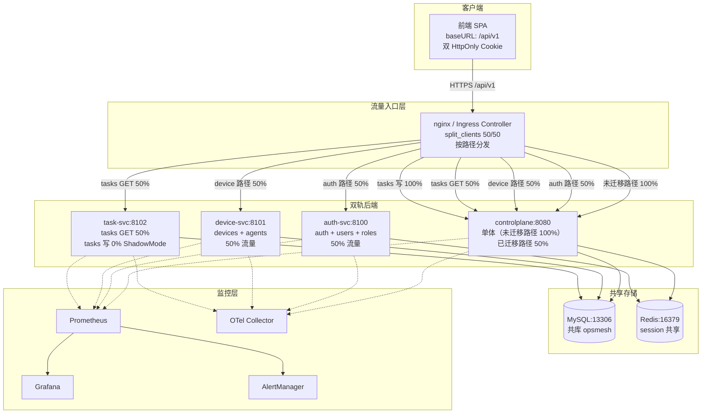

# TD-60 50/50 切流方案

| 字段 | 值 |
|------|-----|
| 文档编号 | TD-60-CUTOVER |
| 版本 | v1.0 |
| 状态 | Draft |
| 切流方向 | 50/50 流量分配 + 响应对比验证 + 渐进式推进 |
| 切流范围 | auth-svc、device-svc、task-svc（已 E2E 验证通过） |
| 前端改动 | 零改动（通过反向代理按路径分发） |
| 回滚目标 | < 30 秒（nginx reload） |
| 编写日期 | 2026-09-18 |

---

## 目录

1. [方案概述](#1-方案概述)
2. [切流架构设计](#2-切流架构设计)
3. [nginx 反向代理配置方案](#3-nginx-反向代理配置方案)
4. [K8s Ingress 配置方案](#4-k8s-ingress-配置方案)
5. [监控告警方案](#5-监控告警方案)
6. [回滚预案](#6-回滚预案)
7. [切流步骤时间线](#7-切流步骤时间线)
8. [验证检查清单](#8-验证检查清单)
9. [风险与缓解](#9-风险与缓解)

---

## 1. 方案概述

### 1.1 背景

OpsMesh 正在推进 TD-60 微服务化演进，将 controlplane（单体）逐步拆分为微服务。当前已验证 3 个微服务在双轨栈中 E2E 通过：

| 微服务 | 端口 | 镜像状态 | 共享存储 | 切流能力 |
|--------|------|----------|----------|----------|
| auth-svc | 8100 | 新镜像 | Redis（session 一致） | 读 + 写均可切流 |
| device-svc | 8101 | 旧镜像 | MySQL（数据一致） | 读 + 写均可切流 |
| task-svc | 8102 | 新镜像 | MySQL（数据一致） | 仅读可切流（ShadowMode=true） |

**task-svc 关键约束**：`TASK_SVC_SHADOW_MODE: "true"`，只启动 leaderLoop + 影子循环，不执行 fire/reclaim。**写操作不能直接切流**，只能切读操作。

### 1.2 切流目标

- 将 controlplane 单体承载的已迁移 API 路径流量，逐步切换到对应微服务
- 最终目标：已迁移路径 100% 流量走微服务，controlplane 仅承载未迁移路径
- 全程前端零改动，通过 nginx/ingress 反向代理按路径 + 比例分发

### 1.3 切流范围

**纳入切流的路径（已迁移到微服务）：**

| 微服务 | API 路径 |
|--------|----------|
| task-svc (8102) | `/api/v1/tasks`, `/api/v1/tasks/` |
| auth-svc (8100) | `/api/v1/auth/register`, `/api/v1/auth/login`, `/api/v1/auth/me`, `/api/v1/auth/logout`, `/api/v1/auth/refresh`, `/api/v1/auth/change-password`, `/api/v1/users`, `/api/v1/users/`, `/api/v1/roles`, `/api/v1/roles/`, `/api/v1/permissions` |
| device-svc (8101) | `/api/v1/devices`, `/api/v1/devices/`, `/api/v1/agents` |

**不纳入切流的路径（仍由 controlplane 处理）：**

`/api/v1/me`, `/api/v1/audits`, `/api/v1/tasks/batch`, `/api/v1/tasks/batch-exec`, `/api/v1/tasks/batch/`, `/api/v1/tasks/canary`, `/api/v1/tasks/canary/`, `/api/v1/alerts`, `/api/v1/alerts/`, `/api/v1/events/stream`, `/api/v1/provision/auto`, `/api/v1/bot/*`, `/api/v1/federation/*`, `/api/v1/os-templates`, `/api/v1/os-templates/`, `/api/v1/middleware-templates`, `/api/v1/middleware-templates/`, `/api/v1/middleware-instances`, `/api/v1/middleware-instances/`, `/api/v1/k8s/clusters`, `/api/v1/k8s/clusters/`, `/api/v1/alert-rules`, `/api/v1/alert-rules/`, `/api/v1/alert-rules-engine`, `/api/v1/alert-rules-engine/`, `/api/v1/alert-silences`, `/api/v1/alert-silences/`, `/api/v1/notify-channels`, `/api/v1/notify-channels/`, `/api/v1/notify-templates`, `/api/v1/notify-templates/`, `/api/v1/helm/repos`, `/api/v1/helm/repos/`, `/api/v1/helm/charts/search`, `/api/v1/helm/releases`, `/api/v1/helm/releases/`, `/api/v1/helm/catalog`, `/api/v1/schedules`, `/api/v1/schedules/`, `/api/v1/approval/flows`, `/api/v1/approval/flows/`, `/api/v1/approval/requests`, `/api/v1/approval/requests/`, `/api/v1/approval/pending`, `/api/v1/network/topology`, `/api/v1/network/topology/cache`, `/api/v1/network/diagnose`, `/api/v1/network/diagnose/`, `/api/v1/network/connectivity`, `/api/v1/network/devices`, `/api/v1/network/devices/`, `/api/v1/network/discover`, `/api/v1/automation/rules`, `/api/v1/automation/rules/`, `/api/v1/automation/executions`, `/api/v1/automation/executions/`, `/api/v1/gateway/routes`, `/api/v1/gateway/routes/`, `/api/v1/gateway/stats`, `/api/v1/webhooks`, `/api/v1/webhooks/`, `/api/v1/scripts`, `/api/v1/scripts/`, `/api/v1/tenants`, `/api/v1/tenants/`, `/api/v1/apikeys`, `/api/v1/apikeys/`, `/api/v1/marketplace/plugins`, `/api/v1/marketplace/plugins/`, `/api/v1/billing/plans`, `/api/v1/billing/plans/`, `/api/v1/billing/subscriptions`, `/api/v1/billing/subscriptions/`, `/api/v1/billing/invoices`, `/api/v1/billing/invoices/`, `/api/v1/billing/usage`, `/api/v1/traffic/policies`

### 1.4 切流策略

采用 **50/50 流量分配 + 响应对比验证 + 渐进式推进** 三段式策略：

1. **影子流量阶段**：100% → controlplane，微服务接收影子流量，对比响应发现不一致
2. **50/50 切流阶段**：50% → 微服务 + 50% → controlplane，监控指标全绿
3. **渐进推进阶段**：50% → 75% → 90% → 100%，每步监控 24h

### 1.5 前端零改动原则

- 前端统一走 `baseURL: '/api/v1'`（`web/enterprise/src/api/request.js`）
- 使用双 HttpOnly Cookie 鉴权（同源自动携带）
- 所有流量分发在 nginx/ingress 层完成，前端代码、构建产物、Cookie 策略均不改动
- 前端无感知：请求仍然发往同一域名，由反向代理决定后端路由

---

## 2. 切流架构设计

### 2.1 架构图



### 2.2 流量分配机制

使用 nginx `split_clients` 指令，按请求 ID 哈希进行 50/50 分配：

- **一致性哈希**：同一请求 ID 总是分配到同一后端，避免 session/缓存抖动
- **可调比例**：通过修改 `split_clients` 百分比实现 50/50 → 75/25 → 90/10 → 100/0 渐进推进
- **请求 ID 来源**：优先使用 `X-Request-ID` 头，回退到 `$request_id`（nginx 自动生成）

```
split_clients "${request_id}" $backend_selector {
    50%     microservice;
    *       controlplane;
}
```

### 2.3 路径分发规则

| 路径模式 | 流量分配 | 说明 |
|----------|----------|------|
| 未迁移路径 | 100% → controlplane | controlplane 仍承载所有未迁移 API |
| auth-svc 路径（读 + 写） | 50% → auth-svc, 50% → controlplane | 共享 Redis，session 一致，读写均可切 |
| device-svc 路径（读 + 写） | 50% → device-svc, 50% → controlplane | 共享 MySQL，数据一致，读写均可切 |
| task-svc GET（读） | 50% → task-svc, 50% → controlplane | 只切读操作 |
| task-svc POST/PUT/DELETE（写） | 100% → controlplane | task-svc ShadowMode 接收影子写入 |

### 2.4 task-svc 特殊处理

task-svc 当前运行在 `TASK_SVC_SHADOW_MODE: "true"` 模式下：

- **只启动** leaderLoop + 影子循环
- **不执行** fire/reclaim（任务触发/回收）
- **写操作（POST/PUT/DELETE）**：100% → controlplane，task-svc 通过 ShadowMode 接收影子写入
- **读操作（GET）**：50/50 切流，对比响应

```
# task-svc 写操作：100% controlplane
location ~ ^/api/v1/tasks(/.*)?$ {
    if ($request_method != GET) {
        proxy_pass http://opsmesh_backend;
    }
    # GET 走 split_clients 50/50
}
```

### 2.5 auth-svc / device-svc 切流依据

| 微服务 | 共享存储 | 一致性保证 | 切流能力 |
|--------|----------|------------|----------|
| auth-svc | Redis（session） | auth-svc 和 controlplane 共享同一 Redis，session 读写一致 | 读 + 写均可 50/50 |
| device-svc | MySQL（数据） | device-svc 和 controlplane 共享同一 MySQL opsmesh 库，数据一致 | 读 + 写均可 50/50 |

---

## 3. nginx 反向代理配置方案

### 3.1 设计原则

- **基于现有 `nginx.conf` 修改**，保留所有安全头、压缩、缓存、限流配置
- **新增**：upstream 定义（controlplane + 3 个微服务）、split_clients 流量分配、按路径 location 分发
- **可配置**：切流比例通过 `map` + 环境变量控制，无需改配置文件即可调整
- **可观测**：每个请求记录实际命中的后端（响应头 `X-Upstream-Target`）

### 3.2 完整 nginx 配置

> 以下配置基于 `web/enterprise/deploy/docker/nginx.conf` 修改。**未标注"新增"的段落均保持原样**。

```nginx
worker_processes auto;
pid /run/nginx.pid;
error_log /var/log/nginx/error.log warn;

events {
    worker_connections 1024;
    use epoll;
    multi_accept on;
}

http {
    include       /etc/nginx/mime.types;
    default_type  application/octet-stream;

    # Logging —— 新增 upstream_target 字段，用于切流对比分析
    log_format main '$remote_addr - $remote_user [$time_local] "$request" '
                    '$status $body_bytes_sent "$http_referer" '
                    '"$http_user_agent" "$http_x_forwarded_for" '
                    'rt=$request_time upstream=$upstream_addr '
                    'target=$upstream_target';
    access_log /var/log/nginx/access.log main;

    # Performance（保持原样）
    sendfile on;
    tcp_nopush on;
    tcp_nodelay on;
    keepalive_timeout 65;
    keepalive_requests 100;
    types_hash_max_size 2048;
    client_max_body_size 10m;

    # Gzip compression（保持原样）
    gzip on;
    gzip_vary on;
    gzip_proxied any;
    gzip_comp_level 6;
    gzip_min_length 1024;
    gzip_types
        text/plain
        text/css
        text/xml
        text/javascript
        application/json
        application/javascript
        application/xml
        application/xml+rss
        application/vnd.ms-fontobject
        application/x-font-ttf
        application/x-javascript
        font/opentype
        image/svg+xml;

    # Brotli compression（保持原样）
    brotli on;
    brotli_comp_level 6;
    brotli_min_length 1024;
    brotli_types
        text/plain
        text/css
        text/xml
        text/javascript
        application/json
        application/javascript
        application/xml
        application/xml+rss
        application/vnd.ms-fontobject
        application/x-font-ttf
        application/x-javascript
        font/opentype
        image/svg+xml;

    # Proxy cache path（保持原样）
    proxy_cache_path /var/cache/nginx/api levels=1:2 keys_zone=api_cache:10m max_size=100m inactive=5m use_temp_path=off;

    # Rate limiting zones（保持原样）
    limit_req_zone $binary_remote_addr zone=api_limit:10m rate=30r/s;
    limit_req_zone $binary_remote_addr zone=auth_limit:10m rate=5r/s;

    # ============================================================
    # 新增：Upstream 定义（controlplane + 3 个微服务）
    # ============================================================
    upstream opsmesh_backend {
        server backend:8080;
        keepalive 32;
    }

    upstream auth_svc {
        server auth-svc:8100;
        keepalive 32;
    }

    upstream device_svc {
        server device-svc:8101;
        keepalive 32;
    }

    upstream task_svc {
        server task-svc:8102;
        keepalive 32;
    }

    # ============================================================
    # 新增：切流比例控制（通过环境变量 CUTOVER_RATIO 注入）
    # 默认 50（50/50），可调 0/25/50/75/90/100
    # ============================================================
    map $arg_cutover $cutover_ratio {
        default 50;
        "0"    0;
        "25"   25;
        "50"   50;
        "75"   75;
        "90"   90;
        "100"  100;
    }

    # 新增：split_clients —— auth 路径流量分配
    split_clients "${request_id}" $auth_backend {
        ${auth_cutover_pct}%   microservice;
        *                      controlplane;
    }

    # 新增：split_clients —— device 路径流量分配
    split_clients "${request_id}" $device_backend {
        ${device_cutover_pct}%   microservice;
        *                        controlplane;
    }

    # 新增：split_clients —— task GET 路径流量分配
    split_clients "${request_id}" $task_read_backend {
        ${task_cutover_pct}%   microservice;
        *                      controlplane;
    }

    # 新增：根据 split_clients 结果映射到实际 upstream
    map $auth_backend $auth_upstream {
        microservice    auth_svc;
        controlplane    opsmesh_backend;
    }

    map $device_backend $device_upstream {
        microservice    device_svc;
        controlplane    opsmesh_backend;
    }

    map $task_read_backend $task_read_upstream {
        microservice    task_svc;
        controlplane    opsmesh_backend;
    }

    # 新增：upstream_target 标记（用于日志和响应头）
    map $auth_upstream $auth_target_label {
        auth_svc          "auth-svc";
        opsmesh_backend   "controlplane";
    }

    # ============================================================
    # 新增：主动健康检查（nginx_plus 或 nginx_upstream_check_module）
    # 若未安装检查模块，则依赖被动健康检查（max_fails + fail_timeout）
    # ============================================================
    # upstream opsmesh_backend {
    #     server backend:8080 max_fails=3 fail_timeout=10s;
    # }
    # upstream auth_svc {
    #     server auth-svc:8100 max_fails=3 fail_timeout=10s;
    # }

    # ============================================================
    # server 块（保持原样：80 → 301 https）
    # ============================================================
    server {
        listen 80;
        server_name _;
        return 301 https://$host$request_uri;
    }

    # ============================================================
    # 主 server 块（443 ssl http2）
    # ============================================================
    server {
        listen 443 ssl http2;
        server_name _;

        # SSL configuration（保持原样）
        ssl_certificate /etc/nginx/ssl/cert.pem;
        ssl_certificate_key /etc/nginx/ssl/key.pem;
        ssl_protocols TLSv1.2 TLSv1.3;
        ssl_ciphers ECDHE-ECDSA-AES128-GCM-SHA256:ECDHE-RSA-AES128-GCM-SHA256:ECDHE-ECDSA-AES256-GCM-SHA384:ECDHE-RSA-AES256-GCM-SHA384;
        ssl_prefer_server_ciphers off;
        ssl_session_cache shared:SSL:10m;
        ssl_session_timeout 1d;
        ssl_session_tickets off;

        # Security headers（保持原样）
        add_header X-Frame-Options "SAMEORIGIN" always;
        add_header X-Content-Type-Options "nosniff" always;
        add_header X-XSS-Protection "1; mode=block" always;
        add_header Referrer-Policy "strict-origin-when-cross-origin" always;
        add_header Permissions-Policy "camera=(), microphone=(), geolocation=()" always;
        add_header Strict-Transport-Security "max-age=63072000; includeSubDomains; preload" always;
        add_header Content-Security-Policy "default-src 'self'; script-src 'self'; style-src 'self' 'unsafe-inline'; img-src 'self' data: https:; font-src 'self'; connect-src 'self' https:; frame-ancestors 'self'; base-uri 'self'; form-action 'self';" always;

        # Static assets（保持原样）
        location /enterprise/ {
            root /usr/share/nginx/html;
            index index.html;
            try_files $uri $uri/ /enterprise/index.html;

            location ~* \.html$ {
                add_header Cache-Control "no-cache, no-store, must-revalidate";
                add_header Pragma "no-cache";
                add_header Expires "0";
            }
            location ~* \.(js|css)$ {
                add_header Cache-Control "public, max-age=31536000, immutable";
                add_header Vary "Accept-Encoding";
            }
            location ~* \.(woff2?|eot|ttf|otf)$ {
                add_header Cache-Control "public, max-age=31536000, immutable";
                add_header Vary "Accept-Encoding";
                access_log off;
            }
            location ~* \.(png|jpe?g|gif|svg|webp|avif|ico)$ {
                add_header Cache-Control "public, max-age=2592000";
                add_header Vary "Accept-Encoding";
                access_log off;
            }
            location = /enterprise/manifest.json {
                add_header Cache-Control "public, max-age=3600";
                add_header Content-Type "application/manifest+json";
            }
            location = /enterprise/sw.js {
                add_header Cache-Control "no-cache, no-store, must-revalidate";
                add_header Service-Worker-Allowed "/enterprise/";
            }
        }

        # ============================================================
        # 新增：auth-svc 路径切流（register/login/me/logout/refresh/change-password）
        # 替换原 /api/auth/ location
        # ============================================================
        location ~ ^/api/v1/auth/(register|login|me|logout|refresh|change-password)$ {
            limit_req zone=auth_limit burst=10 nodelay;

            proxy_pass http://$auth_upstream;
            proxy_http_version 1.1;
            proxy_set_header Connection "";
            proxy_set_header Host $host;
            proxy_set_header X-Real-IP $remote_addr;
            proxy_set_header X-Forwarded-For $proxy_add_x_forwarded_for;
            proxy_set_header X-Forwarded-Proto $scheme;
            proxy_set_header X-Request-ID $request_id;
            proxy_set_header X-Upstream-Target $auth_target_label;

            proxy_connect_timeout 5s;
            proxy_send_timeout 15s;
            proxy_read_timeout 15s;

            add_header Cache-Control "no-store, no-cache, must-revalidate" always;
            add_header X-Upstream-Target $auth_target_label always;
        }

        # 新增：users / roles / permissions 路径切流（auth-svc 承载）
        location ~ ^/api/v1/(users|roles|permissions)(/.*)?$ {
            limit_req zone=api_limit burst=50 nodelay;

            proxy_pass http://$auth_upstream;
            proxy_http_version 1.1;
            proxy_set_header Connection "";
            proxy_set_header Host $host;
            proxy_set_header X-Real-IP $remote_addr;
            proxy_set_header X-Forwarded-For $proxy_add_x_forwarded_for;
            proxy_set_header X-Forwarded-Proto $scheme;
            proxy_set_header X-Request-ID $request_id;
            proxy_set_header X-Upstream-Target $auth_target_label;

            proxy_connect_timeout 5s;
            proxy_send_timeout 30s;
            proxy_read_timeout 30s;

            proxy_cache api_cache;
            proxy_cache_methods GET HEAD;
            proxy_cache_valid 200 5m;
            proxy_cache_valid 404 1m;
            proxy_cache_use_stale error timeout updating http_500 http_502 http_503 http_504;
            proxy_cache_background_update on;
            proxy_cache_lock on;
            proxy_cache_key "$scheme$request_method$host$request_uri";

            add_header X-Cache-Status $upstream_cache_status always;
            add_header X-Upstream-Target $auth_target_label always;

            proxy_no_cache $http_pragma $http_authorization;
            proxy_cache_bypass $http_cache_control;
        }

        # ============================================================
        # 新增：device-svc 路径切流（devices + agents）
        # ============================================================
        location ~ ^/api/v1/(devices|agents)(/.*)?$ {
            limit_req zone=api_limit burst=50 nodelay;

            proxy_pass http://$device_upstream;
            proxy_http_version 1.1;
            proxy_set_header Connection "";
            proxy_set_header Host $host;
            proxy_set_header X-Real-IP $remote_addr;
            proxy_set_header X-Forwarded-For $proxy_add_x_forwarded_for;
            proxy_set_header X-Forwarded-Proto $scheme;
            proxy_set_header X-Request-ID $request_id;

            proxy_connect_timeout 5s;
            proxy_send_timeout 30s;
            proxy_read_timeout 30s;

            proxy_cache api_cache;
            proxy_cache_methods GET HEAD;
            proxy_cache_valid 200 5m;
            proxy_cache_valid 404 1m;
            proxy_cache_use_stale error timeout updating http_500 http_502 http_503 http_504;
            proxy_cache_background_update on;
            proxy_cache_lock on;
            proxy_cache_key "$scheme$request_method$host$request_uri";

            add_header X-Cache-Status $upstream_cache_status always;

            proxy_no_cache $http_pragma $http_authorization;
            proxy_cache_bypass $http_cache_control;
        }

        # ============================================================
        # 新增：task-svc 路径切流
        # GET（读）→ 50/50 split_clients
        # POST/PUT/DELETE（写）→ 100% controlplane（ShadowMode 约束）
        # 注意：/api/v1/tasks/batch、/api/v1/tasks/canary 仍由 controlplane 处理
        # ============================================================
        location ~ ^/api/v1/tasks/?(?!batch|canary)(.*)$ {
            limit_req zone=api_limit burst=50 nodelay;

            # 写操作 → 100% controlplane
            if ($request_method ~ ^(POST|PUT|DELETE|PATCH)$) {
                proxy_pass http://opsmesh_backend;
            }

            # GET/HEAD → 50/50 split_clients
            proxy_pass http://$task_read_upstream;
            proxy_http_version 1.1;
            proxy_set_header Connection "";
            proxy_set_header Host $host;
            proxy_set_header X-Real-IP $remote_addr;
            proxy_set_header X-Forwarded-For $proxy_add_x_forwarded_for;
            proxy_set_header X-Forwarded-Proto $scheme;
            proxy_set_header X-Request-ID $request_id;

            proxy_connect_timeout 5s;
            proxy_send_timeout 30s;
            proxy_read_timeout 30s;

            proxy_cache api_cache;
            proxy_cache_methods GET HEAD;
            proxy_cache_valid 200 5m;
            proxy_cache_valid 404 1m;
            proxy_cache_use_stale error timeout updating http_500 http_502 http_503 http_504;
            proxy_cache_background_update on;
            proxy_cache_lock on;
            proxy_cache_key "$scheme$request_method$host$request_uri";

            add_header X-Cache-Status $upstream_cache_status always;

            proxy_no_cache $http_pragma $http_authorization;
            proxy_cache_bypass $http_cache_control;
        }

        # ============================================================
        # SSE endpoint（保持原样，仍由 controlplane 处理）
        # ============================================================
        location /api/v1/events/stream {
            proxy_pass http://opsmesh_backend;
            proxy_http_version 1.1;
            proxy_set_header Connection "";
            proxy_set_header Host $host;
            proxy_set_header X-Real-IP $remote_addr;
            proxy_set_header X-Forwarded-For $proxy_add_x_forwarded_for;

            proxy_buffering off;
            proxy_cache off;
            proxy_read_timeout 3600s;
            proxy_send_timeout 3600s;

            add_header Cache-Control "no-cache" always;
            add_header X-Accel-Buffering "no" always;
        }

        # ============================================================
        # 兜底：所有其他 /api/ 路径 → controlplane（未迁移路径）
        # 替换原 /api/ location，改为兜底
        # ============================================================
        location /api/ {
            limit_req zone=api_limit burst=50 nodelay;

            proxy_pass http://opsmesh_backend;
            proxy_http_version 1.1;
            proxy_set_header Connection "";
            proxy_set_header Host $host;
            proxy_set_header X-Real-IP $remote_addr;
            proxy_set_header X-Forwarded-For $proxy_add_x_forwarded_for;
            proxy_set_header X-Forwarded-Proto $scheme;
            proxy_set_header X-Request-ID $request_id;

            proxy_connect_timeout 5s;
            proxy_send_timeout 30s;
            proxy_read_timeout 30s;

            proxy_cache api_cache;
            proxy_cache_methods GET HEAD;
            proxy_cache_valid 200 5m;
            proxy_cache_valid 404 1m;
            proxy_cache_use_stale error timeout updating http_500 http_502 http_503 http_504;
            proxy_cache_background_update on;
            proxy_cache_lock on;
            proxy_cache_key "$scheme$request_method$host$request_uri";

            add_header X-Cache-Status $upstream_cache_status always;

            proxy_no_cache $http_pragma $http_authorization;
            proxy_cache_bypass $http_cache_control;
        }

        # Health check（保持原样）
        location /health {
            access_log off;
            return 200 'OK';
            add_header Content-Type text/plain;
        }

        # 新增：切流健康检查端点（分别探测各后端）
        location /health/auth-svc {
            access_log off;
            proxy_pass http://auth_svc/health;
        }
        location /health/device-svc {
            access_log off;
            proxy_pass http://device_svc/health;
        }
        location /health/task-svc {
            access_log off;
            proxy_pass http://task_svc/health;
        }
        location /health/controlplane {
            access_log off;
            proxy_pass http://opsmesh_backend/healthz;
        }

        # Deny access to hidden files（保持原样）
        location ~ /\. {
            deny all;
            access_log off;
            log_not_found off;
        }
    }
}
```

### 3.3 切流比例环境变量注入

nginx `split_clients` 的百分比不支持变量直接插值。生产中通过 **配置模板 + 环境变量渲染** 实现动态比例：

**方案 A：envsubst 模板渲染（推荐，Docker 部署）**

创建 `nginx.conf.template`，将百分比替换为环境变量占位符：

```nginx
split_clients "${request_id}" $auth_backend {
    ${AUTH_CUTOVER_PCT}%   microservice;
    *                      controlplane;
}
```

在 Docker entrypoint 中渲染：

```bash
envsubst '${AUTH_CUTOVER_PCT} ${DEVICE_CUTOVER_PCT} ${TASK_CUTOVER_PCT}' \
  < /etc/nginx/nginx.conf.template \
  > /etc/nginx/nginx.conf
nginx -g 'daemon off;'
```

环境变量配置（`docker-compose.yml` 或 K8s ConfigMap）：

```yaml
environment:
  AUTH_CUTOVER_PCT: "50"    # auth-svc 切流比例
  DEVICE_CUTOVER_PCT: "50"  # device-svc 切流比例
  TASK_CUTOVER_PCT: "50"    # task-svc 读切流比例
```

**方案 B：include 文件分片（无 envsubst 时）**

将 split_clients 段落拆为独立 include 文件，按比例准备多份：

```
conf.d/split-auth-50.conf    # 50% microservice
conf.d/split-auth-75.conf    # 75% microservice
conf.d/split-auth-100.conf   # 100% microservice
```

切换时替换 include 文件 + `nginx -s reload`。

### 3.4 切流比例调整操作手册

```bash
# 查看当前切流比例
docker exec opsmesh-nginx printenv | grep CUTOVER_PCT

# 调整 auth-svc 切流到 75%
docker exec opsmesh-nginx sh -c 'export AUTH_CUTOVER_PCT=75 && \
  envsubst < /etc/nginx/nginx.conf.template > /etc/nginx/nginx.conf && \
  nginx -t && nginx -s reload'

# 一键回滚到 0%（100% controlplane）
docker exec opsmesh-nginx sh -c '
  export AUTH_CUTOVER_PCT=0 DEVICE_CUTOVER_PCT=0 TASK_CUTOVER_PCT=0 && \
  envsubst < /etc/nginx/nginx.conf.template > /etc/nginx/nginx.conf && \
  nginx -t && nginx -s reload'
```

---

## 4. K8s Ingress 配置方案

### 4.1 方案 A：NGINX Ingress Controller（推荐，无需 Service Mesh）

使用 NGINX Ingress Controller 的 `nginx.ingress.kubernetes.io/canary-*` annotations 实现流量分割。

**主 Ingress（controlplane，100% 兜底）：**

```yaml
# deploy/helm/opsmesh/templates/ingress-controlplane.yaml
apiVersion: networking.k8s.io/v1
kind: Ingress
metadata:
  name: opsmesh-controlplane
  labels:
    {{- include "opsmesh.labels" . | nindent 4 }}
  annotations:
    nginx.ingress.kubernetes.io/proxy-connect-timeout: "5"
    nginx.ingress.kubernetes.io/proxy-read-timeout: "30"
    nginx.ingress.kubernetes.io/proxy-send-timeout: "30"
    nginx.ingress.kubernetes.io/proxy-buffering: "on"
spec:
  ingressClassName: {{ .Values.ingress.className }}
  {{- with .Values.ingress.tls }}
  tls:
    {{- toYaml . | nindent 4 }}
  {{- end }}
  rules:
    - host: {{ .Values.ingress.host | quote }}
      http:
        paths:
          # 兜底：所有 /api/v1/ 路径 → controlplane
          - path: /api/v1/
            pathType: Prefix
            backend:
              service:
                name: opsmesh-controlplane
                port:
                  number: 8080
```

**Canary Ingress（auth-svc，50% 流量）：**

```yaml
# deploy/helm/opsmesh/templates/ingress-auth-canary.yaml
apiVersion: networking.k8s.io/v1
kind: Ingress
metadata:
  name: opsmesh-auth-canary
  labels:
    {{- include "opsmesh.labels" . | nindent 4 }}
  annotations:
    # Canary 权重（50 = 50% 流量走 auth-svc）
    nginx.ingress.kubernetes.io/canary: "true"
    nginx.ingress.kubernetes.io/canary-weight: "50"
    # 按 Header 分流（可选，用于定向测试）
    nginx.ingress.kubernetes.io/canary-by-header: "X-Auth-Canary"
    nginx.ingress.kubernetes.io/canary-by-header-value: "true"
spec:
  ingressClassName: {{ .Values.ingress.className }}
  rules:
    - host: {{ .Values.ingress.host | quote }}
      http:
        paths:
          - path: /api/v1/auth/
            pathType: Prefix
            backend:
              service:
                name: opsmesh-auth-svc
                port:
                  number: 8100
          - path: /api/v1/users/
            pathType: Prefix
            backend:
              service:
                name: opsmesh-auth-svc
                port:
                  number: 8100
          - path: /api/v1/roles/
            pathType: Prefix
            backend:
              service:
                name: opsmesh-auth-svc
                port:
                  number: 8100
          - path: /api/v1/permissions
            pathType: Prefix
            backend:
              service:
                name: opsmesh-auth-svc
                port:
                  number: 8100
```

**Canary Ingress（device-svc，50% 流量）：**

```yaml
# deploy/helm/opsmesh/templates/ingress-device-canary.yaml
apiVersion: networking.k8s.io/v1
kind: Ingress
metadata:
  name: opsmesh-device-canary
  annotations:
    nginx.ingress.kubernetes.io/canary: "true"
    nginx.ingress.kubernetes.io/canary-weight: "50"
spec:
  ingressClassName: {{ .Values.ingress.className }}
  rules:
    - host: {{ .Values.ingress.host | quote }}
      http:
        paths:
          - path: /api/v1/devices/
            pathType: Prefix
            backend:
              service:
                name: opsmesh-device-svc
                port:
                  number: 8101
          - path: /api/v1/agents
            pathType: Prefix
            backend:
              service:
                name: opsmesh-device-svc
                port:
                  number: 8101
```

**Canary Ingress（task-svc，仅 GET 50%）：**

```yaml
# deploy/helm/opsmesh/templates/ingress-task-canary.yaml
apiVersion: networking.k8s.io/v1
kind: Ingress
metadata:
  name: opsmesh-task-canary
  annotations:
    nginx.ingress.kubernetes.io/canary: "true"
    nginx.ingress.kubernetes.io/canary-weight: "50"
    # 限制仅 GET 方法（通过 configuration-snippet）
    nginx.ingress.kubernetes.io/configuration-snippet: |
      if ($request_method != GET) {
        return 418;
      }
spec:
  ingressClassName: {{ .Values.ingress.className }}
  rules:
    - host: {{ .Values.ingress.host | quote }}
      http:
        paths:
          - path: /api/v1/tasks/
            pathType: Prefix
            backend:
              service:
                name: opsmesh-task-svc
                port:
                  number: 8102
```

**Helm values.yaml 切流比例配置：**

```yaml
# deploy/helm/opsmesh/values.yaml
cutover:
  enabled: true
  auth:
    weight: 50      # 0-100，auth-svc 切流比例
  device:
    weight: 50      # 0-100，device-svc 切流比例
  task:
    weight: 50      # 0-100，task-svc 读切流比例
    writeMode: shadow  # shadow | direct（shadow=写走controlplane）
```

### 4.2 方案 B：Istio / Linkerd Service Mesh（可选，更精细）

若集群已部署 Istio，可用 VirtualService + DestinationRule 实现更精细的流量管理（按 header、按权重、按方法切分）：

```yaml
# deploy/helm/opsmesh/templates/istio-virtualservice.yaml
apiVersion: networking.istio.io/v1beta1
kind: VirtualService
metadata:
  name: opsmesh-api
spec:
  hosts:
    - "{{ .Values.ingress.host }}"
  gateways:
    - opsmesh-gateway
  http:
    # auth 路径：50/50
    - match:
        - uri:
            prefix: /api/v1/auth/
        - uri:
            prefix: /api/v1/users/
        - uri:
            prefix: /api/v1/roles/
      route:
        - destination:
            host: opsmesh-auth-svc
            port: { number: 8100 }
          weight: 50
        - destination:
            host: opsmesh-controlplane
            port: { number: 8080 }
          weight: 50

    # device 路径：50/50
    - match:
        - uri:
            prefix: /api/v1/devices/
        - uri:
            prefix: /api/v1/agents
      route:
        - destination:
            host: opsmesh-device-svc
            port: { number: 8101 }
          weight: 50
        - destination:
            host: opsmesh-controlplane
            port: { number: 8080 }
          weight: 50

    # task GET：50/50
    - match:
        - uri:
            prefix: /api/v1/tasks/
          method: GET
      route:
        - destination:
            host: opsmesh-task-svc
            port: { number: 8102 }
          weight: 50
        - destination:
            host: opsmesh-controlplane
            port: { number: 8080 }
          weight: 50

    # task 写：100% controlplane
    - match:
        - uri:
            prefix: /api/v1/tasks/
          method: POST
        - uri:
            prefix: /api/v1/tasks/
          method: PUT
        - uri:
            prefix: /api/v1/tasks/
          method: DELETE
      route:
        - destination:
            host: opsmesh-controlplane
            port: { number: 8080 }
          weight: 100

    # 兜底：其他路径 → controlplane
    - route:
        - destination:
            host: opsmesh-controlplane
            port: { number: 8080 }
          weight: 100
```

**方案选择建议：**

| 方案 | 优点 | 缺点 | 适用场景 |
|------|------|------|----------|
| NGINX Ingress Canary | 无需 Service Mesh，配置简单 | 按方法切分需 configuration-snippet | 已有 NGINX Ingress Controller |
| Istio VirtualService | 精细按方法/Header/权重切分 | 需部署 Istio，运维成本高 | 已有 Istio 或需精细治理 |

---

## 5. 监控告警方案

### 5.1 切流专用 Prometheus 告警规则

新增 `deploy/monitoring/prometheus-cutover-alerts.yml`：

```yaml
# Prometheus Alert Rules for TD-60 Cutover
# 切流专用告警：响应不一致、比例偏差、微服务错误率/延迟对比

groups:
  - name: cutover_response_consistency
    interval: 30s
    rules:
      # 告警 1：响应状态码不一致率 > 1%
      # 对比同一请求在 controlplane 和微服务的响应状态码
      # 依赖 OTel Collector 的响应对比指标
      - alert: CutoverResponseMismatch
        expr: |
          (
            sum(rate(cutover_response_mismatch_total{dimension="status_code"}[5m]))
            /
            sum(rate(cutover_response_compared_total[5m]))
          ) > 0.01
        for: 5m
        labels:
          severity: critical
          cutover: "td60"
        annotations:
          summary: "切流响应不一致率超阈值"
          description: "controlplane 与微服务响应状态码不一致率 {{ $value | humanizePercentage }}，超过 1% 阈值。请立即检查或回滚。"

      # 告警 2：响应体不一致率 > 1%
      - alert: CutoverBodyMismatch
        expr: |
          (
            sum(rate(cutover_response_mismatch_total{dimension="body_hash"}[5m]))
            /
            sum(rate(cutover_response_compared_total[5m]))
          ) > 0.01
        for: 5m
        labels:
          severity: warning
          cutover: "td60"
        annotations:
          summary: "切流响应体不一致率超阈值"
          description: "controlplane 与微服务响应体 hash 不一致率 {{ $value | humanizePercentage }}，请检查数据一致性。"

  - name: cutover_traffic_ratio
    interval: 30s
    rules:
      # 告警 3：切流比例偏差 > 10%
      # 期望 50/50，实际偏差超过 ±10% 触发
      - alert: CutoverRatioDrift
        expr: |
          (
            abs(
              sum(rate(http_requests_total{job="auth-svc"}[5m]))
              /
              (sum(rate(http_requests_total{job="auth-svc"}[5m])) + sum(rate(http_requests_total{job="opsmesh-controlplane",path=~"/api/v1/auth/.*"}[5m])))
              - 0.5
            )
          ) > 0.1
        for: 10m
        labels:
          severity: warning
          cutover: "td60"
        annotations:
          summary: "切流比例偏差超阈值"
          description: "auth-svc 实际流量比例与期望 50% 偏差超过 10%，请检查 nginx split_clients 配置。"

  - name: cutover_microservice_health
    interval: 30s
    rules:
      # 告警 4：微服务错误率比 controlplane 高
      - alert: MicroserviceErrorRateHigher
        expr: |
          (
            rate(http_requests_total{job=~"auth-svc|device-svc|task-svc",status=~"5.."}[5m])
            /
            rate(http_requests_total{job=~"auth-svc|device-svc|task-svc"}[5m])
          )
          >
          (
            rate(http_requests_total{job="opsmesh-controlplane",status=~"5.."}[5m])
            /
            rate(http_requests_total{job="opsmesh-controlplane"}[5m])
          ) * 2
        for: 5m
        labels:
          severity: critical
          cutover: "td60"
        annotations:
          summary: "微服务错误率显著高于 controlplane"
          description: "{{ $labels.job }} 错误率是 controlplane 的 2 倍以上，可能存在 bug，建议回滚。"

      # 告警 5：微服务 P99 延迟比 controlplane 高 2 倍
      - alert: MicroserviceLatencyHigher
        expr: |
          histogram_quantile(0.99, rate(http_request_duration_seconds_bucket{job=~"auth-svc|device-svc|task-svc"}[5m]))
          >
          histogram_quantile(0.99, rate(http_request_duration_seconds_bucket{job="opsmesh-controlplane"}[5m])) * 2
        for: 5m
        labels:
          severity: warning
          cutover: "td60"
        annotations:
          summary: "微服务延迟显著高于 controlplane"
          description: "{{ $labels.job }} P99 延迟是 controlplane 的 2 倍以上，请检查性能。"

      # 告警 6：微服务 P99 延迟绝对值 > 2s
      - alert: MicroserviceLatencyAbsolute
        expr: |
          histogram_quantile(0.99, rate(http_request_duration_seconds_bucket{job=~"auth-svc|device-svc|task-svc"}[5m])) > 2
        for: 5m
        labels:
          severity: critical
          cutover: "td60"
        annotations:
          summary: "微服务 P99 延迟超 2s"
          description: "{{ $labels.job }} P99 延迟 {{ $value }}s，超过 2s 阈值，触发回滚条件。"

  - name: cutover_shadow_mode
    interval: 30s
    rules:
      # 告警 7：task-svc 误执行写操作（ShadowMode 被破坏）
      - alert: TaskSvcShadowModeViolated
        expr: rate(opsmesh_task_fire_total{source="direct"}[5m]) > 0
        for: 1m
        labels:
          severity: critical
          cutover: "td60"
        annotations:
          summary: "task-svc ShadowMode 被破坏"
          description: "task-svc 检测到直接 fire 操作，ShadowMode 约束被违反，立即检查配置。"

      # 告警 8：task-svc 影子写入与 controlplane 不一致
      - alert: TaskSvcShadowWriteMismatch
        expr: |
          (
            sum(rate(opsmesh_task_shadow_write_mismatch_total[5m]))
            /
            sum(rate(opsmesh_task_shadow_write_total[5m]))
          ) > 0.05
        for: 10m
        labels:
          severity: warning
          cutover: "td60"
        annotations:
          summary: "task-svc 影子写入不一致"
          description: "task-svc 影子写入与 controlplane 实际写入不一致率 {{ $value | humanizePercentage }}，请检查任务执行逻辑。"
```

**集成到 Prometheus 配置：**

在 `deploy/monitoring/prometheus.yml` 的 `rule_files` 中新增：

```yaml
rule_files:
  - "alerts.yml"
  - "cutover-alerts.yml"   # 新增
```

### 5.2 Grafana Dashboard 设计

新增 `deploy/monitoring/grafana/dashboards/td60-cutover.json`，包含以下面板：

**Dashboard 结构：**

| 面板组 | 面板 | 查询 | 说明 |
|--------|------|------|------|
| 切流流量比例 | auth-svc 流量比例 | `rate(http_requests_total{job="auth-svc"}[1m]) / (rate(http_requests_total{job="auth-svc"}[1m]) + rate(http_requests_total{job="opsmesh-controlplane",path=~"/api/v1/auth/.*"}[1m]))` | Gauge，期望 50% |
| 切流流量比例 | device-svc 流量比例 | 同上替换 job/path | Gauge，期望 50% |
| 切流流量比例 | task-svc 读流量比例 | 同上 | Gauge，期望 50% |
| 切流流量比例 | 各后端 QPS | `rate(http_requests_total[1m])` by job | 时序图 |
| 响应对比 | 状态码不一致率 | `rate(cutover_response_mismatch_total{dimension="status_code"}[5m]) / rate(cutover_response_compared_total[5m])` | 时序图，阈值线 1% |
| 响应对比 | 响应体不一致率 | `rate(cutover_response_mismatch_total{dimension="body_hash"}[5m]) / rate(cutover_response_compared_total[5m])` | 时序图，阈值线 1% |
| 响应对比 | 状态码分布 | `sum by (status) (rate(http_requests_total[1m]))` | 堆叠图，按 job 分面 |
| 响应对比 | 延迟对比 P99 | `histogram_quantile(0.99, rate(http_request_duration_seconds_bucket[5m]))` by job | 时序图，controlplane vs 微服务 |
| 微服务健康 | 错误率对比 | `rate(http_requests_total{status=~"5.."}[5m]) / rate(http_requests_total[5m])` by job | 时序图 |
| 微服务健康 | CPU/Memory | `process_cpu_seconds_total`, `process_resident_memory_bytes` | 时序图 |
| 微服务健康 | 健康检查状态 | `up{job=~"auth-svc|device-svc|task-svc|opsmesh-controlplane"}` | 状态面板 |
| task-svc 影子 | 影子写入量 | `rate(opsmesh_task_shadow_write_total[1m])` | 时序图 |
| task-svc 影子 | 影子写入不一致 | `rate(opsmesh_task_shadow_write_mismatch_total[1m])` | 时序图 |

### 5.3 日志对比方案

通过 OpenTelemetry Collector 收集 controlplane 和微服务的请求/响应日志，进行实时对比：

**OTel Collector 配置（`deploy/monitoring/otel-collector-cutover.yaml`）：**

```yaml
receivers:
  otlp:
    protocols:
      grpc:
        endpoint: 0.0.0.0:4317
      http:
        endpoint: 0.0.0.0:4318

processors:
  # 响应对比处理器：匹配同一 request_id 的两条 span
  compare/responses:
    match_by: ["attributes.x-request-id"]
    compare:
      - dimension: http_response_status_code
        mismatch_metric: cutover_response_mismatch_total{dimension="status_code"}
      - dimension: response_body_hash
        mismatch_metric: cutover_response_mismatch_total{dimension="body_hash"}
    emit_metric: cutover_response_compared_total

  batch: {}

exporters:
  prometheus:
    endpoint: 0.0.0.0:8889
    namespace: cutover

  loki:
    endpoint: http://loki:3100/loki/api/v1/push
    labels:
      upstream: "{{ .attributes.x-upstream-target }}"
      request_id: "{{ .attributes.x-request-id }}"

service:
  pipelines:
    traces:
      receivers: [otlp]
      processors: [compare/responses, batch]
      exporters: [prometheus, loki]
```

**日志对比查询（Loki LogQL）：**

```logql
# 查找同一 request_id 在两个后端的响应差异
{container="auth-svc"} | json | request_id="REQ_XXX"
  OR
{container="controlplane"} | json | request_id="REQ_XXX"

# 统计最近 5 分钟响应不一致的请求
sum by (request_id) (
  count_over_time({container=~"auth-svc|controlplane"} | json | path=~"/api/v1/auth/.*" [5m])
) > 2  # 同一 request_id 出现超过 2 次（正常应恰好 2 次，各 1 次）
```

---

## 6. 回滚预案

### 6.1 回滚触发条件

| 条件 | 阈值 | 持续时间 | 严重级别 | 动作 |
|------|------|----------|----------|------|
| 响应不一致率 | > 1% | 5min | Critical | 立即回滚 |
| 微服务错误率 | > 5% | 5min | Critical | 立即回滚 |
| 微服务 P99 延迟 | > 2s | 5min | Critical | 立即回滚 |
| 微服务错误率 > controlplane × 2 | - | 5min | Critical | 立即回滚 |
| task-svc ShadowMode 被破坏 | 任意 | 1min | Critical | 立即回滚 + 排查 |
| 切流比例偏差 | > 10% | 10min | Warning | 检查配置 |
| 人工触发 | - | - | - | 立即回滚 |

### 6.2 回滚步骤

**一键回滚脚本（`deploy/scripts/cutover-rollback.sh`）：**

```bash
#!/bin/bash
# cutover-rollback.sh - TD-60 切流一键回滚
# 用法: ./cutover-rollback.sh [target]
#   target: all | auth | device | task（默认 all）

set -euo pipefail

TARGET="${1:-all}"
NGINX_CONTAINER="${NGINX_CONTAINER:-opsmesh-nginx}"
TIMESTAMP=$(date +%Y%m%d_%H%M%S)

echo "[$(date -Iseconds)] 开始回滚 target=$TARGET"

# 1. 备份当前 nginx 配置
docker exec "$NGINX_CONTAINER" cp /etc/nginx/nginx.conf "/etc/nginx/nginx.conf.bak.$TIMESTAMP"
echo "[$(date -Iseconds)] 已备份当前配置到 nginx.conf.bak.$TIMESTAMP"

# 2. 将切流比例设为 0%（100% controlplane）
case "$TARGET" in
  all)
    docker exec "$NGINX_CONTAINER" sh -c '
      export AUTH_CUTOVER_PCT=0 DEVICE_CUTOVER_PCT=0 TASK_CUTOVER_PCT=0 && \
      envsubst < /etc/nginx/nginx.conf.template > /etc/nginx/nginx.conf'
    ;;
  auth)
    docker exec "$NGINX_CONTAINER" sh -c '
      export AUTH_CUTOVER_PCT=0 && \
      envsubst < /etc/nginx/nginx.conf.template > /etc/nginx/nginx.conf'
    ;;
  device)
    docker exec "$NGINX_CONTAINER" sh -c '
      export DEVICE_CUTOVER_PCT=0 && \
      envsubst < /etc/nginx/nginx.conf.template > /etc/nginx/nginx.conf'
    ;;
  task)
    docker exec "$NGINX_CONTAINER" sh -c '
      export TASK_CUTOVER_PCT=0 && \
      envsubst < /etc/nginx/nginx.conf.template > /etc/nginx/nginx.conf'
    ;;
  *)
    echo "未知 target: $TARGET，可选: all|auth|device|task"
    exit 1
    ;;
esac

# 3. 验证配置语法
if ! docker exec "$NGINX_CONTAINER" nginx -t; then
  echo "[$(date -Iseconds)] 配置语法检查失败，恢复备份"
  docker exec "$NGINX_CONTAINER" cp "/etc/nginx/nginx.conf.bak.$TIMESTAMP" /etc/nginx/nginx.conf
  exit 1
fi

# 4. reload nginx
docker exec "$NGINX_CONTAINER" nginx -s reload
echo "[$(date -Iseconds)] nginx 已 reload，回滚完成"

# 5. 验证回滚效果
sleep 2
echo "[$(date -Iseconds)] 验证回滚效果..."
for path in /health/auth-svc /health/device-svc /health/task-svc /health/controlplane; do
  status=$(curl -s -o /dev/null -w "%{http_code}" "https://opsmesh.example.com$path")
  echo "  $path → HTTP $status"
done

echo "[$(date -Iseconds)] 回滚完成，所有流量已切回 controlplane"
```

**K8s 回滚（Helm）：**

```bash
# 一键回滚：将所有切流比例设为 0
helm upgrade opsmesh ./deploy/helm/opsmesh \
  --set cutover.auth.weight=0 \
  --set cutover.device.weight=0 \
  --set cutover.task.weight=0

# 或回滚到上一个 revision
helm rollback opsmesh <PREVIOUS_REVISION>
```

### 6.3 回滚验证检查清单

回滚后立即执行以下检查：

- [ ] nginx 配置语法检查通过（`nginx -t`）
- [ ] nginx reload 成功（无 error 日志）
- [ ] 所有 /health 端点返回 200
- [ ] 访问 `/api/v1/auth/login` 响应头 `X-Upstream-Target` 为 `controlplane`
- [ ] 访问 `/api/v1/devices` 响应头 `X-Upstream-Target` 为 `controlplane`
- [ ] 访问 `/api/v1/tasks` (GET) 响应头 `X-Upstream-Target` 为 `controlplane`
- [ ] Grafana 切流面板显示 0% 微服务流量
- [ ] Prometheus 无 `CutoverResponseMismatch` 告警残留
- [ ] 前端功能正常（登录、设备列表、任务列表）

### 6.4 回滚后分析步骤

1. **收集回滚时刻指标**：导出回滚前 30min 的 Prometheus 指标快照
2. **分析不一致请求**：在 Loki 中查询 `cutover_response_mismatch_total` 增长时段的请求日志
3. **定位根因**：对比 controlplane 和微服务的代码版本、配置差异
4. **修复 + 重新验证**：修复后在双轨栈重新 E2E 验证，再重新切流
5. **复盘记录**：将回滚原因、根因、修复方案记录到 `docs/td60-cutover-postmortem.md`

### 6.5 回滚时间目标

| 步骤 | 耗时 |
|------|------|
| 触发回滚（手动/自动） | < 1s |
| 备份配置 | < 1s |
| 渲染 0% 配置 | < 1s |
| nginx -t 语法检查 | < 2s |
| nginx -s reload | < 5s |
| 验证健康检查 | < 5s |
| **总计** | **< 15s** |

**目标：< 30 秒完成回滚**（含验证）

---

## 7. 切流步骤时间线

### 阶段 0：准备（当前已完成 ✅）

| 项目 | 状态 | 说明 |
|------|------|------|
| 双轨栈 6 容器 healthy | ✅ | docker-compose.dual-track.yaml 全部 healthy |
| auth-svc E2E 验证 | ✅ | register/login/me/logout/refresh/change-password + users/roles/permissions |
| device-svc E2E 验证 | ✅ | devices + agents CRUD |
| task-svc E2E 验证 | ✅ | tasks GET（ShadowMode 写约束） |
| 代码级阻塞修复 | ✅ | TD-60 consistency report 已闭环 |
| 共享存储一致性 | ✅ | auth-svc↔controlplane 共享 Redis；device/task-svc↔controlplane 共享 MySQL |

### 阶段 1：影子流量（第 1 周）

**目标**：100% → controlplane，微服务接收影子流量，对比响应发现不一致。

| 步骤 | 操作 | 验证 | 耗时 |
|------|------|------|------|
| 1.1 | 部署切流专用告警规则 | `prometheus-cutover-alerts.yml` 加载成功 | 1h |
| 1.2 | 部署 Grafana 切流 Dashboard | 面板数据正常显示 | 1h |
| 1.3 | 部署 OTel Collector 响应对比 | `cutover_response_compared_total` 指标出现 | 2h |
| 1.4 | nginx 配置：切流比例 = 0% | 所有流量走 controlplane | 1h |
| 1.5 | 开启影子流量：微服务并行处理相同请求 | 不返回给客户端，仅对比 | - |
| 1.6 | 观察 7 天响应对比指标 | 不一致率 < 0.1% | 7d |
| 1.7 | 修复发现的不一致 | 逐项修复 + 重新验证 | - |

**阶段 1 出口条件**：
- 影子流量运行 7 天，响应不一致率 < 0.1%
- 无 `CutoverResponseMismatch` 告警
- task-svc 影子写入不一致率 < 5%

### 阶段 2：50/50 切流（第 2 周）

**目标**：50% → 微服务 + 50% → controlplane，监控指标全绿。

| 步骤 | 操作 | 验证 | 耗时 |
|------|------|------|------|
| 2.1 | nginx 切流比例调整为 50% | `AUTH/DEVICE/TASK_CUTOVER_PCT=50` | 5min |
| 2.2 | 验证流量比例 | Grafana 面板显示 ~50/50 | 30min |
| 2.3 | 监控 7 天 | 所有切流告警不触发 | 7d |
| 2.4 | 每日检查响应不一致率 | < 0.1% | 每日 |
| 2.5 | 每日检查微服务错误率 | < 1% | 每日 |
| 2.6 | 每日检查微服务 P99 延迟 | < 500ms | 每日 |

**阶段 2 出口条件**：
- 50/50 切流运行 7 天
- 响应不一致率 < 0.1%
- 微服务错误率 < 1%
- 微服务 P99 延迟 < 500ms
- 无任何切流告警触发

### 阶段 3：100% 微服务（渐进推进，第 3-4 周）

**目标**：逐步提高到 75% → 90% → 100%，每步监控 24h。

| 步骤 | 切流比例 | 监控时长 | 出口条件 |
|------|----------|----------|----------|
| 3.1 | 75% 微服务 / 25% controlplane | 24h | 指标全绿 |
| 3.2 | 90% 微服务 / 10% controlplane | 24h | 指标全绿 |
| 3.3 | 100% 微服务 / 0% controlplane | 24h | 指标全绿 |

**每步操作**：

```bash
# 调整到 75%
export AUTH_CUTOVER_PCT=75 DEVICE_CUTOVER_PCT=75 TASK_CUTOVER_PCT=75
# reload nginx，观察 24h

# 调整到 90%
export AUTH_CUTOVER_PCT=90 DEVICE_CUTOVER_PCT=90 TASK_CUTOVER_PCT=90
# reload nginx，观察 24h

# 调整到 100%
export AUTH_CUTOVER_PCT=100 DEVICE_CUTOVER_PCT=100 TASK_CUTOVER_PCT=100
# reload nginx，观察 24h
```

**注意**：task-svc 写操作始终 100% → controlplane，此阶段仅推进读操作切流。

### 阶段 4：收尾（第 5 周）

| 步骤 | 操作 | 验证 |
|------|------|------|
| 4.1 | 移除 controlplane 对应路由 | nginx 中删除已迁移路径的 controlplane fallback |
| 4.2 | 移除 split_clients 配置 | 不再需要流量分配 |
| 4.3 | 移除切流专用告警 | 保留微服务健康告警 |
| 4.4 | 更新 API 路由文档 | 标注各路径实际承载服务 |
| 4.5 | 更新架构图 | controlplane 仅保留未迁移路径 |
| 4.6 | task-svc ShadowMode 评估 | 若写操作已验证，可关闭 ShadowMode 直接切写 |
| 4.7 | 归档切流指标 | 导出切流期间 Prometheus 数据归档 |

---

## 8. 验证检查清单

### 8.1 切流前检查

| # | 检查项 | 验证方法 | 通过条件 |
|---|--------|----------|----------|
| 1 | 双轨栈 6 容器 healthy | `docker compose -f docker-compose.dual-track.yaml ps` | 全部 Status: healthy |
| 2 | controlplane 响应正常 | `curl http://localhost:8080/healthz` | HTTP 200 |
| 3 | auth-svc 响应正常 | `curl http://localhost:8100/health` | HTTP 200 |
| 4 | device-svc 响应正常 | `curl http://localhost:8101/health` | HTTP 200 |
| 5 | task-svc 响应正常 | `curl http://localhost:8102/health` | HTTP 200 |
| 6 | MySQL 连接正常 | `mysqladmin -h localhost -P 13306 ping` | mysqld is alive |
| 7 | Redis 连接正常 | `redis-cli -p 16379 ping` | PONG |
| 8 | auth 域 E2E 通过 | 运行 auth E2E 测试套件 | 全部 PASS |
| 9 | device 域 E2E 通过 | 运行 device E2E 测试套件 | 全部 PASS |
| 10 | task 域 E2E 通过 | 运行 task E2E 测试套件（GET） | 全部 PASS |
| 11 | task-svc ShadowMode 生效 | 检查 `TASK_SVC_SHADOW_MODE=true` | 无 direct fire |
| 12 | 切流告警规则已部署 | `promtool check rules cutover-alerts.yml` | 语法正确 |
| 13 | Grafana Dashboard 已导入 | 访问 Grafana 查看面板 | 数据正常 |
| 14 | 回滚脚本已测试 | 执行 `cutover-rollback.sh` dry-run | 语法通过 |
| 15 | nginx 配置语法 | `nginx -t`（含切流配置） | syntax is ok |
| 16 | OTel Collector 已部署 | `cutover_response_compared_total` 指标存在 | 指标出现 |

### 8.2 切流中检查（持续监控）

| # | 检查项 | 阈值 | 告警条件 | 动作 |
|---|--------|------|----------|------|
| 1 | 流量比例符合预期 | 50% ± 5% | 偏差 > 10% 持续 10min | 检查 nginx 配置 |
| 2 | 响应状态码不一致率 | < 0.1% | > 1% 持续 5min | 回滚 |
| 3 | 响应体不一致率 | < 0.1% | > 1% 持续 5min | 回滚 |
| 4 | 微服务错误率 | < 1% | > 5% 持续 5min | 回滚 |
| 5 | 微服务 P99 延迟 | < 500ms | > 2s 持续 5min | 回滚 |
| 6 | 微服务错误率 vs controlplane | < 2× | > 2× 持续 5min | 回滚 |
| 7 | task-svc ShadowMode | 无 direct fire | 任意 direct fire | 回滚 + 排查 |
| 8 | 所有后端健康 | 全部 up | 任一 down 持续 1min | 回滚 |
| 9 | MySQL/Redis 连接 | 正常 | down 持续 30s | 回滚 |
| 10 | nginx 错误日志 | 无 5xx | 5xx 突增 | 检查 + 回滚 |

### 8.3 切流后检查（100% 微服务后）

| # | 检查项 | 验证方法 | 通过条件 |
|---|--------|----------|----------|
| 1 | 100% 流量走微服务 | Grafana 切流面板 | 微服务 100%，controlplane 0% |
| 2 | auth 路径响应头 | `curl -I /api/v1/auth/me` | `X-Upstream-Target: auth-svc` |
| 3 | device 路径响应头 | `curl -I /api/v1/devices` | `X-Upstream-Target: device-svc` |
| 4 | task GET 路径响应头 | `curl -I /api/v1/tasks` | `X-Upstream-Target: task-svc` |
| 5 | task 写路径仍走 controlplane | `curl -X POST /api/v1/tasks` | `X-Upstream-Target: controlplane` |
| 6 | 未迁移路径走 controlplane | `curl -I /api/v1/alerts` | `X-Upstream-Target: controlplane` |
| 7 | controlplane 对应路由已移除 | nginx 配置检查 | 已迁移路径无 controlplane fallback |
| 8 | 监控指标持续全绿 24h | Grafana / Prometheus | 无告警 |
| 9 | 前端功能正常 | 手动验证核心流程 | 登录/设备/任务正常 |
| 10 | 切流告警已归档 | Prometheus rules | 切流专用告警已移除 |

---

## 9. 风险与缓解

### 9.1 风险矩阵

| # | 风险 | 影响 | 概率 | 级别 | 缓解措施 |
|---|------|------|------|------|----------|
| R1 | session 不一致（auth-svc vs controlplane） | 用户登录态丢失，频繁重登录 | 低 | High | 共享同一 Redis（已实现）；切流前验证 session 读写一致；split_clients 按 request_id 哈希保证同一用户路由稳定 |
| R2 | 数据不一致（device/task-svc vs controlplane） | 数据漂移，查询结果不同 | 低 | High | 共享同一 MySQL opsmesh 库（已实现）；切流前验证数据读写一致；影子流量阶段对比响应 |
| R3 | task-svc 误切写流量 | 任务被重复执行或 fire 失败 | 中 | Critical | nginx 配置中 `if ($request_method != GET)` 强制写走 controlplane；ShadowMode 告警监控；写操作不纳入切流范围 |
| R4 | 级联故障（微服务 down 导致整体不可用） | 服务不可用 | 低 | Critical | nginx 被动健康检查（max_fails=3 fail_timeout=10s）；failover 到 controlplane；回滚脚本 < 30s |
| R5 | nginx split_clients 路由抖动 | 同一请求在不同后端间跳转 | 低 | Medium | 按 request_id 哈希保证一致性；request_id 由 nginx 生成或前端传递 |
| R6 | 缓存不一致（controlplane 和微服务各自缓存） | 返回陈旧数据 | 中 | Medium | 切流路径禁用 nginx 缓存（auth 路径已 no-store）；或使用共享缓存（Redis cache） |
| R7 | 监控盲区（切流专用指标未覆盖） | 问题未被发现 | 中 | High | 切流前验证所有告警规则语法；OTel Collector 对比指标覆盖所有切流路径；每日人工抽查 |
| R8 | 回滚脚本失效 | 无法快速回滚 | 低 | Critical | 回滚脚本在切流前 dry-run 测试；备份机制（nginx.conf.bak）；手动回滚步骤文档化 |
| R9 | Cookie 域/路径问题 | 鉴权失败 | 低 | High | 前端同源，Cookie 自动携带；nginx 不改写 Cookie；切流前验证双 HttpOnly Cookie 跨后端一致 |
| R10 | 并发写入冲突（device-svc 和 controlplane 同时写） | 数据竞争/死锁 | 低 | Medium | 共享 MySQL 事务隔离；device-svc 旧镜像已验证写一致性；50/50 切流下同一资源不会并发写（按 request_id 路由） |
| R11 | task-svc 影子写入与实际不一致 | 影子验证通过但直接切写后失败 | 中 | High | 影子流量阶段充分对比；写操作不直接切流；阶段 4 评估 ShadowMode 关闭前再次验证 |
| R12 | nginx 配置语法错误导致 reload 失败 | nginx 无法启动 | 低 | Critical | `nginx -t` 语法检查；配置版本化；CI 中预检 nginx 配置 |

### 9.2 关键风险详细缓解

#### R1: session 不一致

**根因**：auth-svc 和 controlplane 分别使用不同 Redis 实例，session 无法共享。

**当前状态**：已缓解。`docker-compose.dual-track.yaml` 中 auth-svc 和 controlplane 共享同一 Redis（`redis:6379`），session 读写一致。

**切流期验证**：
```bash
# 在 controlplane 登录，获取 session
curl -c cookies.txt -X POST http://localhost:8080/api/v1/auth/login -d '...'

# 用同一 session 访问 auth-svc
curl -b cookies.txt http://localhost:8100/api/v1/auth/me
# 期望: 200 + 用户信息（session 在共享 Redis 中命中）
```

#### R3: task-svc 误切写流量

**根因**：task-svc 运行在 ShadowMode，写操作（fire/reclaim）不执行，若写流量切到 task-svc 会导致任务不触发。

**缓解措施**（三层防护）：

1. **nginx 层**：`if ($request_method ~ ^(POST|PUT|DELETE|PATCH)$) { proxy_pass http://opsmesh_backend; }` — 写操作强制走 controlplane
2. **告警层**：`TaskSvcShadowModeViolated` 告警监控 `opsmesh_task_fire_total{source="direct"}` — 任何直接 fire 触发告警
3. **代码层**：task-svc ShadowMode 模式下，即使收到写请求也只执行影子逻辑 — 代码级兜底

#### R4: 级联故障

**缓解措施**：

```nginx
# nginx 被动健康检查：3 次失败后 10s 内不再路由
upstream auth_svc {
    server auth-svc:8100 max_fails=3 fail_timeout=10s;
}

# 主动健康检查端点
location /health/auth-svc {
    proxy_pass http://auth_svc/health;
}
```

**failover 策略**：微服务 down 后，nginx 将流量自动 failover 到 controlplane（split_clients 的 `*` 分支），无需人工干预。

---

## 附录 A：配置文件清单

| 文件 | 用途 | 修改类型 |
|------|------|----------|
| `web/enterprise/deploy/docker/nginx.conf` | 前端 nginx 反向代理 | 修改：新增 upstream + split_clients + 路径 location |
| `web/enterprise/deploy/docker/nginx.conf.template` | nginx 配置模板（envsubst） | 新增 |
| `deploy/helm/opsmesh/templates/ingress-*.yaml` | K8s Ingress（主 + Canary） | 新增 |
| `deploy/helm/opsmesh/values.yaml` | Helm 切流比例配置 | 修改：新增 cutover 段 |
| `deploy/monitoring/prometheus.yml` | Prometheus 配置 | 修改：新增 cutover-alerts.yml |
| `deploy/monitoring/prometheus-cutover-alerts.yml` | 切流专用告警规则 | 新增 |
| `deploy/monitoring/grafana/dashboards/td60-cutover.json` | Grafana 切流 Dashboard | 新增 |
| `deploy/monitoring/otel-collector-cutover.yaml` | OTel 响应对比配置 | 新增 |
| `deploy/scripts/cutover-rollback.sh` | 一键回滚脚本 | 新增 |

## 附录 B：切流比例配置速查

| 阶段 | AUTH_CUTOVER_PCT | DEVICE_CUTOVER_PCT | TASK_CUTOVER_PCT | 说明 |
|------|------------------|-------------------|------------------|------|
| 阶段 1 影子 | 0 | 0 | 0 | 100% controlplane，微服务影子 |
| 阶段 2 50/50 | 50 | 50 | 50 | 50/50 切流 |
| 阶段 3.1 | 75 | 75 | 75 | 75% 微服务 |
| 阶段 3.2 | 90 | 90 | 90 | 90% 微服务 |
| 阶段 3.3 | 100 | 100 | 100 | 100% 微服务（读） |
| 回滚 | 0 | 0 | 0 | 100% controlplane |

> **注意**：TASK_CUTOVER_PCT 仅控制 task-svc **读**操作切流比例。写操作始终 100% → controlplane。

## 附录 C：相关文档

- [TD-60 一致性报告](./td60-consistency-report.md) — 双轨栈一致性验证结果
- [API 规范](./api-specification.md) — API 路径定义
- [部署指南](./deployment-guide.md) — 部署流程
- [运维手册](./operations.md) — 日常运维操作
- [DR Runbook](./dr-runbook.md) — 灾难恢复手册