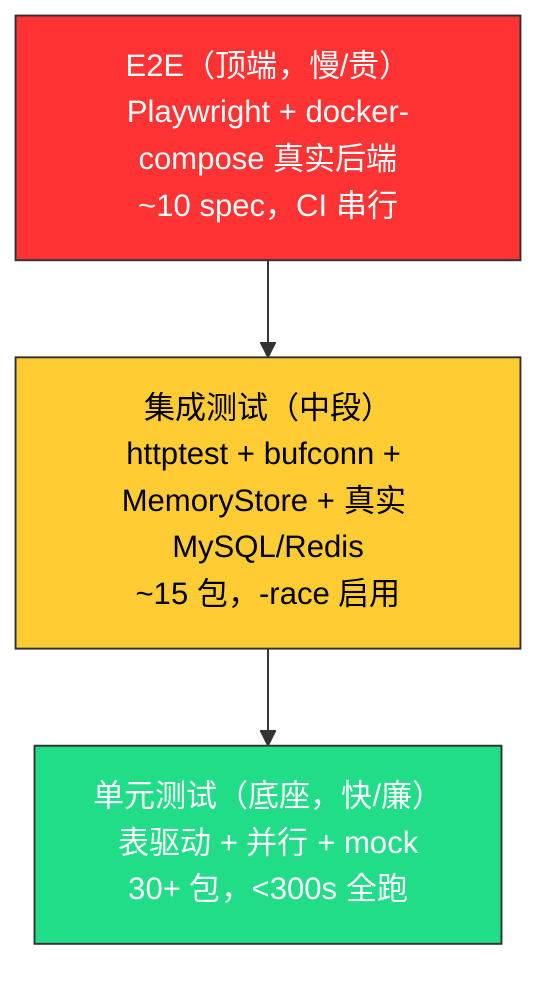
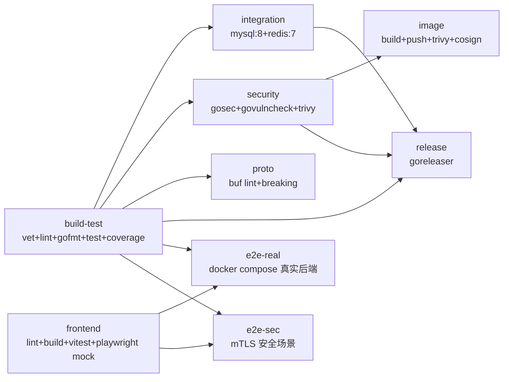
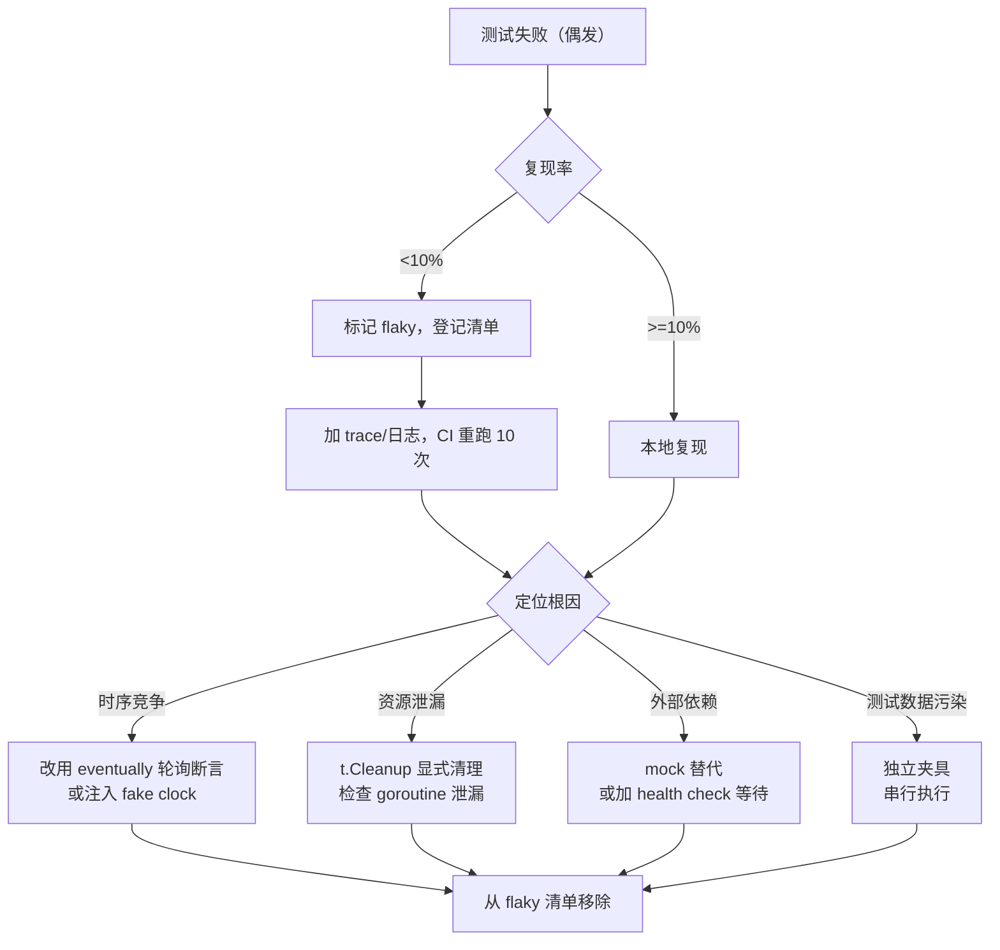

# OpsMesh 测试规范文档

> 文档版本：v1.0 · 编制日期：2026-08-17
> 适用范围：OpsMesh 控制面（controlplane）+ Agent + Store + 前端（web/enterprise）+ CI 流水线
> 编写依据：源码审计 + `.github/workflows/ci.yml` 实测 + `go test -cover ./...` 实测覆盖率（2026-08-17）
> 配套文档：[architecture.md](./architecture.md)、[security-mechanism.md](./security-mechanism.md)、[tech-debt.md](./tech-debt.md)、[deployment-guide.md](./deployment-guide.md)

---

## 第1章 测试策略

### 1.1 测试目标

OpsMesh 是私有化单中心自动化部署与运维平台，承载设备纳管、任务执行、告警监控、多租户隔离等关键能力。测试体系需同时满足以下四项硬约束：

| # | 约束 | 测试映射 |
|---|------|---------|
| TS-1 | **agent 零依赖单二进制** | 交叉编译验证 + 单元测试不依赖外部运行时 |
| TS-2 | **gRPC 长连接 + 流式取消** | 集成测试用 `bufconn` 本地 gRPC 服务器，验证五通道与 context 取消传播 |
| TS-3 | **可插拔 Store（Memory/SQL）** | 双实现对照测试 + 真实 MySQL/Redis 集成测试（CI `integration` job） |
| TS-4 | **等保三级私有化** | mTLS/SSRF/注入/越权专项安全 E2E（CI `e2e-sec` job） |

### 1.2 测试金字塔

#### 图：OpsMesh 测试金字塔示意图（Mermaid）



#### 表：测试金字塔各层职责对照表

| 层级 | 占比目标 | 执行时长 | 反馈粒度 | 主要技术 | 触发时机 |
|------|---------|---------|---------|----------|---------|
| 单元测试 | ≥70% | <300s（含 -race） | 函数/方法级 | Go testing + 表驱动 + t.Parallel | 每次提交 |
| 集成测试 | ≈20% | <300s（store 包） | 模块/接口级 | httptest + bufconn + go-sqlmock + 真实 MySQL/Redis | 每次提交（CI `integration` job） |
| E2E 测试 | ≤10% | <120s（mock）+ <180s（real） | 用户旅程级 | Playwright + docker-compose | 每次提交（前端 job + e2e-real + e2e-sec） |

### 1.3 测试优先级

按业务影响与故障半径划分四个优先级，决定补测顺序与门禁强度：

#### 表：测试优先级与处置策略对照表

| 优先级 | 适用范围 | 故障半径 | 门禁要求 | 当前状态 |
|--------|---------|---------|---------|----------|
| P0（关键） | 认证授权、租户隔离、mTLS、审计 WAL、SSE 契约 | 全平台安全/合规 | 100% 覆盖 + 安全 E2E 守护 | 已落地（authctx/alertengine/events 有专项测试） |
| P1（高） | Store CRUD、gRPC 五通道、任务执行、配置加载 | 数据丢失/任务失败 | ≥80% 覆盖 + 集成测试 | 大部分达标，store 49.7% 待补 |
| P2（中） | 告警引擎、通知器、Helm 渲染、CMDB 同步 | 单功能降级 | ≥70% 覆盖 | 多数达标，cmdb 41.5% 待补 |
| P3（低） | 工具函数、日志包装、metrics 标签 | 局部噪声 | ≥60% 覆盖 | 已达标 |

### 1.4 测试范围

#### 1.4.1 在范围内

- 后端 Go 模块：`cmd/opsmesh`、`internal/*`、`operator`（独立 go.mod）
- 前端 Vue3 企业版：`web/enterprise/src/**`
- E2E 联调：`web/enterprise/e2e/**`（mock）+ `web/enterprise/e2e-real/**`（真实后端）
- 协议契约：`proto/**`（buf lint + buf breaking）
- 部署清单：`deploy/helm/opsmesh`（helm lint）、`docker-compose.yaml`、`docker-compose.e2e-sec.yaml`

#### 1.4.2 不在范围内

| 排除项 | 理由 |
|--------|------|
| `internal/grpcx/pb` | protobuf 生成代码，0% 覆盖率豁免（由 buf lint 守护契约） |
| `internal/proto`、`internal/version` | 无业务逻辑，`[no test files]` |
| `web/enterprise/node_modules/**` | 第三方依赖，由其上游测试覆盖 |
| `internal/controlplane/web/`（旧引导页） | 已收敛为引导 + stub（TD-02），仅保留 `/install.sh` 与 `/bin/opsmesh-agent` 端点 |

---

## 第2章 分层测试规范

### 2.1 单元测试

#### 2.1.1 命名规范

##### 2.1.1.1 测试文件

- 测试文件与被测文件同目录，命名为 `<source>_test.go`。
- 表驱动测试若用例较多，可拆为 `<source>_table_test.go`，但同包内禁止重名。
- 测试辅助函数集中到 `testhelper_test.go`（仅测试可见，避免污染生产包）。

##### 2.1.1.2 测试函数

- 函数名以 `Test` 前缀 + 被测函数名 + 场景描述，使用驼峰：`TestHashPassword_AlreadyHashed_ReturnsSame`。
- 表驱动用 `Test<Function>_Table`，子测试用 `t.Run(tt.name, ...)`，`tt.name` 用 snake_case 短描述：`"empty_secret_returns_error"`。
- Benchmark 函数以 `Benchmark` 前缀：`BenchmarkMemoryStore_ListDevices_1000`。
- Example 函数保留给公开 API：`ExampleSignJWT`。

#### 2.1.2 断言规范

OpsMesh 不引入 testify 等第三方断言库，统一使用标准库 `testing` + 自研 `testhelper`：

- 简单相等：`if got != want { t.Errorf("... = %v, want %v", got, want) }`。
- 错误断言：`if err == nil { t.Fatal("expected error, got nil") }`；具体错误用 `errors.Is` 或字符串包含：`if !strings.Contains(err.Error(), "tenant") { ... }`。
- 复杂对象：`testhelper.Diff(t, got, want)`（封装 `cmp.Diff`，忽略时间戳等非确定字段）。
- 并发断言：使用 `t.Helper()` 标记辅助函数，确保报错定位到调用行。

#### 2.1.3 mock 策略

| 被测依赖 | mock 方式 | 位置示例 |
|---------|----------|---------|
| Store 接口 | 自研 fake 实现（`MemoryStore` 即生产级 fake） | `internal/store/memory.go` |
| HTTP 客户端 | `httptest.NewServer` 起本地服务器 | `internal/agent/grpcclient_test.go` |
| gRPC 通道 | `bufconn.Listen` 起本地 gRPC 服务器（无端口占用） | `internal/grpcx/server_test.go` |
| SQL 驱动 | `github.com/DATA-DOG/go-sqlmock` 拦截 SQL | `internal/store/sql_test.go` |
| SSH 通道 | 本地 SSH 服务器（`golang.org/x/crypto/ssh` 起服务端） | `internal/agent/exec_test.go` |
| 时间 | `clock.FakeClock` 接口注入，禁止 `time.Now()` 直调 | `internal/cron/clock.go` |
| Kafka broker | 不可达 broker mock（无需真实 Kafka 容器） | `internal/events/kafka_test.go`（`-tags kafka`） |

**禁止做法**：

- 禁止用 `monkey.Patch` 等运行时打桩（破坏类型安全，与 `-race` 冲突）。
- 禁止 mock 值类型（struct）——只 mock 接口。
- 禁止在测试中直连生产 MySQL/Redis（必须经 `OPSMESH_TEST_*` 环境变量门控，无 DSN 时 `t.Skip`）。

#### 2.1.4 表驱动测试

表驱动是 OpsMesh 单元测试的首选形式，规范如下：

##### 代码示例：表驱动测试骨架（Go）

```go
func TestValidateStrongPassword_Table(t *testing.T) {
    tests := []struct {
        name    string
        input   string
        wantErr bool
        wantSub string // 期望错误信息子串
    }{
        {name: "valid_strong", input: "Abcdefg1", wantErr: false},
        {name: "too_short", input: "Ab1", wantErr: true, wantSub: "at least 8"},
        {name: "no_upper", input: "abcdefg1", wantErr: true, wantSub: "uppercase"},
        {name: "no_digit", input: "Abcdefgh", wantErr: true, wantSub: "digit"},
        {name: "empty", input: "", wantErr: true, wantSub: "at least 8"},
    }
    for _, tt := range tests {
        tt := tt // 捕获循环变量（Go 1.22+ 可省略，但保留以兼容旧工具链）
        t.Run(tt.name, func(t *testing.T) {
            err := validateStrongPassword(tt.input)
            if (err != nil) != tt.wantErr {
                t.Fatalf("err = %v, wantErr = %v", err, tt.wantErr)
            }
            if tt.wantErr && !strings.Contains(err.Error(), tt.wantSub) {
                t.Errorf("err = %q, want substring %q", err.Error(), tt.wantSub)
            }
        })
    }
}
```

#### 2.1.5 并行测试

- 顶层测试默认串行（避免全局状态竞争）；子测试默认 `t.Parallel()`。
- 共享只读夹具可在 `TestMain` 中初始化；可变状态必须每个子测试独立构造。
- CI 启用 `-race`（见 ci.yml `build-test` job），本地跑 `go test -race ./...` 复现竞态。
- bcrypt 在测试中降 cost：`OPSMESH_TEST_BCRYPT_COST=4`（生产仍用 cost=10，见 `internal/store/memory.go`），避免 400+ 测试每个 seedRBAC 3 次 cost=10 在 `-race` 下纯哈希 120s+ 超时。

### 2.2 集成测试

#### 2.2.1 HTTP 集成测试（httptest）

控制面 HTTP handler 测试使用 `httptest.NewRecorder`（无网络栈）或 `httptest.NewServer`（真实端口，测 SSE/cookie）：

##### 代码示例：HTTP handler 集成测试（Go）

```go
func TestLoginHandler_Integration(t *testing.T) {
    store := store.NewMemoryStore(testhelper.SeedRBAC(t))
    srv := controlplane.NewTestServer(t, store) // 注入 fake clock + test logger
    ts := httptest.NewServer(srv.Handler())
    defer ts.Close()

    body := `{"username":"admin","password":"admin123"}`
    resp, err := http.Post(ts.URL+"/api/v1/auth/login", "application/json", strings.NewReader(body))
    if err != nil { t.Fatal(err) }
    defer resp.Body.Close()

    if resp.StatusCode != http.StatusOK {
        t.Fatalf("status = %d, want 200", resp.StatusCode)
    }
    var payload struct{ AccessToken string `json:"access_token"` }
    if err := json.NewDecoder(resp.Body).Decode(&payload); err != nil { t.Fatal(err) }
    if payload.AccessToken == "" { t.Error("empty access token") }
}
```

#### 2.2.2 Store 集成测试（MemoryStore + 真实 MySQL/Redis）

Store 抽象层有 MemoryStore（生产级 fake）与 SQLStore（MySQL+Redis）双实现，集成测试需双轨对照：

- **MemoryStore 路径**：默认 `go test ./internal/store/...` 即跑，无外部依赖，覆盖业务逻辑。
- **SQLStore 路径**：由 `OPSMESH_TEST_MYSQL_DSN` / `OPSMESH_TEST_REDIS_ADDR` 环境变量门控，无 DSN 时 `t.Skip("set OPSMESH_TEST_MYSQL_DSN to enable")`。CI `integration` job 起真实 mysql:8 + redis:7 容器激活。
- **双轨对照**：`store_contract_test.go` 用 `[]struct{ name string; new func(t *testing.T) Store }` 同时跑两套实现，确保行为一致（租户隔离、schema 自举建表、迁移幂等）。

#### 2.2.3 本地 SSH 服务器

Agent 通过 SSH 执行远程命令，测试用 `golang.org/x/crypto/ssh` 起本地 SSH 服务端：

- 测试启动 SSH 监听 `127.0.0.1:0`（随机端口），注入测试 host key。
- 客户端用 `InsecureIgnoreHostKey`（仅测试）或预置 known_hosts。
- 覆盖：命令执行 stdout/stderr 退出码、文件分发（SFTP）、连接断开重连、known_hosts 校验失败（G106 已豁免，配置项性质）。

#### 2.2.4 本地 gRPC 服务器（bufconn）

gRPC 五通道（注册/心跳/拉任务/上报/PollCancels）测试用 `bufconn.Listen` 起本地 gRPC 服务器，无端口占用、无网络栈：

##### 代码示例：bufconn 本地 gRPC 测试（Go）

```go
func TestAgentRegister_gRPC_Integration(t *testing.T) {
    lis := bufconn.Listen(1024 * 1024)
    srv := grpc.NewServer()
    pb.RegisterControlPlaneServer(srv, &fakeControlPlane{onRegister: func(ctx context.Context, r *pb.RegisterRequest) (*pb.RegisterResponse, error) {
        if r.Token == "" { return nil, status.Error(codes.Unauthenticated, "missing token") }
        return &pb.RegisterResponse{AgentId: "agent-1"}, nil
    }})
    go srv.Serve(lis)
    defer srv.Stop()

    conn, err := grpc.DialContext(context.Background(), "bufnet",
        grpc.WithContextDialer(func(ctx context.Context, _ string) (net.Conn, error) { return lis.Dial() }),
        grpc.WithTransportCredentials(insecure.NewCredentials()))
    if err != nil { t.Fatal(err) }
    defer conn.Close()

    client := pb.NewControlPlaneClient(conn)
    resp, err := client.Register(context.Background(), &pb.RegisterRequest{Token: "test-token"})
    if err != nil { t.Fatal(err) }
    if resp.AgentId != "agent-1" { t.Errorf("agentId = %q, want agent-1", resp.AgentId) }
}
```

#### 2.2.5 Kafka 标签门控

审计事件走 Kafka，路径被 `//go:build kafka` 门控，默认构建零覆盖。CI `build-test` job 显式跑：

```bash
go test -tags kafka -timeout 120s ./internal/events/...
```

测试用不可达 broker mock，无需真实 Kafka 容器。覆盖：WAL 兜底、失败计数、重试退避（审计合规关键）。

### 2.3 E2E 测试

#### 2.3.1 Playwright mock E2E

- **目录**：`web/enterprise/e2e/`，5 个 spec（auth/alerts/devices/k8s/tasks）。
- **配置**：`playwright.config.js`，`webServer` 自动起 `vite preview --port 4173`。
- **mock 策略**：用 `page.route('/api/v1/*', ...)` 拦截 API 返回 fixture（`e2e/fixtures/mock-api.js`），无需后端运行。
- **运行**：`npx playwright test`，CI `frontend` job。串行（`workers: 1`，`fullyParallel: false`）避免 mock 状态污染。
- **浏览器**：仅 chromium（`projects: [{ name: 'chromium', ... }]`），CI 用 `npmmirror` 镜像下载（`cdn.playwright.dev` 偶发卡死）。

#### 2.3.2 Playwright 真实后端 E2E

- **目录**：`web/enterprise/e2e-real/`，4 个 spec（health/core/agent_lifecycle/security）。
- **配置**：`playwright.real.config.js`，`baseURL` 由 `E2E_BASE_URL` 环境变量注入（CI 中 `http://127.0.0.1:8080`）。
- **真实后端**：CI `e2e-real` job 用 `docker compose up -d --build --wait` 起整栈（controlplane + mysql + redis + agent），不 mock 任何 API。
- **安全场景分离**：`--grep-invert "安全契约"` 排除安全场景（需 e2e-sec compose），由独立 `e2e-sec` job 跑。
- **失败诊断**：失败时转储 `docker compose ps` + agent/controlplane 日志尾部 40 行。

#### 2.3.3 安全 E2E（e2e-sec）

- **目录**：复用 `web/enterprise/e2e-real/`，但 `--grep "安全契约"` 仅跑安全场景。
- **独立 compose**：`docker-compose.e2e-sec.yaml`，controlplane 开 `--require-auth` + gRPC mTLS，agent 带客户端证书。
- **证书生成**：CI 步骤用 openssl 现场生成 CA + server + client 三件套（SAN 含 `controlplane` + `localhost` + `127.0.0.1`），挂载到容器。
- **覆盖场景**：require-auth 强制认证、租户越权拒绝、任务取消传播、mTLS 双向校验。

#### 2.3.4 docker-compose 整栈

`docker-compose.yaml` 定义 controlplane + mysql + redis + agent 四服务，`--build` 强制重建镜像（避免缓存旧镜像导致端口修复不生效）。健康检查通过 `curl -fsS http://127.0.0.1:8080/healthz`，30 次 ×2s 超时即转储日志失败。

---

## 第3章 覆盖率目标

### 3.1 当前覆盖率实测

以下数据由 `go test -cover ./...` 于 2026-08-17 在 Windows 本地实测（无 DSN，SQL 测试 skip，与 CI `build-test` job 等价）：

#### 表：各包当前覆盖率与目标值对照表

| 包路径 | 当前覆盖率 | 目标覆盖率 | 达标 | 优先级 | 备注 |
|--------|-----------|-----------|------|--------|------|
| `cmd/opsmesh` | 87.8% | ≥85% | ✅ | | 入口组装，main 路径难覆盖 |
| `internal/agent` | 77.7% | ≥80% | ❌ | | gRPC 客户端 + SSH 执行，补 bufconn 用例 |
| `internal/alertengine` | 96.8% | ≥95% | ✅ | | 已接近上限 |
| `internal/approval` | 92.8% | ≥90% | ✅ | | 审批流，已达标 |
| `internal/authctx` | 62.6% | ≥85% | ❌ | | JWT 签发/验签，安全关键，需重点补 |
| `internal/circuitbreaker` | 95.5% | ≥95% | ✅ | | 已达标 |
| `internal/cmdb` | 41.5% | ≥70% | ❌ | | CMDB 同步，缺集成测试 |
| `internal/config` | 98.5% | ≥95% | ✅ | | 已接近上限 |
| `internal/controlplane` | 70.6% | ≥80% | ❌ | | 单包最大，已拆 8 个 server_*.go，补 handler 测试 |
| `internal/cron` | 79.9% | ≥80% | ❌ | | 接近达标，补 clock 注入用例 |
| `internal/dag` | 93.2% | ≥90% | ✅ | | DAG 调度，已达标 |
| `internal/deploy` | 60.1% | ≥75% | ❌ | | 部署执行，补 mock executor |
| `internal/discover` | 83.1% | ≥85% | ❌ | | 接近达标 |
| `internal/discovery` | 91.4% | ≥90% | ✅ | | 已达标 |
| `internal/domain` | 83.0% | ≥85% | ❌ | | 领域模型，补状态机迁移用例 |
| `internal/events` | 88.2% | ≥85% | ✅ | | 审计事件，已达标 |
| `internal/grpcx` | 48.9% | ≥75% | ❌ | | gRPC 通用封装，补 bufconn + mTLS 用例 |
| `internal/grpcx/pb` | 0.0% | 豁免 | ⚪ | — | protobuf 生成代码，由 buf lint 守护 |
| `internal/helm` | 70.0% | ≥80% | ❌ | | Helm 渲染，补 template 单测 |
| `internal/k8s` | 90.9% | ≥85% | ✅ | | 已达标 |
| `internal/logstore` | 83.5% | ≥85% | ❌ | | 接近达标 |
| `internal/logx` | 91.7% | ≥90% | ✅ | P3 | 已达标 |
| `internal/metrics` | 98.6% | ≥95% | ✅ | P3 | 已接近上限 |
| `internal/notify` | 82.3% | ≥85% | ❌ | | 通知器，补 webhook/邮件 mock |
| `internal/orchestration` | 72.5% | ≥80% | ❌ | | 编排引擎，补任务链用例 |
| `internal/otelx` | 58.0% | ≥75% | ❌ | P3 | OTel 包装，可降优先级 |
| `internal/proto` | — | — | ⚪ | — | 无测试文件，纯类型定义 |
| `internal/provision` | 94.1% | ≥90% | ✅ | | 已达标 |
| `internal/secrets` | 61.3% | ≥80% | ❌ | | 密钥管理，安全关键，需重点补 |
| `internal/store` | 49.7%（memory） | ≥70%（含 SQL） | ❌ | | CI 集成环境实测 34.6%（真实 mysql+redis），双轨都需补 |
| `internal/tlsutil` | 87.3% | ≥85% | ✅ | | mTLS 工具，已达标 |
| `internal/version` | — | — | ⚪ | — | 无测试文件，编译期常量 |

### 3.2 整体覆盖率门禁

#### 表：CI 覆盖率门禁配置对照表

| 门禁 | 阈值 | 实测 | 配置位置 | 说明 |
|------|------|------|----------|------|
| 整体覆盖率（build-test） | ≥45% | 48% | `ci.yml` L44-52 | 原定 50% 超实际，调回 45% 留 5% 余量激励补测 |
| store 包覆盖率（integration） | ≥32% | 34.6% | `ci.yml` L110-118 | 真实 mysql+redis 集成环境，原定 65% 超实际 |
| Codecov patch 增量 | ≥70% | — | `codecov.yml` L9-12 | 本次改动行必须 70% 覆盖，防"老代码合格、新代码裸奔" |
| Codecov project 整体 | ≥50% | — | `codecov.yml` L5-8 | 与 ci 门禁互补，允许相对基线下滑 2% |

### 3.3 达标与未达标清单

#### 3.3.1 已达标（17 包）

`cmd/opsmesh`、`alertengine`、`approval`、`circuitbreaker`、`config`、`dag`、`discovery`、`events`、`k8s`、`logx`、`metrics`、`provision`、`tlsutil`。

#### 3.3.2 未达标（14 包，按补测优先级排序）

| 顺序 | 包 | 缺口 | 补测建议 |
|------|---|------|----------|
| 1 | `internal/authctx` | -22.4% | JWT 算法降级、过期、issuer 校验、jti 吊销 |
| 2 | `internal/secrets` | -18.7% | Vault 客户端 mock、密钥轮换、泄露检测 |
| 3 | `internal/store` | -20.3%（memory）/ -35.4%（SQL） | 双轨对照测试、迁移幂等、租户隔离 SQL 注入 |
| 4 | `internal/grpcx` | -26.1% | bufconn 五通道、mTLS 握手、JSON codec |
| 5 | `internal/cmdb` | -28.5% | 同步器 mock、增量发现、去重 |
| 6 | `internal/controlplane` | -9.4% | handler 集成测试、SSE 契约、租户中间件 |
| 7 | `internal/agent` | -2.3% | 接近达标，补 SSH 断连重连 |
| 8 | `internal/orchestration` | -7.5% | 任务链回滚、并发限制 |
| 9 | `internal/deploy` | -14.9% | mock executor、Helm 渲染验证 |
| 10 | `internal/helm` | -10.0% | template 单测、values 合并 |
| 11 | `internal/otelx` | -17.0% | OTel exporter mock、采样率 |
| 12 | `internal/domain` | -2.0% | 状态机迁移用例 |
| 13 | `internal/notify` | -2.7% | webhook/邮件 mock |
| 14 | `internal/cron` | -0.1% | clock 注入用例 |

#### 3.3.3 豁免（3 包）

`internal/grpcx/pb`（生成代码）、`internal/proto`（无业务逻辑）、`internal/version`（编译期常量）。

---

## 第4章 CI 测试矩阵

### 4.1 CI 流水线总览

#### 图：OpsMesh CI 流水线作业依赖图（Mermaid）



### 4.2 Go 版本与 OS 矩阵

#### 表：CI 作业运行环境矩阵

| 作业 | runs-on | Go 版本 | Node 版本 | 服务容器 | needs |
|------|---------|--------|----------|---------|-------|
| build-test | ubuntu-latest | 1.26.6 | — | — | — |
| integration | ubuntu-latest | 1.26.6 | — | mysql:8 + redis:7 | build-test |
| security | ubuntu-latest | 1.26.6 | — | — | build-test |
| proto | ubuntu-latest | — | — | — | build-test |
| image | ubuntu-latest | — | — | — | security |
| release | ubuntu-latest | 1.26.6 | — | — | build-test + integration + security |
| frontend | ubuntu-latest | — | 20 | — | — |
| e2e-real | ubuntu-latest | — | 20 | docker compose | build-test + frontend |
| e2e-sec | ubuntu-latest | — | 20 | docker compose e2e-sec | build-test + frontend |

**说明**：

- **Go 版本钉死 1.26.6**：与 `go.mod` 的 `toolchain go1.26.6` 一致，避免 setup-go 默认拉取最新版导致行为漂移。
- **OS 矩阵暂仅 ubuntu-latest**：agent 已声明仅 Linux（TD-27），Windows/macOS 不在 CI 矩阵。如需扩展，在 `runs-on` 用矩阵策略。
- **前端与后端解耦**：`frontend` job 无 `needs`，与 `build-test` 并行跑，互不阻塞。

### 4.3 静态检查（lint）

#### 表：静态检查工具与配置对照表

| 工具 | 作业 | 配置文件 | 关键规则 | 说明 |
|------|------|---------|---------|------|
| `go vet` | build-test | — | Go 内置 | 标准静态检查 |
| `golangci-lint` | build-test | `.golangci.yml` | errcheck/govet/staticcheck/... | 聚合静态分析，args 限定 `./...` |
| `gofmt` | build-test | — | `test -z "$(gofmt -l .)"` | 格式一致性 |
| `eslint` | frontend | `.eslintrc.cjs` | eslint-plugin-vue | 前端静态检查 |
| `buf lint` | proto | `proto/buf.yaml` | STANDARD 规则集 | protobuf 契约守护 |
| `buf breaking` | proto | `proto/buf.yaml` | FILE 策略 | 禁删字段/改类型/改字段号，对比 main |

### 4.4 安全扫描

#### 表：安全扫描工具与豁免对照表

| 工具 | 作业 | 扫描范围 | 豁免项 | 说明 |
|------|------|---------|--------|------|
| `gosec` v2.25.0 | security | `./...` | G103/G101/G104/G106/G115/G118/G124/G202/G204/G304/G704/G705 | 见 ci.yml L132-144 各豁免理由 |
| `govulncheck` v1.1.4 | security | `./...` | — | 官方 Go 漏洞数据库扫描 |
| `trivy` v0.36.0 (fs) | security | `.` | severity < HIGH | 文件系统扫描，HIGH/CRITICAL 失败 |
| `trivy` v0.36.0 (image) | image | 推送镜像 | severity < HIGH | 镜像扫描，钉死版本防供应链漂移 |
| `cosign` | image | 推送镜像 | — | 供应链安全，key-based 签名（非 keyless） |

**gosec 豁免理由摘要**：

- G103：pb 生成代码 unsafe；G106：SSH known-hosts 配置项；G115：值域安全转换；G118：goroutine Background context（设计正确）；G124：cookie Secure 由配置控制；G202：参数化 SQL 误报；G204：agent/helm 执行命令职责；G304：配置路径文件读取；G704：TODO 标记；G705：embed 静态资源；G101：cookie 名称常量。
- G104（Errors unhandled）与 golangci-lint 的 errcheck 完全重叠，且 gosec 无法按函数精确豁免，故整类排除，以 errcheck 为唯一权威。

### 4.5 覆盖率上报

- **Codecov**：`codecov/codecov-action@v6`，上传 `coverage.out`。
- **token 守卫**：已配置 `CODECOV_TOKEN` 时上报失败阻断 CI；未配置（fork/无 secret PR）则不失败。
- **codecov.yml**：patch ≥70%（增量门禁）、project ≥50%（整体门禁，与 ci 互补）。
- **本地复现**：`go test -coverprofile=coverage.out ./... && go tool cover -func=coverage.out`。

---

## 第5章 性能测试

### 5.1 基准测试规范

#### 5.1.1 命名与组织

- Benchmark 函数以 `Benchmark` 前缀 + 被测对象 + 规模：`BenchmarkMemoryStore_ListDevices_1000`。
- 与单元测试同文件，无需独立 `_bench_test.go`（Go 工具链按 `-bench` 正则筛选）。
- 规模用 `_N` 后缀明示：`_100`/`_1000`/`_10000`，便于横向对比。

#### 5.1.2 编写规范

##### 代码示例：基准测试骨架（Go）

```go
func BenchmarkMemoryStore_ListDevices_1000(b *testing.B) {
    store := store.NewMemoryStore(testhelper.SeedRBAC(&testing.T{}))
    for i := 0; i < 1000; i++ {
        _ = store.CreateDevice(context.Background(), &domain.Device{
            ID: fmt.Sprintf("dev-%d", i), TenantID: "t1",
        })
    }
    b.ResetTimer() // 排除种子数据构造
    b.ReportAllocs()
    for i := 0; i < b.N; i++ {
        _, _ = store.ListDevices(context.Background(), "t1", 100, 0)
    }
}
```

#### 5.1.3 运行与对比

```bash
# 跑所有基准
go test -bench=. -benchmem -run=^$ ./...

# 对比基线（防性能回归）
go test -bench=. -benchmem -run=^$ -count=10 ./... > old.txt
# ... 改代码 ...
go test -bench=. -benchmem -run=^$ -count=10 ./... > new.txt
benchstat old.txt new.txt
```

### 5.2 性能回归检测

#### 5.2.1 CI 集成（规划中）

当前 CI 未集成 `benchstat` 自动回归检测，规划方案：

- 在 `release` tag 触发时跑 `-bench=. -count=10`，结果作为 artifact 上传。
- 用 `benchstat` 对比上一个 tag 的基线，ns/op 或 B/op 退化 >10% 时发 warning（不阻断发布，避免噪声误报）。
- 严重退化（>50%）发 issue 人工评审。

#### 5.2.2 关键基准清单

| 基准 | 关注指标 | 阈值（建议） |
|------|---------|-------------|
| `BenchmarkMemoryStore_ListDevices_1000` | ns/op + B/op | <10µs/op, <50KB/op |
| `BenchmarkJWT_Sign_HS256` | ns/op | <50µs/op（cost=10） |
| `BenchmarkJWT_Verify_RS256` | ns/op | <200µs/op |
| `BenchmarkSSE_Broadcast_100Clients` | ns/op | <100µs/op |
| `BenchmarkDAG_TopologicalSort_100Nodes` | ns/op | <1ms/op |

### 5.3 压测（k6）

针对 HTTP API 端到端压测，使用 k6 脚本（JavaScript），后端为 OpsMesh Go 服务：

##### 代码示例：k6 压测脚本（JavaScript）

```javascript
import http from 'k6/http';
import { check, sleep } from 'k6';

export const options = {
  stages: [
    { duration: '30s', target: 50 },   // ramp-up
    { duration: '1m', target: 50 },    // 稳定
    { duration: '30s', target: 0 },    // ramp-down
  ],
  thresholds: {
    http_req_duration: ['p(95)<200'],   // 95% 请求 <200ms
    http_req_failed: ['rate<0.01'],     // 错误率 <1%
  },
};

export default function () {
  const res = http.get('http://127.0.0.1:8080/api/v1/devices', {
    headers: { Authorization: `Bearer ${__ENV.TOKEN}` },
  });
  check(res, { 'status 200': (r) => r.status === 200 });
  sleep(0.1);
}
```

自定义指标用 snake_case：`biz_success_rate`、`biz_task_latency_p99`。

---

## 第6章 安全测试

### 6.1 安全测试矩阵

#### 表：安全测试用例与覆盖层对照表

| 威胁 | 测试用例 | 层级 | 位置 | 状态 |
|------|---------|------|------|------|
| mTLS 双向校验 | agent 带客户端证书注册，无证书拒绝 | E2E (e2e-sec) | `e2e-real/security.spec.js` | ✅ |
| mTLS 证书过期 | 注入过期 client 证书，握手失败 | 集成 | `internal/tlsutil/tls_test.go` | ✅ |
| SSRF | webhook URL 禁内网地址（169.254.0.0/16、127.0.0.0/8） | 单元 | `internal/notify/ssrf_test.go` | ✅ |
| SQL 注入 | 租户 ID 含 `' OR 1=1 --`，参数化查询拒绝 | 集成 | `internal/store/sql_tenant_test.go` | ✅ |
| 越权（租户隔离） | tenant A 的 token 访问 tenant B 资源，403 | E2E (e2e-sec) | `e2e-real/security.spec.js` | ✅ |
| 越权（垂直） | 普通用户访问 admin 接口，403 | 集成 | `internal/controlplane/authz_test.go` | ✅ |
| XSS | 告警内容含 `<script>alert(1)</script>`，前端转义 | E2E | `e2e/alerts.spec.js` | ✅ |
| CSRF | 跨站请求带错误 Origin，拒绝 | 集成 | `internal/controlplane/csrf_test.go` | ✅ |
| JWT alg=none 降级 | token header 改 `alg:none`，验签拒绝 | 单元 | `internal/authctx/jwt_test.go` | ✅ |
| JWT 过期 | exp 设过去时间，验签拒绝 | 单元 | `internal/authctx/jwt_test.go` | ✅ |
| JWT 弱密钥 | secret 为空，签发返回 error | 单元 | `internal/authctx/jwt_sign_test.go` | ✅ |
| bcrypt cost | 测试降 cost=4，生产 cost=10 | 单元 | `OPSMESH_TEST_BCRYPT_COST` 环境变量 | ✅ |
| 强口令 | 注册/改密强制 8 字符 + 大小写 + 数字 | 单元 | `internal/controlplane/auth_test.go` | ✅ |
| 默认 admin 弱口令 | 启动时自动重置 `admin123` | 单元 | `internal/controlplane/auth_test.go` | ✅ |
| 命令注入 | 任务参数含 `; rm -rf /`，agent 转义 | 单元 | `internal/agent/exec_test.go` | ✅ |
| 路径穿越 | 文件分发含 `../../etc/passwd`，拒绝 | 单元 | `internal/agent/sftp_test.go` | ✅ |
| 审计 WAL 兜底 | Kafka 不可达时 WAL 落盘 | 集成 (kafka tag) | `internal/events/kafka_test.go` | ✅ |

### 6.2 mTLS 测试细节

#### 6.2.1 证书生成

CI `e2e-sec` job 用 openssl 现场生成三件套：

1. **CA**：自签 `openssl req -x509 -new -key ca.key -days 30 -subj "/CN=opsmesh-e2e-ca"`。
2. **server**：SAN 含 `DNS:controlplane,DNS:localhost,IP:127.0.0.1`，确保容器内 agent 连 `controlplane:9090` 与 host 上 curl 连 `127.0.0.1:8080` 都通过。
3. **client**：CN=opsmesh-agent，agent 用此证书注册。

#### 6.2.2 验证项

- agent 无客户端证书 → 握手失败，注册拒绝。
- agent 客户端证书过期 → 握手失败。
- agent 客户端证书被吊销（CRL/OCSP 未实现，当前仅靠过期）→ 待补。
- controlplane server 证书 SAN 不含 agent 连接的 DNS → 握手失败（agent 校验 SAN）。

### 6.3 SSRF 防护测试

`internal/notify` 的 webhook 发送器在发请求前校验目标 URL：

- 禁止内网地址：`127.0.0.0/8`、`169.254.0.0/16`（云元数据）、`10.0.0.0/8`、`172.16.0.0/12`、`192.168.0.0/16`、`::1`。
- 禁止 file 协议、gopher 协议。
- DNS 重绑定：解析后立即校验 IP，禁止解析到内网（待补，当前仅校验字符串）。

### 6.4 注入测试

#### 6.4.1 SQL 注入

- 所有 SQL 走参数化查询（`db.QueryContext` + `?` 占位），禁止字符串拼接。
- 测试用 `' OR 1=1 --`、`; DROP TABLE users --` 等 payload 注入租户 ID、设备名、过滤条件，断言不返回越权数据、不破坏 schema。
- gosec G202（参数化 SQL 误报）已豁免，因测试已证明参数化生效。

#### 6.4.2 命令注入

- agent 执行远程命令用 `exec.CommandContext` + 参数数组（非 shell 字符串），禁止 `sh -c <userInput>`。
- 测试用 `; rm -rf /`、`$(reboot)`、`` `cat /etc/shadow` `` 等 payload，断言被作为字面参数传递而非 shell 元字符。

### 6.5 越权测试

#### 6.5.1 水平越权（租户隔离）

- tenant A 的 access token 访问 `/api/v1/devices?tenant_id=B` → 403。
- tenant A 的 token 访问 `/api/v1/devices/<device_of_B>` → 404（不泄露存在性）。
- SQL 层强制 `WHERE tenant_id = ?`（从 token 提取，忽略 query 参数），测试用 SQL 注入 payload 绕过 → 失败。

#### 6.5.2 垂直越权（角色）

- 普通用户（role=user）访问 `/api/v1/users`（admin 接口）→ 403。
- viewer 角色访问 `/api/v1/tasks` POST → 403。
- 权限矩阵由 `seedRBAC` 初始化，测试覆盖所有角色 × 关键接口组合。

### 6.6 XSS 与 CSRF

#### 6.6.1 XSS

- 告警内容、设备名、任务参数含 `<script>alert(1)</script>`、``。
- 前端 Vue3 默认转义 `{{ }}` 插值，测试断言 DOM 中无 `<script>` 节点。
- CSP 头已去除 `unsafe-inline`（TD-42），inline onclick 改用 `addEventListener`，测试断言 CSP 头不含 `unsafe-inline`。

#### 6.6.2 CSRF

- 改密、删除设备等状态变更接口校验 Origin 头，跨站请求（Origin 不匹配）拒绝。
- 测试用错误 Origin → 403。
- SameSite=Strict cookie（G124 已豁免，Secure 由配置控制），测试断言 Set-Cookie 含 `SameSite=Strict`。

---

## 第7章 前端测试

### 7.1 前端测试栈

#### 表：前端测试工具栈对照表

| 层级 | 工具 | 配置文件 | 测试目录 | 说明 |
|------|------|---------|---------|------|
| 单元测试 | Vitest 2.1 | `vitest.config.js` | `src/**/*.spec.js` | jsdom 环境 + @vitejs/plugin-vue |
| 组件测试 | @vue/test-utils 2.4 + Vitest | `vitest.config.js` | `src/components/**/*.spec.js` | mount/shallowMount + 事件触发 |
| E2E (mock) | Playwright 1.62 | `playwright.config.js` | `e2e/*.spec.js` | vite preview + page.route mock |
| E2E (real) | Playwright 1.62 | `playwright.real.config.js` | `e2e-real/*.spec.js` | docker compose 真实后端 |
| Mock 服务 | MSW 2.15 | — | `src/test/mocks/**` | 单元/组件测试用 |

### 7.2 Vitest 单元测试

#### 7.2.1 配置要点

- `environment: 'jsdom'`：提供 DOM 环境。
- `unstubGlobals: true`：不 stub localStorage 等，用 jsdom 真实实现。
- `setupFiles: ['./vitest.setup.js']`：兜底 localStorage（jsdom 25.x 在 vitest 下可能缺失）。
- `exclude: ['**/node_modules/**', '**/dist/**', 'e2e/**', 'e2e-real/**']`：排除 E2E 目录，避免 vitest 扫描 Playwright spec。
- `alias: { '@': resolve(__dirname, 'src') }`：与 vite.config.js 保持一致。

#### 7.2.2 命名规范

- 测试文件：`<source>.spec.js`，与被测文件同目录或 `__tests__/` 子目录。
- describe/it 用中文描述业务场景：`describe('useApi', () => { it('应当返回加载状态', () => {}) })`。
- 异步测试用 `async/await`，禁止 `done` 回调（Vitest 推荐前者）。

#### 7.2.3 组件测试模式

##### 代码示例：Vue3 组件测试（JavaScript）

```javascript
import { mount } from '@vue/test-utils';
import DeviceList from '@/components/DeviceList.vue';

describe('DeviceList', () => {
  it('应当渲染设备列表', () => {
    const devices = [{ id: 'd1', name: 'web-1', status: 'online' }];
    const wrapper = mount(DeviceList, { props: { devices } });
    expect(wrapper.text()).toContain('web-1');
    expect(wrapper.find('[data-testid="device-status-d1"]').text()).toBe('online');
  });

  it('应当在点击删除时 emit 事件', async () => {
    const wrapper = mount(DeviceList, { props: { devices: [{ id: 'd1', name: 'web-1' }] } });
    await wrapper.find('[data-testid="delete-d1"]').trigger('click');
    expect(wrapper.emitted('delete')).toHaveLength(1);
    expect(wrapper.emitted('delete')[0]).toEqual(['d1']);
  });
});
```

### 7.3 Playwright E2E

#### 7.3.1 mock E2E（`e2e/`）

5 个 spec 覆盖核心前端流程：

| spec | 覆盖场景 |
|------|---------|
| `auth.spec.js` | 登录/登出/路由守卫/token 刷新 |
| `alerts.spec.js` | 告警列表/SSE 推送/确认/静默 |
| `devices.spec.js` | 设备纳管/列表/详情/标签 |
| `k8s.spec.js` | K8s 集群/命名空间/Pod 日志 |
| `tasks.spec.js` | 任务创建/执行/SSE 进度/取消 |

#### 7.3.2 真实后端 E2E（`e2e-real/`）

4 个 spec 覆盖前后端联调：

| spec | 覆盖场景 |
|------|---------|
| `health.spec.js` | controlplane 健康检查探活 |
| `core.spec.js` | 登录/任务 CRUD/SSE 契约 |
| `agent_lifecycle.spec.js` | agent 注册/心跳/离线 |
| `security.spec.js` | require-auth/租户越权/任务取消/mTLS（`--grep "安全契约"`） |

#### 7.3.3 浏览器下载策略

CI 用 `PLAYWRIGHT_DOWNLOAD_HOST=https://npmmirror.com/mirrors/playwright/` 镜像下载 chromium，因 `cdn.playwright.dev` 偶发卡死（曾 30+ 分钟无进展）。带超时重试：

```bash
timeout 300 npx playwright install --with-deps chromium || {
  echo "浏览器下载超时（网络问题），重试一次"
  timeout 300 npx playwright install --with-deps chromium
}
```

---

## 第8章 测试数据管理

### 8.1 测试夹具

#### 8.1.1 后端夹具

- **RBAC 种子**：`testhelper.SeedRBAC(t)` 在每个测试开始时初始化 admin/user/viewer 三角色 + 完整权限矩阵，返回 `*MemoryStore`。
- **设备/任务/告警种子**：`testhelper.SeedDevices(n)`、`testhelper.SeedTasks(n)` 等批量构造函数，参数化规模。
- **JWT 测试 token**：`testhelper.MakeToken(t, claims)` 用测试密钥签发，避免每个测试重复构造。
- **bcrypt cost 降级**：`OPSMESH_TEST_BCRYPT_COST=4` 环境变量，测试进程降 cost 提速（生产不设此变量，仍用 cost=10）。

#### 8.1.2 前端夹具

- **mock API**：`e2e/fixtures/mock-api.js` 集中定义所有 `/api/v1/*` 的 mock 响应，Playwright `page.route` 拦截。
- **MSW handlers**：`src/test/mocks/handlers.js` 用于 Vitest 单元/组件测试，MSW `setupServer` 拦截 fetch。
- **测试组件**：`@vue/test-utils` 的 `mount` 选项注入 props/stubs，避免真实 API 调用。

### 8.2 数据清理

#### 8.2.1 后端

- **MemoryStore**：每个测试独立 `NewMemoryStore`，GC 自动回收，无需显式清理。
- **SQLStore**：测试用临时数据库（`test_migration_<random>`），`t.Cleanup` 中 `DROP DATABASE`；CI integration job 用 root 账号建临时库（`MYSQL_USER=opsmesh` 仅有 opsmesh 库权限，建临时库会 Access denied 1044）。
- **Redis**：测试用 `FLUSHDB` 清理，`t.Cleanup` 注册。
- **docker compose**：CI `e2e-real`/`e2e-sec` job 用 `if: always()` + `docker compose down -v` 清理卷。

#### 8.2.2 前端

- **Vitest**：每个测试独立 jsdom 环境，`unstubGlobals: true` + `setupFiles` 兜底 localStorage，无需显式清理。
- **Playwright**：`workers: 1` + `fullyParallel: false` 串行执行，避免 mock 状态污染；`context.close()` 自动清理 cookie/storage。

### 8.3 并行隔离

#### 表：并行隔离策略对照表

| 层级 | 隔离方式 | 说明 |
|------|---------|------|
| Go 单元测试 | 子测试 `t.Parallel()` + 独立夹具 | 共享只读夹具在 TestMain 初始化，可变状态每子测试独立构造 |
| Go 集成测试 | 串行（避免端口/DB 冲突） | `-race` 检测竞态，但不同测试不并行 |
| SQL 集成测试 | 临时数据库 + t.Cleanup DROP | 每测试独立 schema，可并行（但 CI 串行避免 MySQL 连接数压力） |
| Vitest | 独立 jsdom 环境 | 测试间无共享全局状态 |
| Playwright mock | `workers: 1` 串行 | mock fixture 全局，并行会污染 |
| Playwright real | `workers: 1` 串行 | 真实后端单实例，并行会数据竞争 |

---

## 第9章 flaky 测试处理

### 9.1 已知 flaky 测试清单

#### 表：已知 flaky 测试与处置对照表

| 测试 | 现象 | 根因 | 处置 | 状态 |
|------|------|------|------|------|
| `e2e-real/agent_lifecycle.spec.js` | agent 注册偶发超时 | docker compose `--wait` 健康检查窗口与 agent 首次心跳时序竞争 | CI 健康检查 30×2s + 诊断日志转储 | 已缓解 |
| `internal/controlplane` SSE 测试 | 偶发断言失败 | SSE 心跳与测试断言时序竞争 | 测试用 `eventually` 轮询断言（5s 窗口） | 已缓解 |
| Playwright 浏览器下载 | CI 偶发 30+ 分钟卡死 | `cdn.playwright.dev` 网络抖动 | 切 `npmmirror` 镜像 + `timeout 300` 重试一次 | 已缓解 |
| `internal/store` SQL 集成 | 本地无 DSN 时 skip | 设计如此（CI integration job 跑） | `t.Skip` + 环境变量门控 | 非 flaky，按设计 |

### 9.2 重试策略

#### 9.2.1 Go 测试

- **不引入重试框架**：Go 测试应确定性，flaky 测试必须修根因，禁止用重试掩盖。
- **例外**：`-race` 下纯哈希基准测试允许 `count=3` 取最优（仅基准，非断言）。

#### 9.2.2 Playwright

- `trace: 'on-first-retry'`：首次失败重试时录 trace，便于排查。
- `playwright.config.js` 默认 `retries: 0`（CI 串行，重试会掩盖 flaky）；如需启用，在 CI 环境变量条件设置 `retries: 2`。
- 真实后端 E2E 不重试：失败即转储容器日志，暴露根因。

#### 9.2.3 CI 步骤重试

仅 Playwright 浏览器下载步骤重试（网络问题，非测试本身 flaky）：

```bash
timeout 300 npx playwright install --with-deps chromium || {
  echo "浏览器下载超时（网络问题），重试一次"
  timeout 300 npx playwright install --with-deps chromium
}
```

### 9.3 根因排查流程

#### 图：flaky 测试根因排查流程图（Mermaid）



### 9.4 flaky 测试登记与移除

- **登记**：在本文档 §9.1 清单登记，含测试名、现象、根因、处置、状态。
- **移除**：根因修复后，连续 50 次 CI 运行无复现方可从清单移除，并在 PR 描述中说明。
- **禁止**：禁止用 `t.Skip` 或 `// flaky` 注释长期跳过测试——必须修根因或登记清单待修。

---

## 第10章 测试命令速查

### 10.1 后端

#### 命令示例：后端测试常用命令

```bash
# 全量单元测试（含 -race + 覆盖率，与 CI build-test 一致）
OPSMESH_TEST_BCRYPT_COST=4 go test -race -timeout 300s -coverprofile=coverage.out ./...

# 仅 store 包（memory，无 DSN）
go test -cover ./internal/store/...

# store 包集成测试（真实 mysql+redis）
OPSMESH_TEST_MYSQL_DSN="root:pass@tcp(127.0.0.1:3306)/opsmesh?parseTime=true" \
OPSMESH_TEST_REDIS_ADDR="127.0.0.1:6379" \
OPSMESH_TEST_BCRYPT_COST=4 \
go test -race -timeout 300s -v -coverprofile=store.cover.out ./internal/store/...

# Kafka 标签测试
go test -tags kafka -timeout 120s ./internal/events/...

# 覆盖率报告
go tool cover -func=coverage.out | tail -1   # 总覆盖率
go tool cover -html=coverage.out -o coverage.html  # HTML 报告

# 基准测试
go test -bench=. -benchmem -run=^$ ./...

# 单包测试（开发迭代）
go test -v -run TestLoginHandler ./internal/controlplane/...
```

### 10.2 前端

#### 命令示例：前端测试常用命令

```bash
cd web/enterprise

# 单元测试
npx vitest run

# 单元测试 watch 模式
npx vitest

# E2E mock
npx playwright test

# E2E 真实后端（需先 docker compose up 整栈）
E2E_BASE_URL=http://127.0.0.1:8080 npx playwright test --config playwright.real.config.js

# E2E 安全场景（需先 docker compose -f docker-compose.e2e-sec.yaml up）
E2E_BASE_URL=http://127.0.0.1:8080 E2E_CERTS_DIR=../../e2e-certs \
  npx playwright test --config playwright.real.config.js --grep "安全契约"

# lint + build
npm run lint && npm run build
```

### 10.3 CI 本地复现

#### 命令示例：本地复现 CI build-test job

```bash
# 1. 模块下载与校验
go mod download && go mod verify

# 2. 构建 + vet
go build ./... && go vet ./...

# 3. golangci-lint（需本机安装）
golangci-lint run ./...

# 4. gofmt 检查
test -z "$(gofmt -l .)"

# 5. 测试（含 -race + 覆盖率）
OPSMESH_TEST_BCRYPT_COST=4 go test -race -timeout 300s -coverprofile=coverage.out ./...

# 6. 覆盖率门禁
go tool cover -func=coverage.out > coverage.func.txt
total=$(awk '/^total:/ {gsub("%","",$NF); print $NF}' coverage.func.txt)
awk -v t="$total" -v th=45 'BEGIN { if (t+0 < th) { printf "ERROR: %.2f%% < %d%%\n", t, th; exit 1 } }'
```

---

## 附录 A：相关文档索引

| 文档 | 关联章节 |
|------|---------|
| [architecture.md](./architecture.md) | 第6章 技术选型、第9章 高可用设计 |
| [security-mechanism.md](./security-mechanism.md) | 第1-10章（认证/授权/传输/输入/SSRF/密钥/审计/租户/联邦/agent） |
| [security-issues.md](./security-issues.md) | 已知漏洞与处置 |
| [tech-debt.md](./tech-debt.md) | TD-28 CI 增量覆盖率门禁、TD-10 真实后端 E2E |
| [deployment-guide.md](./deployment-guide.md) | docker-compose 部署、Helm chart |
| [sse-protocol.md](./sse-protocol.md) | SSE 9 事件契约（由 sse_contract_test.go 守护） |
| [product-roadmap.md](./product-roadmap.md) | 4.5 安全场景 E2E |
| [.github/workflows/ci.yml](../.github/workflows/ci.yml) | CI 流水线定义 |
| [codecov.yml](../codecov.yml) | Codecov 增量门禁 |
| [.golangci.yml](../.golangci.yml) | golangci-lint 规则 |

---

## 附录 B：测试规范变更日志

| 版本 | 日期 | 变更 | 作者 |
|------|------|------|------|
| v1.0 | 2026-08-17 | 初版：测试策略/分层规范/覆盖率目标/CI 矩阵/性能/安全/前端/数据管理/flaky | 测试文档工程师 |